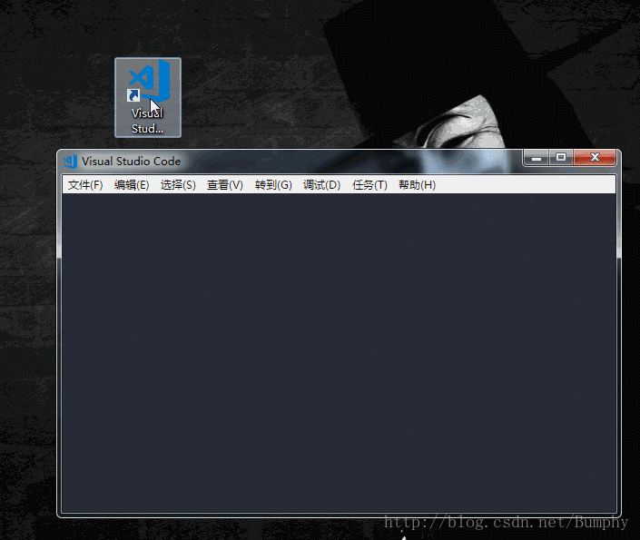

# 1. CodeMix入门基础知识
CodeMix是一个Eclipse插件，可以直接从Eclipse访问VS Code和为Code OSS构建的附加扩展的各种技术。
* VS Code全称：VisualStudioCode，是一个轻量级且功能强大的源代码编辑器，它运行在桌面上，支持Windows、MacOS和Linux系统。它提供了对JavaScript、TypeScript和Node.js的内置支持，并为其他语言（如C、C#、Java、Python、PHP、GO）提供了一个丰富的扩展生态系统和运行平台（如.NET 和 Unity）。官方下载网址：https://code.visualstudio.com/

# 2. 配置
要选择重要键绑定，支持的编辑器和验证器的选项，请转到Window> Preferences（或Mac上的Eclipse> Preferences），然后展开CodeMix并选择适当的节点。