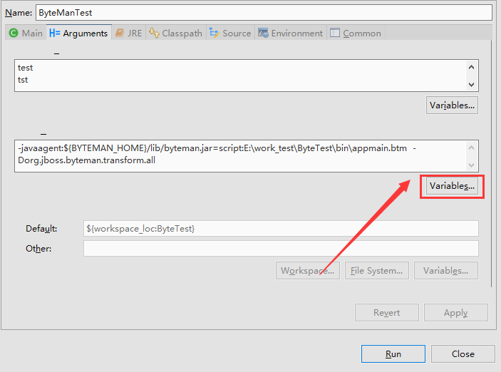
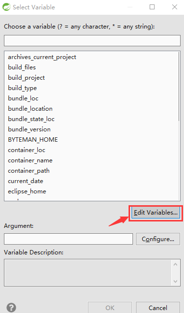
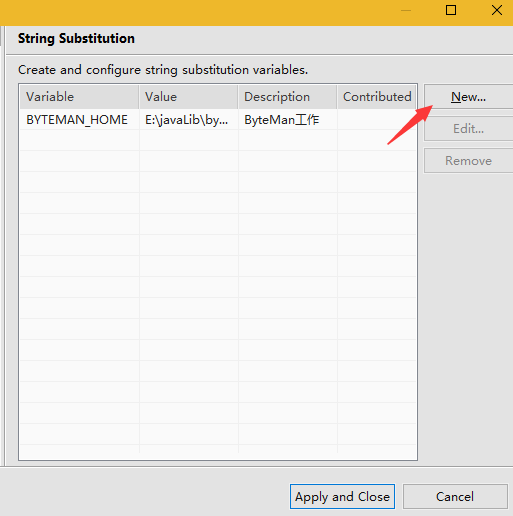
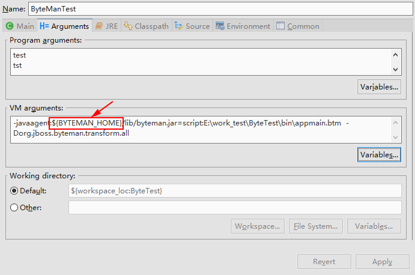

# 1. ByteMan
## 1.1. 定义
它是个软件致力修改Byte码的软件，运行机理是根据规则引擎去统计数据。
## 1.2. 应用场景
1. 运行指定的代码，显示应用程序的状态或JVM的状态。
2. 对异常状况的测试。
3. 测试代码执行效率。
4. 综合性的统计应用程序和JVM的操作。
## 1.3. 如何运行
可以通过命令行参数的形式运行。“-javaagent”。在虚拟机加载时发现并应用规则引擎，解析规则脚本，执行指定操作。
## 1.4. 自动化测试
必须与现有的测试框架连用，并使用Ant或者是Maven运行。代码中需要引入ByteMan的注解，并且ByteMan的Jar必须在类路径中。
## 1.5. 行动规范
### 1.5.1. 事件条件规范(ECA引擎)
#### 1.5.1.1. 要素
**事件：** 当进程执行时，在那执行特定的代码。  
**条件：** 决定特定代码是否被执行。  
**行为：** 特定代码的作用。  
#### 1.5.1.2. 例子
在类`BoundedBuffer`的`get`方法上设置触发器。假设`get`方法中有代码`Object.wait()`。如果`buffer`是空的。
```apache
RULE throw on Nth empty get
CLASS org.my.BoundedBuffer
METHOD get()
AT INVOKE Object.wait()
BIND buffer = $this
IF countDown(buffer)
DO throw new org.my.ClosedException(buffer)
ENDRULE
```
*上例说明：  
    1. `BIND`关键字后跟赋值语句。`$this`指的是被调用的`get`方法。之后做为参数传给了`DO`语句中的构造方法。  
    2. `IF`定义了触发条件,本例中使用了ByteMan内部提供的方法`countDown(Object)`。`countDown`是减1方法，在本例中假设有其它的隐情引擎调用了初始化方法`createCountDown(buffer,N)`,当`countDown`减小为0时，返回`true`。  
    3. `DO`定义了将要执行的动做.本例中当条件被处发，则会抛出`ClosedException`的异常
### 1.5.2. 规则绑定以及参数化
上例中涉及到的初始化规则定义如下;
```apache
RULE set up buffer countDown
CLASS org.my.BoundedBuffer
METHOD <init>(int)
AT EXIT
BIND buffer = $0;
     size = $1
IF $1 < 100
DO createCountDown(buffer, size - 1)
ENDRULE
```
此规则监控的是类`org.my.BoundedBuffer`的整型初始化方法，即`BoundedBuffer(Int xx)`。`AT EXIT`定义了触发的时机，是在`BoundedBuffer`的初始化方法返回前。
 `BIND`采用索引的形式，指定了引用的对象，`$0`标识应用的方法，`$1`标识了方法的第一个参数。后者在本例中标识`BoundedBuffer`的大小。
### 1.5.3. 内置条件和动做
ByteMan提供了一套独立的内置条件的线程，如：delays、waits、signals、countdowns以及标识操作（flag operations）等等。这对于测试线程调度十分有用。恰当的使用内置的条件可以保证线程可以在预定的顺序并行执行。
* Tracing operations：提供了打印进程状态，判断测试成功或失败的功能。
* 少数built-in aciont: 提供了修改代码行为的功能，例如模拟抛出异常等。
* return action ：提供模拟返回值功能 。
* throw aciont : 提供模拟异常抛出。支持（RuntimeException以及它的子类）
* killJVM builtin：允许程序立即退出。  
 :loudspeaker: _注意: 内置操作不只限于使用自己的对象，也可以使用其它的java对象方法，并且它有特权访问私有的或保护型字段_
### 1.5.4. 替换或修改ByteMan语言的内置插件
前面例子用的是`org.jboss.byteman.rule.helper.Helper`提供的`createCountDown`和`countDown`方法。当然所有的非虚类都可以成为helper，但是需要继承Helper类。它们的公共方法都可以自动的用在内部操作中的event、condition和action中。
#### 1.5.4.1. 代理执行
ByteMan改变执行方式，使用的是Java代理程序。JVM的类加载器，提供了此选项，将其编译到某个需要的点上。再JVM启动程序时，其代理将会读取规则脚本。之后监控代码加载触发某个事件。代理会调用每个规则触发的事件。触发器调用执行引擎，执行引擎会确定：
* 处发的方法，这个方法包含了一个特定的触发器指向。
* 匹配的规则。
* 触发器方法的参数。
当多个规则匹配到同一个规则上，那么对于每一个匹配的规则，都会被顺序执行。执行的顺序，与脚本出现的顺序有关。只有以下这种情况会例外，即：规则指定了`AFTER`标识，如：`AFTER READ`某个字段或者`AFTER INVOKE`某个方法，那么执行的顺序正好相反。当触发器被调用，那么规则执行引擎会获取相应的规则执行。规则执行引擎会监控在规则事件中用到的变量，并且后续会测试构成规则的条件。如果条件是`TURE`那就触发规则，并有序的执行规则对应的事件动作。触发器传递方法本身（this）和方法的参数到规则引擎中。这些值可能使用到条件和事件动作中被使用，它们被定义为`$0`,`$1`等。事件可以引入其它的变量。这些变量，可以使用明文数据，调用的方法或者方法的参数以及静态数据初始化。事件变量在条件和动作在的绑定可以简单的使用名字。可以绑定任意的数据从触发器的上下文、到被测试是否执行某个规则的条件，以及规则动作的某个对象或参数。使用开启**DEBUG** 方式编译触发器代码，则代理就可以使用缺省绑定方式传递本地变量，（触发器被当作参数传给调用者）。规则可以使用内置变量，它们的名字以`$`开头，如`$this`.`$arg1`,`$i`等。代理还会编译异常处理代码，以便处理触发器调用的异常。这不是对规则执行引擎做异常检查（这些异常应该在内部处理完成）。执行引擎抛出的异常改变了触发器方法的控制流程。正常情况下，触发器触发线程在返回结果后会曳光弹执行原本的代码。而当有`return`和`throw`内置动作，来指定触发器的方法，提前返回或抛出异常。规则语言实现这些通过抛出私有的，内部的异常。触发器方法内部的处理代码捕获到内部异常后，要么返回，要么递归地抛出运行时或程序指定的异常。这个可以避免触发器方法中其它的正常代码被执行。如果还有其它的触发器在这个点上被挂起，那么由于有`return`和`throw`动作被执行，所以，挂起的触发器也被忽略。
#### 1.5.4.2. 代理重新执行
代理也允许再程序运行期间更新规则。这样可以重新定义以加载的规则，也可以引入新的规则。在当前加载的类没有匹配的规则时，新加入的规则也仅仅是加入到规则集中。这可能替换掉早期的规则（规则名相同)。当匹配的类加载了最新的规则，那这个新规则将变成有效的规则。加载了新规则的类的代理，会重新执行这些规则，修改触发器需要的适当方法。如果使用更新后的规则，那么，前序规则中所有的触发器以及涉及的对像都会被删除。重新执行的类不会使用现有类的对像，访问新类的对像。它仅仅是为它们的方法安装了不同的实现。**重要的一点是：重新执行是自动过成的，没有明确标识它会在加载时更新。**JVM需要加载它自己的各种
引导程序类，然后才能启动代理程序并允许其注册成执行器。一旦代理完成初始化规则集，并将它们注册成执行器，代理就会扫描所有当前加载的类，并确定规则集是的那些规则匹配。代理会自动执行这些类，这会使后续的加载代码触发规则执行。
### 1.5.5. ECA规则引擎 
Byteman规则执行器引擎由一个规则解析器，类型检查器和解释器/编译器组成。规则解析器在加载阶段被代理调用。这给代理提供了足够的信息，确定潜在的触发点。规则在触发器注入时不进行检查类型和编译。这些步骤被延迟到，所涉及的类和方法加载时进行。触发器属性的类型检查，是检查它所涉及到的类。做到这一点需要确定加载类的属性如类型、访问的属性和方法签名等。所以，为了确保触发器类及其所有相关类已在类型检查器试图去访问它们，以便在触发的第一时间规则被编译和检查。这也是为了避免规则在检查和编译的消耗实际上，这些动作并未执行。单个的规则，可以访问多个触发器。首先，取决于规则绑定的事件，它可以被使用到多个类或一个类的多个方法中。其次，即使一个规则指定一个类和方法，但很显然，同一个类文件，也可以被不同的类加载器加载。所以，在每个触发点上规则必须要类型检查和编译。如果一个类型检查或编译失败，那么规则引擎就会打印出error信息，并且不会执行触发器调用。  
 :loudspeaker: _注意：当事件规范模糊，则规则在某一个触发点上类型检查成功后，就不会再次被检查。规则只有在类型检查失败时，不会被执行。_  
 在基础模式下，触发器调用某规则是通过解释规则解析树实现的。也可以配置规则引擎通过JIT编译器来解析规则绑定，条件和动作。执行时，是通过Byteman代理叫做`helper adapter`的东东，生成的辅助类实现的。这个类实际上是helper类的一个子类，它被规则访问。它继承自helper类，所以它知道如何执行help类内建的操作。一个子类被用来增加规则系统需要的功能，最值得注意的是可以在触发点上获取调用的方法，以及绑定的本地字段，它们被存储在一个hashmap中，它映射了方法和参数，以及事件的变量和它们的值。当规则被触发时，规则引擎会创建规则的辅助适配器实例类来为触发器调用提供上下文。它使用的setter方法生成的Byteman代理初始化规则和绑定字段，然后调用适配器实例的执行方法。每一个规则者会被它们的适配器处理，这使得多个线程相同规则的情况下，各触发器相互不会有影响。  
 `execute0`版本的解释器定位触发器规则以及事件、条件和动作解析树的位置。它会遍历这三种规则树组件，并递归地去为每个表达式估值。事件，条件或动作中涉及的变量绑定是在规则执行期间完成的。当执行的方法中含有内在的引用时，这会使它调用它超类（helper）的某个方法。当规则进行编译时，Byteman代理会生成一个可执行方法，这个方法包含了规则事件、条件和动作的字节码。这种直接的编码，使所有的操作和方法调用都在一块了。这种代码访问绑定和执行内在的引用，一样的方式，解析代码访问内在的引用 被编译成直接的方法，而不是反射调用。虽然编译器在触发方法获取调用上花费了一些时间，理想情况下，编译应该是可以按照规则进行选择，也可以对规则集中的所有规则进行全盘选择。目前它只能被全部禁用或启用。
## 1.6. Byteman规则语言
### 1.6.1. 注解
 规则定义是由有序的规则定义语句，以及穿插的注解组成 。注解可以放在规则定义中，也可以放在之前或之后，但是必须和规则语句不在一行上。注解由`#`开头，如：
 ```apache
 ######################################
# Example Rule Set
#
# a single rule definition
RULE example rule
# comment line in rule body
. . .
ENDRULE
```
### 1.6.2. 规则事件
规则事件指定了用目标类访问的具体方位（某个目标方法），目标方法可以是静态方法，可以是实例方法，也可以是构造方法。如果没有指定具体的方位，那么，将使用缺省的方位（目标方法的入口）:no_mouth:所以对于一个简单的规则基础模式如下：
```apache
# rule skeleton
RULE <rule name>
CLASS <class name>
METHOD <method name>
BIND <bindings>
IF <condition>
DO <actions>
ENDRULE
```
规则的名字跟随在`RULE`关键字之后，名字必须是非空自由形式文本。规则的名字不必是唯一的，但是名字要能表达规则的作用，这样有助于调试。当解析、类型检查，编译或执行时遇到错误，则规则的名字会被输出出来。类名和方法名是跟在关键字`CLASS`和`METHOD`之后，并且必须和关键字在同一行。类名可以指定或不指定包名。方法名，可以指定或不指定参数列表或返回类型。构造函数通过`<init>`来指定。列如：
```apache
# class and method example
RULE any commit on any coordinator engine
CLASS CoordinatorEngine
METHOD commit
. . .
ENDRULE
```
上例规则表示匹配所有的类名是`CordinatorEngine`的类，不管它的包名是什么。当任何是这个名字的类被加载，则代理会在所有的`commint`方法之前插入一个触发点。如果有几个不同签名的这种方法出现，那么每个方法会插入一个触发点。更精确的匹配，可以加入某个特征，如可选的参数列表、返回值类型。例如：
```apache
# class and method example 2
RULE commit with no arguments on wst11 coordinator engine
CLASS com.arjuna.wst11.messaging.engines.CoordinatorEngine
METHOD State commit()
AT LINE 324
. . .
ENDRULE
```
上例中规则只会匹配包`com.arjuna.wst11.messaging.engines`下且仅匹配一个没有参数及返回值类型是`State`的类`CoordinatorEngine`。:loudspeaker:_注意本例中类`State`的包并未确定。这种情况下，类型检查器推断的参数包和返回值类型会被忽略。_  
前面的例子还使用了位置说明符`AT LINE`，紧跟其后的一定是一个整数的行号。这指定了代理在特定代码的行插入触发器。  
:loudspeaker:注意：
* Byteman代理不会在包`java.lang`或在`org.jboss.byteman`（Byteman自己所在的包）上被执行。（第一个包的限制可以通过设置System属性来放开，但你真的知道你在干什么嘛？-请看下面详细描述）
* 内部类可以使用`$`来界定那个是外部的类，那个是内部的。如：`org.my.List$Cons`,`Map$Entry$Wrapper`。
### 1.6.2. 类规则vs接口规则
Byteman规则可以附加到接口上也可以附加到类上。如果`CLASS`关键字被`INTERFACE`关键字替代，那么规则涉及到的类，都是要完成接口的。例如，下面的规则：
```apache
# interface rule example
RULE commit with no arguments on any engine
INTERFACE com.arjuna.wst11.messaging.engines.Engine
METHOD commit()
. . .
ENDRULE
```
上面的例子，附加到了接口`Engine`的方法`commit`。如果`Engine`接口被两个类实现`CoordinatorEngine`和`ParticipantEngine` 那么规则有两个触发点，即： CoordinatorEngine.commit() 的开始点和ParticipantEngine.commit()的开始点。代理会确保每一个实现接口的类被执行，包括触发器调用规则。
### 1.6.3. 重载规则
一般地，Byteman只会注入规则代码到由`CLASS`指定的类的方法中。有些时候这没有什么用处。例如，下面的规则就是没有啥用的：
```apache
RULE trace Object.finalize
CLASS java.lang.Object
METHOD finalize
IF TRUE
DO System.out.println(“Finalizing “ + $0)
ENDRULE
```
`print`语句取得了方法`Object.finalize()`的入口,虽然JVM只会调用重载后的方法`Object.finalize()`。但这种规则重载并不会改变此方法。所以此规则不会被触发，无论这个trace是多么的有用。(这不是全部的故事——当调用`super.finalize()`时，就会触发此规则)。还有其它的情况，关于重载代码规则的替代。例如，类`Socket`它比较特殊，会被各种不同的类实现`bind`,`accept`等方法。因此，一个规则附加到`Socket.bind()`上时，是不会被触发的。（直到有调用`super.bind()`时，触发条件才成功。）当然，为每一个重载类定义某个规则是必要的。然而，当代码改变了，这就有可能没有什么意义了，并且在某些情况下不能匹配规则。因此Byteman提供了一个简单的语法，以支持重载的代码形式。
```apache
RULE trace Object.finalize
CLASS ^java.lang.Object
METHOD finalize
IF TRUE
DO System.out.println(“Finalizing “ + $0)
ENDRULE
```
类名的前缀`^`告诉代理此规则会被应用到所有继承了Object并完成了`finalize`方法的类上或是Object本身上。此前缀也可以用到接口规则上，即：代理会注入规则代码到完成了这个接口类的方法上，也会注入到子类的对于这个接口的重载方法中。  
:loudspeaker:_如果重载的方法调用了它父类的这个方法时，规则代码会被触发多次。实际上如果是构造方法注入，也经常会发生触发多次的情况（当然这也是必然的，也有会调用父类的构造函数的情况。）_ 这也是可以很容易的避免的，通过在规则中加入某些条件，就比如检测调用方法者的名字。所以，上面的规则可以被更好的重写为以下的形式：
```apache
RULE trace Object.finalize at initial call
CLASS ^java.lang.Object
METHOD finalize
IF NOT callerEquals(“finalize”)
DO System.out.println(“Finalizing “ + $0)
ENDRULE
```
此规则使用了内建的函数`callerEquals`,它可以使用各种函数名进行调用。（后续会详细介绍）。 这个版本是调用的`String.equals()`方法，比较函数名称是否相等，它会将调用的方法传递给String的方法，并返回结果。条件中使用了否定逻辑，即使用`NOT`操作符来界定。（另处在JAVA中使用!表示否定）。因此如果通过最终线程的`runFinalizer()`方法调用了`finalize`方法，则条件就会是`true`规则就会被触发。当是通过重载的函数（`super.finalize()`）调用，则条件是`false`规则不会被触发。
### 1.6.4. 重载接口规则
前缀`^`也可以与关键字`INTERFACE`组合使用。一般来说，针对于接口的规则仅仅会注入到直接完成此接口的类中。这就表明，简单的`INTERFACE`规则不总是能注入到你所期望的类中。例如：类`ArrayList`继承了类`AbstractList`,而且也完成了接口`List`。`INTERFACE List`规则只会注入到`AbstractList`类中而不会注入到`ArrayList`类中。这种的直观感觉是`AbstractList`类完成了`List`接口的所有方法(有一些方法可能是抽象的)，因此在`ArrayList`类中任何重新完成接口的方法，都被当作是重载方法。可以用前缀`^`达到预期的效果。如果这种`INTERFACE ^List`规则被使用，那么它会被注入到`ArrayList`和`AbstractList`两个类中。:loudspeaker:_注意：在类的继承和接口的继承方面，还是有一些细微的差别的。_ 同级别的类可以用来诠释接口继承是什么样的。让我们来看一下接口`Collection`,它继承自接口`List`。当一个规则试图附加到`INTERFACE Collection`时，那么它可以注入到任何完成了接口`Collection`的类中，也可以注入到继承了`Collection`接口的接口，并完成了继承接口的全部方法的类中。一旦`List`继承了`Collection`这就意味实现了接口的类例如`AbstractList`会是一个规则的候选对象。这是因为`AbstractList`是类继承（`List`继承了`Collection`）等级的第一个类，它完也在`Collection`的所有方法。（即使它仅仅是一个抽象方法）。类`ArrayList`将不会是注入的候选对象，因为所以预完成的由`Collection`声明的方法，都是被`AbstractList`类重载完成的。如果你需要将规则注入到类`ArrayList`中，那么你需要使用`INTEERFACE ^Collection`语句来定义。
### 1.6.5. 位置说明符
上面的例子中，即指定了触发点在触发方法中的行号（使用`AT LINE`指定）也指定了开始的方法。明显地，行号可以用来指定任何的点，在执行期间，并且也是简单方便地，对于那些不会改变的代码。然而对于自动化测试，代码会不断的变化，这种方法就不是太好用。显然当代码被修改，访问的测试代码也需要修改。但是，也很容易根据被修改过的代码，修改原本的行号。幸运的是，这还有其它一些指定触发点的方法。例如：
```apache
# location specifier example
RULE countdown at commit
CLASS CoordinatorEngine
METHOD commit
AFTER WRITE $current
. . .
ENDRULE
```
`current`变量在一带有前缀`$`会被识别为某个本地变量，或者很可能是某来方法的参数。这种情况表示，在返回枚举`State`的`CoordinatorEngine.commit`方法中，有一个本地变量`current`，在方法的开始就被定义上初始化了。
```java
public State commit()
{
final State current ;
synchronized(this)
{
current = this.state ;
if (current == State.STATE_PREPARED_SUCCESS) {
. . .
```
上例中，在字节码中第一个写入操作(istore)后会立即插入上面的那个出发点，写入操作会更新堆栈中存储`current`的位置。也就是说，在代码中本地变量`current`被初始化后触发器被触发。对比一下，下面的规则，在本地变量`recovered`被读后的触发器：
```apache
# location specifier example 2
RULE add countdown at recreate
CLASS CoordinatorEngine
METHOD <init>
AT READ CoordinatorEngine.recovered
. . .
ENDRULE
```
:loudspeaker:_注意：上面的例子中，字段类型确保了它是属于类`CoordinatorEngine`的一个属性。没有指定类型时，规则会匹配任何读到的名字为`recovered`的字段。_  
所的位置说明符定义如下：
```apache
AT ENTRY
AT EXIT
AT LINE number
AT READ [type .] field [count | ALL ]
AT READ $var-or-idx [count | ALL ]
AFTER READ [ type .] field [count | ALL ]
AFTER READ $var-or-idx [count | ALL ]
AT WRITE [ type .] field [count | ALL ]
AT WRITE $var-or-idx [count | ALL ]
AFTER WRITE [ type .] field [count | ALL ]
AFTER WRITE $var-or-idx [count | ALL ]
AT INVOKE [ type .] method [ ( argtypes ) ] [count | ALL ]
AFTER INVOKE [ type .] method [ ( argtypes ) ][count | ALL ]
AT SYNCHRONIZE [count | ALL ]
AFTER SYNCHRONIZE [count | ALL ]
AT THROW [count | ALL ]
```
如果使用了位置说明符，那么它一定是紧跟在`METHOD`关键字之后。如果没有指定位置说明符，则会使用默认的`AT ENTRY`做为说明符。
* `AT ENTRY`的触发点是在触发方法执行的第一个可执行指令之前。在构造函数的第一行就调用父类的构造函数或去调用另一个构造函数时，可能会产生异常。确保规则不会注入到或操作于构造函数之前是必要的。
* `AT EXIT`的触发点是在触发方法的返回过程时发生。（如：显式或隐式返回，而不是抛出异常退出）。
* `AT LINE`的触发点是在触发方法被以参数形式指定的行号（大于或等于此行号）之前可执行的字节码。当在指定的行号上不存在可执行的代码，那么代理不会插入触发点。（:loudspeaker:_这不会以错误的形式打印出来。这个情怳会被当做此规则不适用于这个类或方法_）。
* `AT READ`后跟一个本地的字段名，此时的触发点在所匹配的本地字段之前。即第一个使用`getXxx`的方法。如果为`getXxx`方法指定了类型，那不仅仅是要匹配字段名，还是匹配字段的类型。如果指定了一个数N，那么触发点就是第N次匹配时触发。:loudspeaker:_注意：N所指定的是字段的访问次数，而不是在实际执行时的第N个字段。_ 如果指定了关键字`ALL`则表示在所有的`getXxx`调用被匹配时，都会执行规则。
* `AT READ`后跟一个以`$-`为前缀的本地变量名，方法参数名，或方法参数索引，则触发点会被设置在本地变量或方法参数被读取之前，这所对应的字节码命令是：`iload`，`dload`，`aload`等。如果指定了`N`，那么第N次读取匹配被当作触发点。:loudspeaker:_注意：这里的N指定的是读取变量的次数，而不是访问的次数。_ 如果指定了`ALL`则表示在每次读取变量时触发指定的规则。:loudspeaker:_注意：只有在触发方法的字节码中包含本地的变量表，又或是在编译时使用了`-g`标识，则在使用本地变量或参数时可以使用`$i`,`$this`或者`$arg1`等。做为对比通常情况下，引用参数时一般使用的是它们的序号如`$0`，`$1`等。（然而，在`AT READ`指令中，`$0`只仅仅用于指定触发方法本身的实例）。_
* `AFTER READ`与`AT READ`基本相同，除了它的触发点是在`getXxx`或变量读取之后进行。
* `AT WROTE`和`AFTER WRITE`与`READ`基本相同，除了他们访问在代码中对应的字段或者变量，即`putXxx`或者`istore`，`dstore`等等指令。:loudspeaker:_定位符`AT WRITE $0`或者是`AT WRITE $this`不会匹配任何方法，因为触发的是方法调用实例，而它从不会被访问。同样的，一个给定的本地变量如`localvar`，`AT WRITE $localvar`与`AT WRITE $localvar 1`是等效的，他们的触发点在本地变量初始化之后，定位符`AFTER WRITE $localvar`也和前面的两个指令相同。_ 这是必要的，因为变量在初始化之后才会在范围内。这也确保了被写入的本地变量，可以在规则体中被安全访问。
* `AT INVOKE`和`AFTER INVOKE`与`READ`和`WRITE`基本相同，除了它们指定的触发方法是调用的方法或构造函数做为触发点。这个方法通过它的方法名或方法类型（可以指定包名）或某个描述符来确定。这个描述符的构成是由括号中类型名列表构成，类型名之间现代使用逗号隔开。类型名指定了方法中参数的类型并也可以指定包名，也可以是参数的后缀部分:no_mouth:。
* `AT SYNCHRONIZE`和`AFTER SYNCHRONIZE`指定的是触发方法的同步代码块儿，即它们对应的是字节码命令`MONITORENTER`。:loudspeaker:_注意：`AFTER SYNCHRONIZE`的触发点是在同步代码块儿的入口，而不是代码块的出口。_ （_译者注，这段没有说明`AT SYNCHRONIZE`的触发点。。略困惑_）
* `AT THROW`指定了在触发方法内的`throw`操作被指定为触发点。`throw`操作也可以指定异常的类型名（包名也可加入）。如果指定了`N`，则会在第`N`次抛出异常时触发，如果指定了关键字`ALL`，则在每次抛出对应的异常时会被触发。**注：当有多个规则指定了相同的位置时，它们注入的顺序，取决于它们各自脚步的书写顺序，有一个特例即`AFTER`的顺序，会是书写顺序的倒序。当位置说明符（除了`ENTRY`或`EXIT`外）被用在重载规则中，那么，与位置说明符匹配的规则代码只会被注入到原始的方法中或重载后的方法中。因此，例如位置说明符`AT READ myField 2`标识的规则，仅仅被注入到了实现了某个方法，且此方法包含了一个被载入了2次的字段`myField`。不匹配的方法，会被位置说明符忽略。由于共识的原因，`CALL`与`INVOKER`被当作同义词，`RETURN`与`EXIT`是同义词，并且`AT LINE`中的`AT`是可选的。**
### 1.6.6. 规则绑定
事件规则中，包含了绑定规则，它可以获取变量的值，这个值是由后面的规则体决定的。这个值在每次规则触发后都会在检测规则条件之前被计算。例如：
```apache
# binding example
RULE countdown at commit
CLASS com.arjuna.wst11.messaging.engines.CoordinatorEngine
METHOD commit
AT READ state
BIND engine:CoordinatorEngine = $0;
recovered:boolean = engine.isRecovered();
identifier:String = engine.getId()
. . .
ENDRULE
```
创建一个变量`engine`，这个变量绑定到了触发规则的`commit`方法上，它的值赋成了`$0`（如果`commit`是静态方法那么`$0`会导致类型检查异常）。触发函数的参数可以通过连续的数字来指定，如`$1，$2`等等。对于`engine`的类型声明即`CoordinatorEngine`并不是必须的，它可以通过`$0`推断出来。现样地，变量`recovered`和`identifier`也被绑定，它们的值可以通过`=`右边的表达式估算出来。:loudspeaker:_注意：绑定变量`engine`的值已经能确定，在这些变量被绑定之前，因此它的赋值可以使用表达式方式。再一个，提供的变量类型也是可以被推测出来的。_特殊的`BIND NOTHING`这种语法也是可用的，它适用于规则不需要绑定任何值的情况。另外，也可以不写`BIND`语句。
### 1.6.7. 规则表达式
在绑定事件中，表达式总是出现在`=`操作符的右边，它可以是简单的表达式。例如:
* 赋值为前面的绑定变量。
* 赋值为某个触发器的方法:no_mouth:或者方法的参数。
* 赋值为在某个触发点上的本地变量。
* 赋值为特殊的变量`$!,$^,$#,$*,$@,$CLASS`和`$METHOD`
* 赋值为静态的字段
* 赋值为原始值（_译者注：整数，字符串等_）
* 赋值为某字段
* 赋值为静态的或非静态的方法调用
* 赋值为内置操作的调用  

**<font color=red>注内置操作的说明会在后面有详细说明</font>**  
表达式也可以是复杂的，它们可以是由其它的表达式构成，可以使用Java的操作符：`+,-,*,/,%,&,|,^,&&,||,!,=,==,!=,<,<=,>,>=,new`等。这里也支持三元运算符：`? :`。类型检查器会尽力去确定，简单的和复杂的表达式类型。因此，例如，假设类型检查器知道绑定变量`engine`的类型，那么它也可以推断出字段`engine.recovered`，方法`engine.isRecovered（）`的类型等等。  
:loudspeaker:注意:
* `throw`和`return`操作，只能用在整个规则动作的最后一个动作上。
* 表达要遵守正常的结合性、优先权规则。
* 触发方法和其参数可以使用索引来访问即：`$0`(**<font color=red>对于静态方法无效</font>**),`$1`等等。如果此方法使用了`debug`相关的编译参数进行编译，那么使用变量名也可以。因此，例如：`$this`也可以是`$0`的一个别名，`$myArg`也可以是`$1`的一个别名，这里面的`$myArg`是某一方法的第一个参数。
* 如果触发方法使用了`debug`相关的编译参数编译，那么可以使用它的变量名称。如：有变量`idx`它在触发点的上下文中，那么可以使用`$idx`来获取它的值。
* 使用特殊的变量可以访问其它触发方法的数据，现在有7种这样的特殊变量：
    * `$!`在`AT EXIT`规则中是有效的，并且规则触发时它绑定了返回值。它的类型与出发方法的返回值类型一致。如果触发方法是`void`类型时，它是无效的。
    * `$!`也可以用在`AT EXIT`规则中。这与上面的原理相同。
    * `$^`是只仅在`AT THROW`规则中有效，它绑定了抛出的异常(`throwable`)，它的类型就是异常的类型。
    * `$#`可以是整型和给定的数字参数，提供给触发方法。:no_mouth:
    * `$*`绑定了一个对象数组`Object[]`，它包含了触发方法本身即`$this`（数组下标0）和触发参数`$1,$2`等（数组下标1，2）。（对于静态方法数组0的位置上的值是`null`）。
    * `$@`只有在`AT INVOKE`规则中有效，它绑定了一个对象数组`Object[]`，包含了目标函数本身（在数组下标0上）和目标函数的参数（从数组下标1开始顺序的往下排），如果目标方法是静态的，那么数组下标是0的值为`null`。:loudspeaker:_注意：这些变量不适用于`AFTER INVOKE`规则。_ 这个数组包含了所有的参数，它被放置在触发方法调用前的堆栈上，当方法调用完毕时，这些值将不复存在。
    * `$CLASS`在所有的规则中都可以使用，它绑定了一个字符串，值是规则触发类的全名（包含包名和类名）。触发类是指此类的方法被规则所注入。:loudspeaker:_注意：这种说法与目标类的说法一致，在此范畴中。:no_mouth:_ 然而，在接口注入或重载注入时，触发类可以是一个完成接口的类，也可以是某超类的子类。因此对于任意给定的目标类，有可能有多个触发类。
    * `$METHOD`在所有的规则中都有效，它绑定了一个字符串，值是触发方法的全名包括方法名和返回类型。:loudspeaker:_注意：这种说法与目标方法一致，在此范畴中。:no_mouth:_ 但目标方法可能会省略名字:no_mouth:和返回值。因此，给定的目标方法可能会有多个触发方法匹配。
* 在`BINDS`语句中，引入了绑定规则变量的更新操作，即参数，本地变量，字段实例，静态字段，或者是返回值`$!`。这种操作不会马上更新任何的特殊变量。
* 在触发方法时，参数变量和本地变量是可见的。例如：假设某规则包含了一个赋值语句`$name = "Ernie"`，这里`name`可以是参数变量也可以是本地变量，在触发点的范围内。如果`name`有值为`"Bert"`当规则被触发，并且赋值语句执行后使用`gets`方法获取的值是`"Ernie"`。:loudspeaker:_注意：赋值语句不能使用`$this`（或等效的`$0`），这是由于对于普通方法而言，它们一般都是`final`的。_
* 在触发点堆栈的顶端，会更新返回值到`$!`中，这由于触发方法返回了要更新的值。这与执行`RETURN`表达式效果相同。
* Byteman提供了英语关键字列表，它们可以用来替代与之相应的Java操作符，Java操作符在（）中的部分：`OR(||),AND(&&),NOT(!),LE(<=),LT(<),EQ(==),NE(!=),GE(>=),GT(>),TIMES(*),DIVIDE(/),PLUS(+),MINUS(-),MOD(%)`。关键字可是使用大写或小写字母，但大小写字母不可以混用。在Byteman规则中，目标类和方法中，不要使用这些关键字，否则会有冲突。
### 1.6.8. 规则条件
规则条件，只不过是`boolean`型的规则表达式。例如：
```apache
# condition example
RULE countdown at commit
CLASS com.arjuna.wst11.messaging.engines.CoordinatorEngine
METHOD commit
AT READ state
BIND engine:CoordinatorEngine = $this;
recovered:boolean = engine.isRecovered();
identifier:String = engine.getId()
IF recovered
. . .
ENDRULE
```
上例，仅仅是测试了一下绑定变量`recovered`的值。使用下面的条件也可实现一样的效果：
```apache
# condition example 2
RULE countdown at commit
CLASS com.arjuna.wst11.messaging.engines.CoordinatorEngine
METHOD commit
AT READ state
BIND engine:CoordinatorEngine = $this,
. . .
IF engine.isRecovered()
. . .
ENDRULE
```
另外，如果实例使用的是公有的字段`recovered`存储方法`isRecovered`的`boolean`返回值，效果与之前的是一样的，实现的代码如下：
```apache
# condition example 3
RULE countdown at commit
CLASS com.arjuna.wst11.messaging.engines.CoordinatorEngine
METHOD commit
AT READ state
BIND engine:CoordinatorEngine = $this,
. . .
IF engine.recovered
. . .
ENDRULE
```
:loudspeaker:_注意：`boolean`值`true`是可用的表达式，因此当一个条件表达式使用`true`时，那么它总是会被触发。_
### 1.6.9. 规则动作
规则动作，可以是一个规则表达式，也可以是一个返回或抛出异常的动作，也可以是一些有序的通过分号间隔的规则表达式，很可能以返回或抛出异常的动作结尾。在动作列表中使用的规则表达式可以是任意的类型，包括`void`类型。返回动作是以`return`开头的，后面可是跟随一个规则表达式，它是用来计算返回值的。如果仅仅如果方法是`void`的，那么触发方法的返回动作可以被忽略。如果有返回值，那么类型检查器会确保，返回类型可以被触发器方法访问。因此，如下面的例子中使用的方法返回的`boolean`就是合法的：
```apache
# return example
RULE countdown at commit
CLASS com.arjuna.wst11.messaging.engines.CoordinatorEngine
METHOD commit
AT READ state
. . .
DO debug(“returning early with failure”);
return false
ENDRULE
```
抛出动作是以`throw`为关键字，后面跟随一个`throwable`的构造函数表达式。`throwable`构造函数表达式是由关键字`new`后面跟上`throwable`的类名，抛出的是参数列表确定的异常。参数列表可以为空，即一对空括号。另外，括号中也可以写上简单的规则表达式或有序的规则表达式，一使用逗号分隔。如果没有参数，那么抛出的类型需要完成空的构造函数。如果有参数，那么抛出的类型需要完成类型兼容的构造函数。_:loudspeaker:注：对于跟在`throw`关键字后的`new`关键字可以忽略，在`throwable`的构造函数中。_`throw`动作会导致创建一个`throwable`类型名的对象，这个对象定义在异常构造中，由触发函数抛出。为了使这个动作有效，表达式类型必须是`java.lang.RuntimeException`或`java.lang.Error`亦或明确地在出发函数抛出列表中明确声明过的。如果以上的条件不满足，那么类型检查器会抛出一个`type exception`。所以，例如，以下使用`throw`是合法的，假设方法`commit`的抛出列表中包括了`WrongStateException`异常。
```apache
# 2. throw example
RULE countdown at commit
CLASS com.arjuna.wst11.messaging.engines.CoordinatorEngine
METHOD commit
AT READ state
. . .
DO debug(“throwing wrong state”);
throw new WrongStateException()
ENDRULE
```
空的动作列表可以使用关键字`NOTHING`指定。
### 1.6.10. 内联调用
内联调用没有接受者，就象调用`this`中的方法一样。规则引擎识别了这种形式，并把它们转换成运行时调用的`helper`类实例的方法。因此，参考上面的几个例子，这显然是`helper`类完成了`debugging`方法的签名。`boolean debug（String message）`这个方法为`System.out`提供了打印的字符串，并返回了`true`。它可以使用规则动作来`trace`信息，例如：`DO debug("killing JVM"), killJVM()`。当`debug`内联方法被执行，规则引擎调用了当前的`helper`实例的方法，并传递字符串参数“killing JVM"。方法killJVM是另一个内联完成的缺省实例`Helper`类的方法。*:loudspeaker:注意：方法`debug`有一个`boolean`型的返回值，因此`tracing`也可以当作规则条件来执行。* 这种情况也会经常出现，在测试某些绑定变量或方法参数。例如：
```apache
IF debug(“checking for recovered participant”)
AND
participant.isRecovered()
AND
debug(“recovered participant “ + participant.getId())
```
*注：`AND`是替换了`Java`中的`&&`操作符。*
规则语言自动完成并暴露了所有的`Helper`类的公共方法，当作内联操作符。因此，当规则类型检查器发现`debug`方法的没有接受方调用时，它会识别`Helper`类的方法并自动对这个方法进行类型检查。在执行时间调用被执行通过调用`helper`实例的`debug`在规则触发器调用时。这一特性允许额外的内联被加入到规则引擎，仅仅是增加新的`helper`实现。为此类型检查器和编译器不需要做任何改变。
### 1.6.11. 用户自定义规则Helpers
规则在需要时可以指定自已的`helper`类，这个类可以扩展、重载以及替换现有的内联调用，它可以用在事件，条件或动作中。例如：在以下的规则中，类`FailureTester`被用作`helper`类。`boolean`型实例方法`doWrongState(CoordinatorEnginge)`被当作条件来调用，它决定了是否需要抛出`WrongStateException`的异常。
```apache
# helper example
RULE help yourself
CLASS com.arjuna.wst11.messaging.engines.CoordinatorEngine
METHOD commit
HELPER com.arjuna.wst11.messaging.engines.FailureTester
AT EXIT
IF doWrongState($0)
DO throw new WrongStateException()
ENDRULE
```
`helper`类不需要完成任何特定的接口或继承任何预先指定的类。它仅仅需要提供实例方法，来支撑发生在规则中的内联调用。子类继承缺省`helper`，它很可能扩展或重载了一套缺省的方法。例如，下面的规则使用了一个`helper`，它为规则加入了重要信息打印的功能。
```apache
# 2. helper example 2
RULE help yourself but rely on others
CLASS com.arjuna.wst11.messaging.engines.CoordinatorEngine
METHOD commit
HELPER HelperSub
AT ENTRY
IF NOT flagged($this)
DO debug(“throwing wrong state”);
flag($this);
throw new WrongStateException()
ENDRULE
```

```java
class HelperSub extends Helper
{
    public boolean debug(String message)
    {
        super(“!!! IMPORTANT EVENT !!! “ + message);
    }
}
```
上面的规则仍然可以使用内联函数`flag`和`flaged`，它们定义在缺省的helper类中。  
以上例子使用了`HELPER`行在规则体中来重置指定`helper`类。对于所有的规则重置`helper`也是可以的， 在文件中通过加入`HELPER`行在规则之外。因此，下面例子中开始的两个规则中使用了类`HelperSub`，而第三个用的是`YellowSub`。
```apache
HELPER HelperSub
# helper example 3
RULE helping hand
. . .
RULE I can't help myself
. . .
RULE help, I need somebody
CLASS . . .
METHOD . . .
HELPER YellowSub
```
### 1.6.12. 规则`Helper`生命周期方法
当规则加载或者在规则卸载时进行排序有时是非常有用的。例如，如果`tracing`规则被加载，来收集程序信息，而加入一个后台线程来有规律的打印信息或将各种规则计数器清零都是很方便的。同样的，对于检测`tracing`规则是否已经全部卸载（这样目标线程才能关闭），避免浪费CPU时间是有帮助的。规则引擎支持生命周期模式，无论加载或是卸载它都会对规则进行排序，并且这两种动作的排序算法相同。在这种模式下会有四个生命周期事件发生：**<font color = blue>启用**、**加载**、**卸载</font>** 和 **<font color = blue>关闭</font>**。虽然这些生命周期事件通过加载和卸载的规则控制访问的，但是事件的焦点被helper类访问所正在加载或者卸载的规则。处理生命周期事件的句柄是`helper`类提供的`callbacke`方法。四个生命周期事件是根据以下的模式产生的。假设我们有一个helper类`H`和一套加载规则`R(H)`,它使用`H`作为`helper`类。很明显`R(H)`在启动期间是空的。当使用`H`为`helper`的规则`r(H)`被加载(亦或是在代理启动或动态监听)时，注入和类型检查被安装到这套`R(H)`上。当规则通过动态监听器被卸载，它也会从这套`R(H)`中被卸载。
* 在加载`R(H)`的场景中，规则从无到有的过程中，**启用事件**将会被触发。
* 在`r(H)`被加载到`R(H)`中时，**加载事件**将会被触发。
* 在`r(H)`被从`R(H)`中卸载时，**卸载事件**将会被触发。
* 在卸载`R(H)`的场景中，规则从有到无时，**关闭事件**将会被触发。  
*:loudspeaker: 注意：加载总是产生启用事件，在加载事件可访问之前。卸载总产生卸载事件，在关闭事件可访问之前。*  
`helper`类`H`完成了以下协同静态方法后，将会收到事件通知。
```java
public static void activated()
public static void installed(Rule rule)
public static void installed(String ruleName)
public static void uninstalled(Rule rule)
public static void uninstalled(String ruleName)
public static void deactivated()
```
- `activated()`在启用事件发生时被调用。它是一次性设置操作，对于使用了给定的`helper`类的所有规则。
- `deactivated()`在关闭事件发生时被调用。它是一次性设置操作，对于使用了给定的`helper`类的所有规则。
- `installed(Rule)`在加载事件发生时被调用。它可以对给定的规则进行初始化。
- `deinstalled(Rule)`在<font color=yellow>加载事件发生时[^1]</font>被调用。它可以对给定的规则进行释放。
`installed(String)`和`uninstalled(String)`可以被完成来替换Byteman自己的`installed(String)`和`uninstalled(String)`方法，这可以是一种选择，假如给定的`helper`类可以处理规则名称的话。*:loudspeaker: 注意：如果两种风格都仅仅实现了方法，那么使用的规则将会调用这些方法*。正在加载和卸载规则并不总是会发起生命周期处理过程，懂得这一点是十分重要的。如果规则解析或类型检查失败，那么它就不会被加载，因此也不会触发启用或加载事件。如果之后这个规则被卸载，它也不会产生卸载或关闭事件，因为它就没有被加载过。对于有效的规则加载和启用时也可能不触发生命周期处理。例如，规则就不会被注入，因为没有匹配的触发类使它被加载到JVM中。
### 1.6.13. Byteman规则语言标准内联
缺省的`helper`类提供了一下标准的内联表达式，可以使用在规则中。它们通常广泛使用在条件和动作表达式中，但也可以使用在事件监听器中。它们被设计成可以简单的执行复杂的测试，在实际应用中也被用来协调多线程程序的各线程动作中。内联操作划分了三种类型：线程协调操作类、规则状态管理操作类和`tace`和调试操作类。
#### 1.6.13.1. 线程协调操作类
##### 1.6.13.1.1. Waiters模式（驿站模式）
规则引擎提供了`Waiters`模式来使正在执行的线程挂起并且之后可以使用其它的线程唤醒他们。唤醒线程可以简单地允许被挂起的线程恢复执行它们的规则。另外，当异常发生时`Waiters`模式可以强行将挂起线程从触发方法中移除。`helper`类的`API`定义是：
```java
public void waitFor(Object identifier)
public void waitFor(Object identifier, long millisecsWait)
public boolean waiting(Object identifier)
public boolean signalWake(Object identifier)
public boolean signalWake(Object identifier, boolean mustMeet)
public boolean signalThrow(Object identifier)
public boolean signalThrow(Object identifier, boolean mustMeet)
```
与`CountDowns`一样，`Waiters`可以被任意对象识别。*:loudspeaker:注意：挂起操作不能被`Object.wait`对象所识别执行。* 这样做可以阻止触发方法或者调用者执行正在被锁定和同步操作的类。这种识别仅仅使用规则引擎访问挂起信号操作。`Helper`类使用他们自己的私有的`Waiter`对象管理同步操作。  
- `waitFor`被用在规则动作中。他会在`Waiter`识别访问后暂停当前线程，直到`signalWake`或`signalThrow`被识别访问。前面的情况线程将会继续处理后续的动作，之后返回触发调用。后面的情况线程会从触发方法调用框架中抛出运行时异常。本版本不使用等待参数，则永远不会超时。本版本使用了等待参数，就会在给定的毫秒之后超时。
- `waiting`被使用在规则条件中。如果任何线程正在等待相应的`Waiter`信号量，那么，此函数会返回`true`。如果没有等待的线程，则返回`false`。
- `signalWake`被使用在规则条件或动作中。如果线程等待`Waiter`访问，并识别唤醒他们，则这个函数返回`true`。否则的话就返回`false`。*:loundspeaker:注意：这种行为确保了多线程之间的信号竞争。从规则条件中等待线程只能有一个赢家。* `signalWake`有一个可选参数`mustMeet`，它在不能确保等待线程到达触发点之前信号线程到达触发点的场景非常有用。如果此参数传递的值是`true`，那么信号线程不会发送信号，直到其它线程在等待。如果必要信号线程将会暂停，直到等待线程到来。传递`false`后，系统将会忽略此参数。
- `signalThrow`与`signalWake`基本相同除了它不会唤醒任何线程。当线程被唤醒时，他们的触发方法会使他们抛出运行时异常`ExecuteException`。`signalThrow`也提供了可选参数`mustMeet`，它的功能与`signalWake`相同。

##### 1.6.13.1.2. Rendezvous模式（交汇模式）
`Waiters`模式是对于线程间非对称的关系有用的一种模式——一个或多个线程等待某个事件的到来，这个线程会在事件触发时产生唤醒信号。`rendezvous`模式提供了一种方法同步那些对称的情况。`rendezvous`提供了一种方法引入非对称线程按到达时间排序。`rendezvous`模式的内联函数返回的值可以用来检测判定第一个（或最后一个）到达的线程，并且这个线程可以是被动作触发的。
```java
public boolean createRendezvous(Object identifier,int expected)
public boolean createRendezvous(Object identifier,int expected,boolean rejoinable)
public boolean rendezvous(Object identifier)
public boolean rendezvous(Object identifier, long timeout)
public boolean isRendezvous(Object identifier, int expected)
public int getRendezvous(Object identifier, int expected)
public int deleteRendezvous(Object identifier, int expected)
```
- `createRendezvous`创建了一个`rendezvous`模式确定了线程的数目通过`identifier.count`来计数，这个方法在任意的一个线程继续运行之前必须调用此方法。可选参数`rejoinable`缺省为`false`，即一旦第一个线程到达被记录后，后续线程再次到达时不再成功。如果这个参数被传成`true`，则表示一旦线程到达后，`rendezvous`模式将会被重置，可以让其它的线程调用。`createRendezvous`返回`true`如果`rendezvous`模式已经创建。如果`rendezvous`模式确定`identifier`已经存在，函数将返回`fasle`。*:loudspeaker:注意：将计数器设置成1是合法的（尽管有些不合适）。*
- `rendezvous`在`rendezvous`模式下由`identifier`确定的其它线程会调用此方法。如果到达交汇(`rendezvous`)点的线程数量少于`expected`指定的数量，那么调用线程将会被暂停。如果线程数与期望的数值相等时，则所有的暂停线程将会被唤醒。在可重新交汇(`rendezvous`)模式下，在线程到达时线程计数器会清零。如果交汇(`rendezvous`)模式是非可重新交汇，那么交汇点将会被删除，并且随后使用原来的`identifier`调用的`rendezvous`函数将会返回`-1`。`rendezvous`也可以传递参数`timeout`，此参数指定了一个毫秒值，规定了调用者等待所有的线程到达的时间间隔。如果在期望的时间间隔内没有指定个数的线程到达，则会抛出一个（runtime）异常。零和负数的超时时间意味着没有超时时间。
- `isRendezvous`如果交汇识别参数`identifier`指定的线程个数和现在活动的线程数相同，则此函数返回`true`。如果 交汇识别参数`identifier`指定的线程没有活动的，或者它存在但是没有达到预期的个数则`isRendezvous`将返回`false`。
- `getRendezvous`返回由交汇识别参数`identifier`指定的线程等待数量或者如果没有等待线程时，返回值为0。如果没有被交汇识别参数`identifier`指定的线程或有这个值但与期望的数值不同，那么`getRendezvous`将会返回-1。
- `deleteRendezvous`删除一个交汇点，中断指定的线程访问交汇点，并且强制等待的线程立即调用`rendezvous`返回-1。如果一个交汇点有期望的线程数，并且成功被删除了则返回`true`。如果没有这样的交汇点或者同时有其它调用`deleteRendezvous()`或者同时有调用`rendezvous()`方法完成交汇的，则此函数会返回`false`。
##### 1.6.13.1.3. Joiners模式（接头模式）
`Joiners`(接头模式)可以确保线程没有被处理，直到有一个或多个关联线程退出后才会被处理。通常这么做，对于程序正常执行是没有必要的，只有在需要验证测试脚本时才需要这么做。例如一个`socket`监听线程，创建了连接管理线程来处理增量的连接请求。这个监听器使用连接对象去通知连接线程管理器强行让线程退出。保留处理连接线程的句柄并显示地调用`Thread.join()`方法来确保线程在得到通知时会退出是没有必要的。然而，测试可能想要检查线程池中所有活动线程是否已经运行完成。这意味着测试需要一个管理线程的列表并且随后将他么从管理线程或测试线程中放入。
```java
public boolean createJoin(Object identifier, int expected)
public boolean isJoin(Object identifier, int expected)
public boolean joinEnlist(Object identifier, int expected)
public boolean joinWait(Object identifier, int expected)
public boolean joinWait(Object identifier,int expected,long timeout)
```
- `createJoin`创建了`Joiner`模式（接头模式），它是后边的参数`identifier`确定的。`expected`参数指定了接入线程的数量。如果`Joiner`模式（接头模式）被创建那么就返回`true`。如果`Joiner`模式（接头模式）是由当前的`identifier`参数指定的，那么此函数返回`false`。
- `isJoin`测试由参数`identifier`指定的`Joiner`模式（接头模式）是否到达`expected`指定的数量。如果`Joiner`模式（接头模式）达到了`expected`指定的数量返回`true`否则返回`false`。
- `joinEnlist` 将调用线程加入到访问Joiner（接头）的线程列表中并且返回`true`，允许线程处理后退出。如果`identifier`没有指定`Joiner`（接头）亦或指定的`Joiner`（接头）个数与期望的不符时，此函数返回`false`。如果调用的线程已经存在于`Joiner`的线程列表中或者线程的个数已经达到期望值时，此函数也会返回`false`的。
- `joinWait`会暂停调用线程，直到访问`Joiner`（接头）的线程数达到期望的个数，之后在列表中的每一个线程都会返回`true`。如果`identifier`没有指定`Joiner`（接头）或者指定了一个未达到预期个数的`Joiner`（接头）时，就会返回`false`。`joinWait`函数也会传一个超时时间，以毫秒为单位。调用方应等待线程个数达到期望值，并且后续接入操作也已完成。如果超时时间间隔内没有足够的线程到达，那么（runtime）异常将从调用的地方抛出。零或者负数的超时时间意味着没有超时时间。
##### 1.6.13.1.4. Aborting异常模式（终止异常模式）
规则引擎提供了两个内联，使用在规则动作中，它允许执行中的触发方法，终止运行。在`helper`类中的API定义如下：
```java
public void killThread()
public void killJVM()
public void killJVM(int exitCode)
```
- `killThread`会引发触发方法调用框架抛出一个运行时异常类型是`ExecuteException`。这种方式对于杀死线程是十分有效地，除非`catch-all`异常处理被放置到某个触发此问题堆栈处。
- `killJVM`会引发调用`java.lang.Runtime.getRuntime().halt()`。此方法杀死JVM使那些已注册的退出句柄无法执行，用于模拟JVM死掉（crash）的情况。如果`exitCode`不支持，则使用缺省值`-1`。
#### 1.6.13.2. 规则状态管理操作类
##### 1.6.13.2.1. CountDowns模式（计数自减模式）
规则引擎提供了`CountDowns`模式，它用来确保给定的规则的触发只在其他规则被触发或发射一定次数之后才会发生。`helper`类中API定义如下：
```java
public boolean createCountDown(Object identifier, int count)
public boolean getCountDown(Object identifier)
public boolean countDown(Object identifier)
```
 `CountDowns`模式指定了一个对象，允许依次地调用`countdown`模式API，使用在相同或不同场景。这种指定可以交叉于不同的规则和`helper`实例间。例如：某规则可能包含动作`createCountDown($0,1)`和其它规则可能包含条件`countDown($0)`。`CountDown`模式被第一个规则创建，而第二个规则被某方法触发时，由于`this`值相同，则第一个规则的计数也会相应的减少。`CountDowns`模式创建时使用不同的`this`值，则会有与之相匹配的计数器。然而如果`CountDown`指定的值是特定的字符串时(如动作和条件分别使用了`createCountDown("counter",1)`和`countDown("counter")`)，那么第一个规则创建的`CountDown`，在下一个规则第二次触发时也会减少，不不管是否是相关的实例。
 - `createCountDown` 被用来创建`CountDown`模式。`count`指定了`CountDown`在减少失败前减少的次数。例如：`count`设置为`1`那么`CountDown`模式在减少一次后，下次减少就会失败。如果`count`的值小于1，那么它的值就是1。`createCountDown`常常在规则动作中被使用。当一个新的`CountDown`模式被创建，它的返回值就是`true`,如果`CountDown`由`identifier`访问，并已经存在，则返回`false`。这样的返回值 使它可以直接用在规则条件中，用来与其它的规则竞争创建`CountDown`的操作。
 - `getCountDown` 用于规则条件中，来测试给定的`identifier`是否是当前的`CountDown`模式，如果是返回`true`否则返回`false`。
 - `countDown` 是用在规则条件中，对当前的`CountDown`模式做减操作。如果减操作成功或者没有`indentifier`指定的访问`CountDown`模式就返回`false`。如果`CountDown`失败就返回`true`。如计数器的值是0。在后面的情况中，`identifier`和`CountDown`模式的关系被移除，这样可以允许新的使用相同的`identifier`的`CountDown`再次开始。*:loudspeaker:注意：这个情况下，确保在线程中的减操作计数器竞争，只能有唯一的胜出者。*
##### 1.6.13.2.2. Flags模式（标识模式)
规则引擎提供了简单的机制来设置，测试清除全局的`flags`。`helper`类中定义的API如下：
```java
public boolean flag(Object identifier)
public boolean flagged(Object identifier)
public boolean clear(Object identifier)
```
如上，`Flags`可以是任何的对象。所以三个方法被设计可以使用在动作或是条件中。
- `flag` 被调用以确保`Flag`指定的`identifier`已经设置。如果`Flag`前面已经清理过，它就会返回`true`反之返回`false`。*:loudspeaker:注意：这个API是用来确保在多线程竞争的场景中，只能有一个设置`FLAG`成功的线程。*
- `flagged` 是用来测试`Falg`指定的`identified`是否在设置。如是在设置返回`true`否则返回`false`。
- `clear` 是用来确保由`Falg`指定的`identifier`在被清除。如果是则返回`true`否则返回`false`。*:loudspeaker:注意：这个API是用来确保多线程竞争的条件中，只能有一个线程清除`Flag`。*
##### 1.6.13.2.3. Counters模式（计数器模式）
规则引擎提供了`Counters`模式，它维持了全局的计数器在独立的规则触发器中。它们可以被创建、初始化、读、自增以及自减在有序的触发`track`和响应中。*:loudspeaker:注意：不像`CountDowns`模式，在减为零时它没有特殊的语意。*它们也可以是负数。`helper`类中定义的API如下：
```java
public boolean createCounter(Object o)
public boolean createCounter(Object o, int count)
public boolean deleteCounter(Object o)
public int incrementCounter(Object o, int amount)
public int incrementCounter(Object o)
public int decrementCounter(Object o)
public int readCounter(Object o)
public int readCounter(Object o, boolean zero)
```
如上，`Counters`模式可以指定任意的对象。所有的方法可以使用在条件或动作中。
- `createCounter` 被调用创建一个新的`Counter`由`o`来访问。如果参数`count`没有被提供，那么新的`Counter`模式使用缺省的访问`o`的次数。`createCounter`会在创建了新的`Counter`模式时返回`true`，而当访问`o`的`Counter`模式已经创建了，那么就会返回`false`。*:loudspeaker:注意：此API是为了确保在多线程环境中，有切仅有一个可以创建`Counter`模式的规则条件。*
- `deleteCounter` 用于删除已存在的访问`o`的`Counter`模式。如果成功删除了`Counter`模式，则返回`true`；如果没有访问`o`的`Counter`模式，则返回`false`。*:loudspeaker:注意：此API是用来确保在多线程环境下，有且仅有一个线程可以删除`Counter`模式。* 
- `incrementCounter` 用于自增访问`o`的`Counter`模式。如果没有相应的`Counter`模式，它就会自已创建一个，并返回值是0，在自增前。`incrementCounter`返回的是`Counter`模式的新值。如果参数`amount`被忽略时，它的缺省值就是1。*注：`amount`表示步长。*
- `decrementCounter`与`incrementCounter(o,-1)`是等效的。
- `readCounter` 用于获取访问`o`的`Counter`模式的值。如果没有`Counter`模式存在，它会创建一个，并返回值是0。如果操作标识参数传入`true`，则会是原子读，并且归零。`zero`缺省值是`false`。
[^1]:怀疑这块是作者的笔误作者原文摘录如下：“deinstalled(Rule) is called when an install event occurs”。
##### 1.6.13.2.4. Timers模式（计时器模式)
规则引擎提供了`Timers`模式，此模式允许测量触发器之间的消耗的时间。`Timers`模式可以创建、读、重置以及删除通过以下的API
```java
public boolean createTimer(Object o)
public long getElapsedTimeFromTimer(Object o)
public long resetTimer(Object o)
public boolean deleteTimer(Object o)
```
如上，`Timers`模式可以指定任意的对象。所有的方法都可以用在规则方法和规则动作中。
- `createTimer` 此方法可以创建一个新的方法`o`的`Timer`模式。`createTimer`如果成功创建了`Timer`模式则返回`true`；如果创建的`Timer`访问`o`的已经存在了，则返回`false`。
- `getElapsedTimeFromTimer` 此方法用来获取`Timer`模式访问`o`的创建或者最后调用`resetTimer`消耗的毫秒数。如果没有访问`o`的计时器存在，则会新建一个计时器在返回消耗时间之前。
- `resetTimer`此方法用来将访问`o`的`Timer`模式重置成零。它会返回一个秒数，此秒数是指`Timer`模式创建的耗时，或者是从上一次调用`resetTimer`消耗的时间，如果不存在访问`o`的计时器，那么在返回消耗时间之前会创建一个新的计时器。
- `deleteTimer` 此方法用来删除访问`o`的`Timer`模式。`deleteTimer`在新创建的`Timer`模式被删除时返回`true`；如果没有访问`o`的`Timer`模式则返回`false`。
##### 1.6.13.2.5. Recursive Triggering模式（循环触发模式）
当规则被触发时，它执行了事件的、条件的以及动作的`Java`代码。这其中可以包含调用`Helper`方法，或者定义在测试程序中的方法或者JVM的方法。如果这些方法中任意的匹配了`Byteman`的规则，那么将会导致规则执行器的循环执行。在一些情况下这也许就是我们想要的效果。然而，另一些情况下循环执行会导致触发链式无限循环，并且在规则执行时，有必要将这种情况禁止掉。例如，下面的规则就是由于上述的原因产生了问题：
```apache
RULE infinite triggering chain
CLASS java.io.FileOutputStream
METHOD open(String, int)
AT EXIT
BIND filename = $1
IF TRUE
DO traceln(“openlog”, “Opened “ + $1 + “ for write”)
ENDRULE
```
上面的代码问题在于第一个调用默认`helper`类的内建方法`traceln(Object, String)`试图打开 一个`trace`文件，它之后会访问关键字“openlog”。这么做会使它尝试打开文件调用`FileOutputStream.open`并且会重复触发规则。解决上面问题的一个方法是指定一个可以破坏链的条件。`trace`文件的文件名可以指定为“trace*NNN*.txt”,下面版本的规则定义如下：
```apache
RULE infinite triggering chain broken using IF test
CLASS java.io.FileOutputStream
METHOD open(String, int)
AT EXIT
BIND filename = $1
IF !filename.matches(“trace.*”)
DO traceln(“openlog”, “Opened “ + $1 + “ for write”)
ENDRULE
```
上面的规则被循环触发调用`traceln`时，由于条件打破了这种循环，所以不会出现死循环的情况了。当然，在其它的情况下，也许仅仅依靠简单地条件是不能避免这种死循环触发的。因此，缺省的`helper`提供了下面的方法，它允许禁止或重新允许在规则执行时重复触发。
```java
public boolean setTriggering(boolean enabled)
```
使用上面的语句可以不用特意的去指定适合的条件下下面的例子所示：
```apache
RULE infinite triggering chain broken using IF test
CLASS java.io.FileOutputStream
METHOD open(String, int)
AT EXIT
BIND filename = $1
IF TRUE
DO setTriggering(false);
traceln(“openlog”, “Opened “ + $1 + “ for write”)
ENDRULE
```
*:loudspeaker:注意：一旦规则执行完成触发，它会被自动地设置成重新允许。因此在本例中，没有必要再调用`setTriggering(true)`方法在`DO`语句的最后。*方法`setTriggering`常常会返回`true`这允许它加入到条件语句`IF`中或者在规则变量声明初始化的`BIND`语句中。在一些情况下即：在表达式语句`IF`或者`BIND`估值之前确保触发禁止使用它是必要的。
#### 1.6.13.3. `Trace`和调试操作类
##### 1.6.13.3.1. Debugging模式（调试模式）
规则引擎提供了简单的内联方法`debug`来支持有条件地在规则执行期间显示信息。`helper`类的API定义如下：
```java
public boolean debug(String message)
```
`debug`打印信息通过`System.out`，信息的前缀是所执行的规则的名字。此方法返回总是会`true`，因此它可以使用在条件中的`boolean`表达式中。`debug`信息可以通过`JVM`命令行属性开关来控制是否打印：
```java
org.jboss.byteman.debug
```
##### 1.6.13.3.2. Tracing模式（跟踪模式）
规则引擎提供了一套内联方法在执行期间来支持日志信息的记录。日志信息可以被`System.out`、`Sytem.err`或者命名好的文件来记录。`helper`类的API定义如下：
```java
public boolean traceOpen(Object identifier, String filename)
public boolean traceOpen(Object identifier)
public boolean traceClose(Object identifier)
public boolean trace(Object identifier, String message)
public boolean traceln(Object identifier, String message)
public boolean trace(String message)
public boolean traceln(String message)
```
- `traceOpen`打开一个由`filename`指定的文件，并且用`identifier`来访问它，返回`true`。`filename`可以是绝对的也可以是相对的路径。相对的文件名定位基准在`JVM`工作目录中。如果已经存在一个使用`identifier`访问的文件，那么`traceOpen`方法会返回`false`。如果一个给定名字的文件已经存在，那么将使用追加模式打来此文件。如果`filename`参数被忽略，那么系统将会生成一个唯一的文件名，已区别当前工作目录现有的`trace`文件。
- `traceClose`将会关闭`identifier`与文件的关联，并移除关联，返回`true`。如果没有文件关联到`identifer`，则会返回`false`。
- `trace`打印信息到与`identifier`关联的文件中，返回`ture`。如果没有文件与`identifier`关联，则会打开一个与`identifier`关联的文件，就像似`trace`未提供文件名的处理方法一样。如果`identifier`参数被忽略那么将会把信息写入到`System.out`上。
- `traceln` 打印信息到与`identifier`关联的文件中并且是以新的一行的形式打印，返回`true`。如果没有与`identifier`关联的文件打开，那么将打开一个文件与`identifier`关联的，就像似`trace`未提供文件名的处理方法一样。如果`identifier`参数被忽略那么将会把信息写入到`System.out`上。
关于上面三个方法特殊使用方法的注意事项：如果`identifier`是`null`值或者是字符串`out`，那么`trace`和`traceln`将信息写入到`System.out`中。如果`identifier`是`err`，那么`trace`和`traceln`会写到`System.err`。`traceOpen`和`traceClose`总是立即返回`false`，如果`identifier`指定的是上面的值。调用`trace(message)`和`traceln(message)`的方法忽略了`identifier`,它会由调用时补齐，形式分别是`trace("out",message)`和`traceln("out",message)。
#### 1.6.14.4. 栈管理操作类
##### 1.6.14.4.1. 检测调用树
规则引擎提供一套内联方法，它们可以用来检测调用栈在规则触发的时候。显然，规则只有当触发方法与`METHOD`语句指定的名字相匹配时才会触发。然而，某些时候知道那个方法触发了规则也是很有用的。例如下面的规则，当`MyClass.getData()`被`MyOtherClass`的方法`handleIncoming`调用：
```apache
RULE trace getData call under handleIncoming
CLASS MyClass
METHOD myGetData
IF callerEquals("MyOtherClass.handleIncoming", true)
DO traceStack("found the caller!\n", 10)
ENDRULE
```
`helper`类的API调用是
```java
public boolean callerEquals(String name)
public boolean callerEquals(String name,int frameCount)
public boolean callerEquals(String name,int startFrame,int frameCount)
public boolean callerEquals(String name,boolean includeClass)
public boolean callerEquals(String name,boolean includeClass,int frameCount)
public boolean callerEquals(String name,boolean includeClass,int startFrame,int frameCount)
public boolean callerEquals(String name,boolean includeClass,boolean includePackage)
public boolean callerEquals(String name,boolean includeClass,boolean includePackage,int frameCount)
public boolean callerEquals(String name,boolean includeClass,boolean includePackage,int startFrame,int frameCount)
public boolean callerMatches(String regExp)
public boolean callerMatches(String regExp,int frameCount)
public boolean callerMatches(String regExp,int startFrame,int frameCount)
public boolean callerMatches(String regExp,boolean includeClass)
public boolean callerMatches(String regExp,boolean includeClass,int frameCount)
public boolean callerMatches(String regExp,boolean includeClass,int startFrame,int frameCount)
public boolean callerMatches(String regExp,boolean includeClass,boolean includePackage)
public boolean callerMatches(String regExp,boolean includeClass,boolean includePackage,int frameCount)
public boolean callerMatches(String regExp,boolean includeClass,int startFrame,int frameCount)
public boolean callerCheck(String match, boolean isRegExp,boolean includeClass,boolean includePackage,int startFrame,int frameCount)
```
在`callerCheck(String,boolean,boolean,boolean,int,int)`方法中产生的真实动作：所有的其它方法互相调用默认地各种参数缺失，直到筛选出调用此方法的参数。`callerCheck`测试`frameCount`在调用从`startFrame`开始的任意匹配，返回`true`。`startFrame`缺省值是`1`，它指定了调用触发器方法的堆栈（`0`可以用来指定触发方法自身）。`framecount`缺省值为`1`，它表示当`startFrame`和`frameCount`是缺省值，调用方法仅仅只检查触发方法。`includeClass`和`includePackage`缺省值为`false`。如果`includeClass`是`false`，那么就会与选定堆栈的方法名做比较。如果`includeClass`是`true`并且`includePackage`是`false`，那么会匹配类对应的方法名。如果两个都是`ture`，那么匹配全包名，以及类对应的方法名。如果`isRegExp`是`true`那么匹配正则使用`String.matches()`方法，否则使用`String.equals()`。`callerEquals`方法传递给`callerCheck`是`false`并且`callerMatches`方法传递这个参数是`true`。
##### 1.6.14.3.3. Tracing调用栈模式（跟踪调用栈模式）
规则引擎提供了一套内联函数，使用它们可以获得有关栈信息的字符串，或者是打印出栈的信息到一个文件中。`helper`类的定义如下：
```java
public void traceStack()
public void traceStack(String prefix)
public void traceStack(String prefix, Object key)
public void traceStack(int maxFrames)
public void traceStack(String prefix, int maxFrames)
public void traceStack(String prefix,Object key,int maxFrames)
public String formatStack()
public String formatStack(String prefix)
public String formatStack(int maxFrames)
public String formatStack(String prefix, int maxFrames)
```
`traceStack(String, Object, int)`和`formatStack(String, int)`是正真的根方法。所有的其它方法都是通过使用缺省值来替代两个根方法需要的值 ，实现它们自身的功能的。
- `formatStack(String prefix, int maxFrames)`的功能是产生一个可以打印的字符串，来表示触发器框架中栈的起始结构，这包括了所有的方法名、文件名和行号，并且每个框架都会新起一行。如果`prefix`参数非空，那么它会被加入到生成的文本中。它的缺省值是`null`会导致在前缀中“Stack trace for thread <*current*>\n"的<*current*>将会被`Thread.currentThread().getName()`所替代。如果`maxFrames`是正数并且栈中框架的量小于此值，那么它就会被用做框架打印的限定数并且文本以"...\n"的形式追加到返回值中，否则所有的栈中的框架将会被包括。`maxFrames`的缺省值是0.
- `traceStack(String prefix, Object key, int maxFrames)`的功能是用来调用`formatStack(key, maxFrames)`跟踪栈的。它会调用`trace(key, <value>)`打印信息到`trace`文件中。在这之前，`prefix`缺省值是`null`并且`maxFrames`是0，`key`缺省值是`out`，因此此函数是将栈信息缺省的打印到`System.out`中。

##### 1.6.13.3.3. 选择栈跟踪，使用正则表达式过滤器
可以选择跟踪栈的过滤器是有用的，它会限定并指明仅包含给定的一个包或多个包的框架。骨折引擎提供了一种可选的内联函数，使用它们可以获取，打印包含了正则表达式过滤后的栈的子集字符串。`helper`类的API定义如下：
```java
public void traceStackMatching(String regExp)
public void traceStackMatching(String regExp, String prefix)
public void traceStackMatching(String regExp,String prefix,Object key)
public void traceStackMatching(String regExp,boolean includeClass)
public void traceStackMatching(String regExp,boolean includeClass,String prefix)
public void traceStackMatching(String regExp,boolean includeClass,String prefix,Object key)
public void traceStackMatching(String regExp,boolean includeClass,boolean includePackage)
public void traceStackMatching(String regExp,boolean includeClass,boolean includePackage,String prefix)
public void traceStackMatching(String regExp,boolean includeClass,boolean includePackage,String prefix,Object key)
public void formatStackMatching(String regExp)
public void formatStackMatching(String regExp, String prefix)
public void formatStackMatching(String regExp,boolean includeClass)
public void formatStackMatching(String regExp,boolean includeClass,String prefix)
public void formatStackMatching(String regExp,boolean includeClass,boolean includePackage)
public void formatStackMatching(String regExp,boolean includeClass,boolean includePackage,String prefix)
```
再一次真正起作用的是参数最多的方法，其它的方法仅仅是通过缺省的参数调用的全参数方法。
- `formatStackMatching(String regExp, boolean includeClass, boolean includePackage,String prefix)`是用来格式化可打印的栈前缀字符串，每一个格式化栈用来在不出的框架上，它仅仅包括正则表达式匹配的框架。参数`includeClass`和`includePackage`使用缺省值并且它们的详细说明已经在`callserMatches`的API中做过详细说明。如果`prefix`是`null`（它是缺省值）那么字符串"Stack trace for thread <*current*> matching regExp\n"会被做为前缀，<*current*>将会被值`Thread.courrentThread().getName()`所取代，并且*`regExp`*将会被值`regExp`取代。
- `traceStackMatching(regExp, includeClass, includePackage, prefix,key)`调用`formatStackMatching`来获取栈信息，之后调用`trace(String, Object)`将信息输出到由`key`指定的`trace`流中。`key`的缺省值已经在`traceStack`API列表中有过描述，在此不在赘述。
##### 1.6.13.3.4. 选择栈范围跟踪
对于选定的栈跟踪，还有其它的选项，就是制订配置表达式来指定跟踪框架的开始和结束点。规则引擎提供了其它的一套内联方法，它们可以以上述方式获取或者输出一段栈的表达字符串。`helper`类的API定义如下：
```java
public void traceStackBetween(String from, String to)
public void traceStackBetween(String from, String to,String prefix)
public void traceStackBetween(String from, String to,String prefix, Object key)
public void traceStackBetween(String from, String to,boolean includeClass)
public void traceStackBetween(String from, String to,boolean includeClass,String prefix)
public void traceStackBetween(String from, String to,boolean includeClass,String prefix, Object key)
public void traceStackBetween(String from, String to,boolean includeClass,boolean includePackage)
public void traceStackBetween(String from, String to,boolean includeClass,boolean includePackage,String prefix)
public void traceStackBetween(String from, String to,boolean includeClass,boolean includePackage,String prefix, Object key)
public void formatStackBetween(String from, String to)
public void formatStackBetween(String from, String to,String prefix)
public void formatStackBetween(String from, String to,boolean includeClass)
public void formatStackBetween(String from, String to,boolean includeClass,String prefix)
public void formatStackBetween(String from, String to,boolean includeClass,boolean includePackage)
public void formatStackBetween(String from, String to,boolean includeClass,boolean includePackage,
String prefix)public void traceStackBetweenMatches(String from, String to)
public void traceStackBetweenMatches(String from, String to,String prefix)
public void traceStackBetweenMatches(String from,String to,String prefix,Object key)
public void traceStackBetweenMatches(String from, String to,boolean includeClass)
public void traceStackBetweenMatches(String from, String to,boolean includeClass,String prefix)
public void traceStackBetweenMatches(String from, String to,boolean includeClass,String prefix,Object key)
public void traceStackBetweenMatches(String from, String to,boolean includeClass,boolean includePackage)
public void traceStackBetweenMatches(String from, String to,boolean includeClass,boolean includePackage,String prefix)
public void traceStackBetweenMatches(String from, String to,boolean includeClass,boolean includePackage,String prefix,Object key)
public void formatStackBetweenMatches(String from, String to)
public void formatStackBetweenMatches(String from, String to,String prefix)
public void formatStackBetweenMatches(String from, String to,boolean includeClass)
public void formatStackBetweenMatches(String from, String to,boolean includeClass,String prefix)
public void formatStackBetweenMatches(String from, String to,boolean includeClass,boolean includePackage)
public void formatStackBetweenMatches(String from, String to,boolean includeClass,boolean includePackage,String prefix)
public void traceStackRange(String from, String to,boolean isRegExp,boolean includeClass,boolean includePackage,String prefix,Object key)
public String formatStackRange(String from, String to,boolean isRegExp,boolean includeClass,boolean includePackage,String prefix)
```
再一次真正起作用的是参数最多的方法，其它的方法仅仅是通过缺省的参数调用的全参数方法。`BetweenMatches`方法的参数`isRegExp`传`true`值，反之传`false`。
- `formatStackRange`查询栈的起点从栈的触发器框架，它是由`from`匹配确定的。如果没有找到匹配的，就返回""。如果`from`是`null`那么触发器帧会指向起始帧。之后触发器帧会在起始帧之上查找匹配的帧。如果没有找到或者`to`参数的值是`null`，那么起始帧之上的所有帧会被选中。每个帧的匹配范围详情会追加到返回结果的前缀中。如果`isRegExp`是`true`那么起始帧和结束帧会被`String.matches()`所匹配，否则会使用`String.equals()`。`includeClass`和`includePackage`有缺省值并且在方法`formatStackMatching`中对每个参数都有对应的说明。如果`prefix`的值是`null`（缺省）那么字符串“Stack trace （restricted）for thread <*current*>\n”中的<*current*>将会取代`prefix`使用`Thread.currentThread().getName()`。
- `traceStackRange`调用`formatStackRange`来获取栈范围的`trace`并且之后调用`trace(Object,String)`输出到一个`trace`文件中。`key`的缺省值是“out”这和其它的栈API描述过。
##### 1.6.13.3.5. 跟踪名字线程栈
缺省的`helper`类也提供了一些方法，它可以用来`tace`或者格式化指定的栈帧，命名栈：
```java
public void traceThreadStack(String threadName)
public void traceThreadStack(String threadName,String prefix)
public void traceThreadStack(String threadName,String prefix,Object key)
public void traceThreadStack(String threadName,int maxFrames)
public void traceThreadStack(String threadName,String prefix,int maxFrames)
public void traceThreadStack(String threadName,String prefix,Object key,int maxFrames)
public void formatThreadStack(String threadName)
public void formatThreadStack(String threadName,String prefix)
public void traceThreadStack(String threadName,int maxFrames)
public void traceThreadStack(String threadName,String prefix,int maxFrames)
```
或者`trace`或者格式化所有的线程运行时的栈：
```java
public void traceAllStacks()
public void traceAllStacks(String prefix)
public void traceAllStacks(String prefix, Object key)
public void traceAllStacks(int maxFrames)
public void traceAllStacks(String prefix, int maxFrames)
public void traceAllStacks(String prefix, Object key, int maxFrames)
public void formatAllStacks()
public void formatAllStacks(String prefix)
public void formatAllStacks(int maxFrames)
public void formatAllStacks(String prefix , int maxFrames)
```
### 1.6.14. 缺省的Helper生命周期方法
缺省的`helper`提供了已完成的4个`helper`生命周期方法，它生成了简单的调试信息到`System.out`中。因此，使用可`debug`配置你可以看到信息像下面这个的规则加载和卸载：
>Default helper activated</br>
Installed rule using default helper : my test rule</br>
. . .</br>
Installed rule using default helper : my second test rule</br>
. . .</br>
Uninstalled rule using default helper : my test rule</br>
Uninstalled rule using default helper : my second test rule</br>
Default helper deactivated
## 1.7. 使用Byteman
### 1.7.1. eclipse集成Byteman
设置环境变量如下：
1. 进入设置环境变量部分：  

2. 变量设置界面：  

3. 新建环境变量  

4. 运行时的配置参数   

### 1.7.2. 命令行执行Byteman
命令行使用`bmjava`完成程序执行
> bmjava -l thread.btm org.my.AppMain2 foo bar baz
