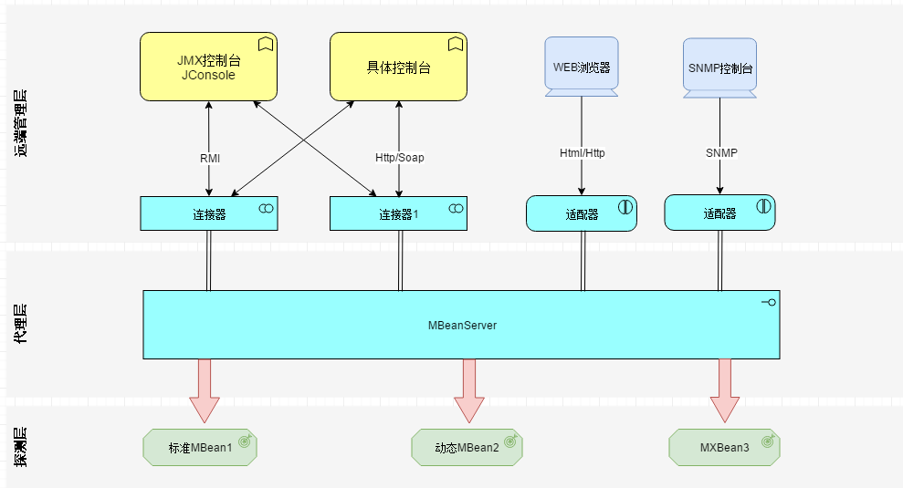

#  JMX及MBean
## JMX定义
JMX(java management extensions)java管理程序扩展，是一个为应用程序、设备、系统等植入管理功能的框架。
## MBean
JMX使用了最简单的一类javaBean，使用有名的MBean，其内部包含了数据信息，这些信息可能是程序配置信息、模块信息、系统信息、统计信息等。MBean可以操作可读可写的属性、直接操作某些函数。
### 定义
通常是一个java类，他提供接口，可以是这个类具有管理功能。例如：Standard Mbean是最简单的MBean，他能管理的资源必须定义在接口中，然后MBean必须实现这个接口，命名必须遵守一定的规范。
```java
MBean interface：
/**1、名字必须以MBean结尾
   2、必须与签名暴漏属性和操作
**/
MBean implement
/**
1、必须有个名字和接口中"MBean"的前缀相同
2、实现接口中的方法
**/
```
动态Mbean必须实现DynamicMBean，所有的属性和方法都在运行时定义。
## MBean Server 
管理MBean的一个java类，需要向MBean Server中注册一个MBean之后，这个MBean才会具有管理功能，MBeanServer还提供了查询和注解监听器的功能，不同的JMX实现中MBean Server实现也不同。
## JMX 代理
代理是为了管理一些列的MBean而提供的一系列服务。代理可以利用protocal adapters（例如HTTP）和connectors使不同的客户端可以访问MBean。
## JMX架构
  
_**说明：**_ 
- _探测层：负责资源的检测，获取信息。_
- _代理层：是JMX的核心，连接这个Mbeans和应用程序。_
- _远端管理层：通过连接器和适配器来远程操作MBeanServer， Applications可以是大家比较熟悉的控制台。_