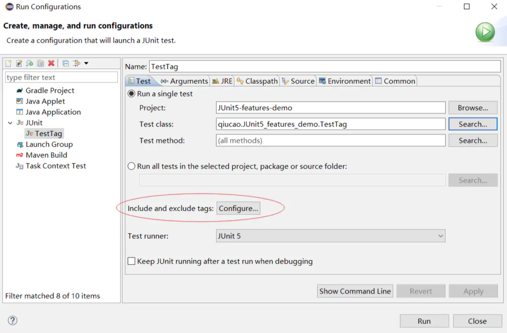
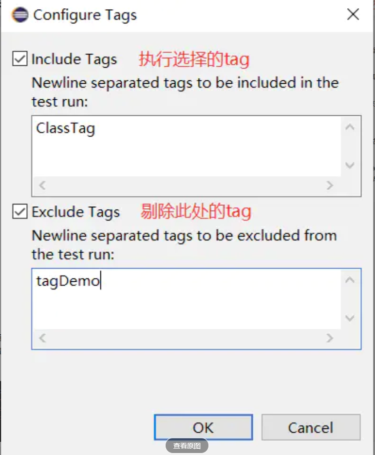
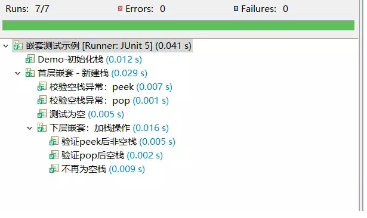
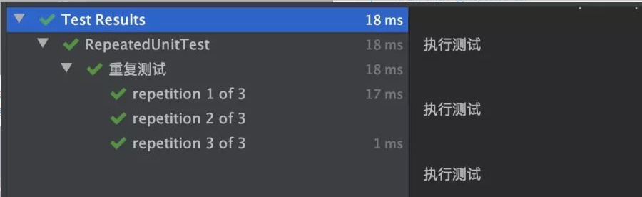
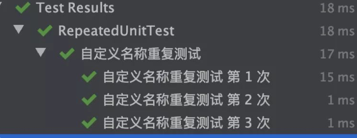

# 1. Junit5新特性
1.  倒入的包不一样的了`@test` 现在的包名是：`org.junit.jupiter.api.Test`
2. 支持排序执行测试方法`@order`
3. 支持测试方法中文名显示`@DisplayName`
4. 支持测试方法带参数方法`@ParameterizedTest`
```java
    @DisplayName("所有门店信息")
    @ParameterizedTest
    @CsvSource({
            "1535355969521"
    })
    void getAllStores(String agentId) {
        Response<List<StoreItemDTO>> response;

        ParameterizedTypeReference<Response<List<StoreItemDTO>>> typeRef
                = new ParameterizedTypeReference<Response<List<StoreItemDTO>>>() {
        };
        String url = "/{agentId}/stores";
        response = this.restTemplate.exchange(baseUrl+url, GET, null, typeRef, agentId).getBody();
        response(response);
        List<StoreItemDTO> data = response.getData();

        assertThat(data.size()).as("门店个数").isEqualTo(6);
    }
```
5. 还有一个方法不名`@SpringBootTest(webEnvironment= RANDOM_PORT)`其中的`RANDOM_PORT`作用不是很明白
6.  @BeforeAll 只执行一次，执行时机是在所有测试和 @BeforeEach 注解方法之前。 
7. @BeforeEach 在每个测试执行之前执行。 
8. @AfterEach 在每个测试执行之后执行。 
9. @AfterAll只执行一次，执行时机是在所有测试和 @AfterEach 注解方法之后。
10. Tag标签分组功能，利用 Tag 标签，用户可以比较方便地根据标注来分类，并在执行时快速根据分类来针对性地运行测试。
-  单标签模式
```java
@Test
@Tag("tagDemo")
void test() {
    fail("Not yet implemented");
}
```
-  多标签模式
```java
@Test
@Tag("test-tag")
@Tag("tagDemo")
void testTag1() {
    assertTrue(true);
}
```  
- 嵌套模式
```java
@Test
@Tags({@Tag("tagDemo"),@Tag("test-tag")})
void testTag3() {
    assertTrue(true);
}
```  
-  默认提供了一个方法参数 TestInfo，可以通过这个参数的 getTags 方法来获取当前测试方法的 Tag
```java
@Test
@Tag("ShowInfo")
void GetTagFromInfo(TestInfo info) {
    System.out.println(info.getTags());
}
```
12. Junit5 也支持直接读取自定义的注解，比如我们自定义一个注解 QiucaoTag，将 @Tag("qiucao") 和 @Test 注解聚合，来简化标注操作。
- 自定义注解代码
```java
import java.lang.annotation.ElementType;
import java.lang.annotation.Retention;
import java.lang.annotation.RetentionPolicy;
import java.lang.annotation.Target;

import org.junit.jupiter.api.Tag;
import org.junit.jupiter.api.Test;

@Target(ElementType.METHOD)
@Retention(RetentionPolicy.RUNTIME)
@Tag("qiucao")
@Test
public @interface QiucaoTag {}
```
- 使用例子
```java
@QiucaoTag
void customTag(TestInfo info) {
    System.out.println(info.getTags());
}
```

13. 如何按Tag执行：通过设置 Tag，在测试执行时便可以根据需要进行筛选，如下图是在 Eclipse 中，运行 Junit 时在 Run Configuration 中的 Tag 筛选配置：


14. 在Maven中配置Tag的运行
```xml
<plugin>
  <artifactId>maven-surefire-plugin</artifactId>
  <version>3.0.0-M3</version>
  <configuration>
            <groups>ClassTag</groups>
            <excludedGroups>tagDemo</excludedGroups>
        </configuration>
</plugin>
```
15. 嵌套测试通过 @Nested 关键字可以实现用例的多层嵌套实现，在嵌套类上添加 @Nested 注解即可。嵌套类也支持基本的生命周期 @BeforeEach @AfterEach，官方示例代码能很清楚地看出所起作用：
``` java
package qiucao.JUnit5_features_demo;

import static org.junit.jupiter.api.Assertions.assertEquals;
import static org.junit.jupiter.api.Assertions.assertFalse;
import static org.junit.jupiter.api.Assertions.assertThrows;
import static org.junit.jupiter.api.Assertions.assertTrue;

import java.util.EmptyStackException;
import java.util.Stack;

import org.junit.jupiter.api.BeforeEach;
import org.junit.jupiter.api.DisplayName;
import org.junit.jupiter.api.Nested;
import org.junit.jupiter.api.Test;

@DisplayName("嵌套测试示例")
class TestNested {

    Stack<Object> stack;

    @Test
    @DisplayName("Demo-初始化栈")
    void isInstantiatedWithNew() {
        new Stack<>();
    }

    @Nested
    @DisplayName("首层嵌套 - 新建栈")
    class WhenNew {

        @BeforeEach
        void createNewStack() {
            stack = new Stack<>();
        }

        @Test
        @DisplayName("测试为空")
        void isEmpty() {
            assertTrue(stack.isEmpty());
        }

        @Test
        @DisplayName("校验空栈异常：pop")
        void throwsExceptionWhenPopped() {
            assertThrows(EmptyStackException.class, stack::pop);
        }

        @Test
        @DisplayName("校验空栈异常：peek")
        void throwsExceptionWhenPeeked() {
            assertThrows(EmptyStackException.class, stack::peek);
        }

        @Nested
        @DisplayName("下层嵌套：加栈操作")
        class AfterPushing {

            String anElement = "an element";

            @BeforeEach
            void pushAnElement() {
                stack.push(anElement);
            }

            @Test
            @DisplayName("不再为空栈")
            void isNotEmpty() {
                assertFalse(stack.isEmpty());
            }

            @Test
            @DisplayName("验证pop后空栈")
            void returnElementWhenPopped() {
                assertEquals(anElement, stack.pop());
                assertTrue(stack.isEmpty());
            }

            @Test
            @DisplayName("验证peek后非空栈")
            void returnElementWhenPeeked() {
                assertEquals(anElement, stack.peek());
                assertFalse(stack.isEmpty());
            }
        }
    }
}
```

效果图



16.  JUnit 5 里新增了对测试方法设置运行次数的支持，允许让测试方法进行重复运行。当要运行一个测试方法 N次时，可以使用 @RepeatedTest 标记它，如下面的代码所示：

```java
@DisplayName("重复测试")
@RepeatedTest(value = 3)
public void i_am_a_repeated_test() {
    System.out.println("执行测试");
}
```

运行后测试方法会执行3次，在 IDEA 的运行效果如下图所示：

漂亮一点的输出
```java
@DisplayName("自定义名称重复测试")
@RepeatedTest(value = 3, name = "{displayName} 第 {currentRepetition} 次")
public void i_am_a_repeated_test_2() {
    System.out.println("执行测试");
}
```
