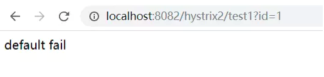
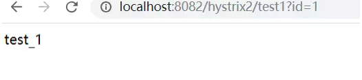

# 1. Hystrix配置
## 1.1. Springboot代码
```java
@Configuration
public class HystrixConfig {

    @Bean
    public HystrixCommandAspect hystrixCommandAspect() {
        return new HystrixCommandAspect();
    }

    /**
     * 向监控中心Dashboard发送stream消息
     */
    @Bean
    public ServletRegistrationBean hystrixMetricsStreamServlet() {
        ServletRegistrationBean registrationBean =
                new ServletRegistrationBean(new HystrixMetricsStreamServlet());
        registrationBean.addUrlMappings("/hystrix.stream");
        return registrationBean;
    }
}
```
### 1.1.1. 配置参数讲解：
```java
// 熔断器在整个统计时间内是否开启的阀值
 @HystrixProperty(name = "circuitBreaker.enabled", value = "true"),
 // 至少有3个请求才进行熔断错误比率计算
 /**
  * 设置在一个滚动窗口中，打开断路器的最少请求数。
  比如：如果值是20，在一个窗口内（比如10秒），收到19个请求，即使这19个请求都失败了，断路器也不会打开。
  */
 @HystrixProperty(name = "circuitBreaker.requestVolumeThreshold", value = "3"),
 //当出错率超过50%后熔断器启动
 @HystrixProperty(name = "circuitBreaker.errorThresholdPercentage", value = "50"),
 // 熔断器工作时间，超过这个时间，先放一个请求进去，成功的话就关闭熔断，失败就再等一段时间
 @HystrixProperty(name = "circuitBreaker.sleepWindowInMilliseconds", value = "5000")
@HystrixProperty(name = "coreSize", value = "30"),
 /**
  * BlockingQueue的最大队列数，当设为-1，会使用SynchronousQueue，值为正时使用LinkedBlcokingQueue。
  */
 @HystrixProperty(name = "maxQueueSize", value = "101"),
 /**
  * 设置存活时间，单位分钟。如果coreSize小于maximumSize，那么该属性控制一个线程从实用完成到被释放的时间.
  */

/**
  我们知道，线程池内核心线程数目都在忙碌，再有新的请求到达时，线程池容量可以被扩充为到最大数量。
等到线程池空闲后，多于核心数量的线程还会被回收，此值指定了线程被回收前的存活时间，默认为 2，即两分钟。
*/
 @HystrixProperty(name = "keepAliveTimeMinutes", value = "2"),
 /**
  * 设置队列拒绝的阈值,即使maxQueueSize还没有达到
  */
 @HystrixProperty(name = "queueSizeRejectionThreshold", value = "15"),

// 滑动统计的桶数量
 /**
  * 设置一个rolling window被划分的数量，若numBuckets＝10，rolling window＝10000，
  *那么一个bucket的时间即1秒。必须符合rolling window % numberBuckets == 0。默认1
  */
 @HystrixProperty(name = "metrics.rollingStats.numBuckets", value = "10"),
 // 设置滑动窗口的统计时间。熔断器使用这个时间
 /** 设置统计的时间窗口值的，毫秒值。
  circuit break 的打开会根据1个rolling window的统计来计算。
  若rolling window被设为10000毫秒，则rolling window会被分成n个buckets，
  每个bucket包含success，failure，timeout，rejection的次数的统计信息。默认10000
  **/
 @HystrixProperty(name = "metrics.rollingStats.timeInMilliseconds", value = "10000")


fallbackMethod：方法执行时熔断、错误、超时时会执行的回退方法，需要保持此方法与 Hystrix 方法的签名和返回值一致。

defaultFallback：默认回退方法，当配置 fallbackMethod 项时此项没有意义，另外，默认回退方法不能有参数，返回值要与 Hystrix方法的返回值相同。
```
### 1.1.2. 服务降级和熔断进行测试
#### 1.1.2.1. 例子1
```java
@RestController
@RequestMapping("/hystrix1")
@DefaultProperties(defaultFallback = "defaultFail")
public class HystrixController1 {

    @HystrixCommand(fallbackMethod = "fail1")
    @GetMapping("/test1")
    public String test1() {
        throw new RuntimeException();
    }

    private String fail1() {
        System.out.println("fail1");
        return "fail1";
    }

    @HystrixCommand(fallbackMethod = "fail2")
    @GetMapping("/test2")
    public String test2() {
        throw new RuntimeException();
    }

    @HystrixCommand(fallbackMethod = "fail3")
    private String fail2() {
        System.out.println("fail2");
        throw new RuntimeException();
    }

    @HystrixCommand
    private String fail3() {
        System.out.println("fail3");
        throw new RuntimeException();
    }

    private String defaultFail() {
        System.out.println("default fail");
        return "default fail";
    }


}
```
当访问http://localhost:8082/hystrix1/test1抛出异常，服务降级返回fail1。
当访问http://localhost:8082/hystrix1/test2抛出异常，服务不断降级返回default fail。
#### 1.1.2.2. 例子2
```java
@RestController
@RequestMapping("/hystrix2")
@DefaultProperties(defaultFallback = "defaultFail")
public class HystrixController2 {

    @HystrixCommand(commandProperties =
            {
                    // 熔断器在整个统计时间内是否开启的阀值
                    @HystrixProperty(name = "circuitBreaker.enabled", value = "true"),
                    // 至少有3个请求才进行熔断错误比率计算
                    /**
                     * 设置在一个滚动窗口中，打开断路器的最少请求数。
                     比如：如果值是20，在一个窗口内（比如10秒），收到19个请求，即使这19个请求都失败了，断路器也不会打开。
                     */
                    @HystrixProperty(name = "circuitBreaker.requestVolumeThreshold", value = "3"),
                    //当出错率超过50%后熔断器启动
                    @HystrixProperty(name = "circuitBreaker.errorThresholdPercentage", value = "50"),
                    // 熔断器工作时间，超过这个时间，先放一个请求进去，成功的话就关闭熔断，失败就再等一段时间
                    @HystrixProperty(name = "circuitBreaker.sleepWindowInMilliseconds", value = "5000"),
                    // 统计滚动的时间窗口
                    @HystrixProperty(name = "metrics.rollingStats.timeInMilliseconds", value = "10000")
            })
    @GetMapping("/test1")
    public String test1(@RequestParam("id") Integer id) {
        System.out.println("id:" + id);

        if (id % 2 == 0) {
            throw new RuntimeException();
        }
        return "test_" + id;
    }

    private String defaultFail() {
        System.out.println("default fail");
        return "default fail";
    }
}
```
当访问1次http://localhost:8082/hystrix2/test1?id=1和2次http://localhost:8082/hystrix2/test1?id=2，错误率达66%超过了设置的50%。服务进入熔断。
下次请求http://localhost:8082/hystrix2/test1?id=2会进入熔断策略，返回default fail

如果在5s之后，下一次请求成功，会关闭熔断，服务恢复。


#### 1.1.2.3. 例子3
```java
@RestController
@RequestMapping("/hystrix3")
@DefaultProperties(defaultFallback = "defaultFail")
public class HystrixController3 {

    @HystrixCommand(commandProperties = {
            @HystrixProperty(name = "execution.isolation.thread.timeoutInMilliseconds", value = "500")
    })
    @GetMapping("/test1")
    public String test1() throws InterruptedException {
        TimeUnit.MILLISECONDS.sleep(1000);
        return "test1";
    }

    @HystrixCommand(commandProperties = {
            @HystrixProperty(name = "execution.isolation.thread.timeoutInMilliseconds", value = "1500"),
            // 滑动统计的桶数量
            /**
             * 设置一个rolling window被划分的数量，若numBuckets＝10，rolling window＝10000，
             *那么一个bucket的时间即1秒。必须符合rolling window % numberBuckets == 0。默认1
             */
            @HystrixProperty(name = "metrics.rollingStats.numBuckets", value = "10"),
            // 设置滑动窗口的统计时间。熔断器使用这个时间
            /** 设置统计的时间窗口值的，毫秒值。
             circuit break 的打开会根据1个rolling window的统计来计算。
             若rolling window被设为10000毫秒，则rolling window会被分成n个buckets，
             每个bucket包含success，failure，timeout，rejection的次数的统计信息。默认10000
             **/
            @HystrixProperty(name = "metrics.rollingStats.timeInMilliseconds", value = "10000")},
            threadPoolProperties = {
                    @HystrixProperty(name = "coreSize", value = "15"),
                    /**
                     * BlockingQueue的最大队列数，当设为-1，会使用SynchronousQueue，值为正时使用LinkedBlcokingQueue。
                     */
                    @HystrixProperty(name = "maxQueueSize", value = "15"),
                    /**
                     * 设置存活时间，单位分钟。如果coreSize小于maximumSize，那么该属性控制一个线程从实用完成到被释放的时间.
                     */
                    @HystrixProperty(name = "keepAliveTimeMinutes", value = "2"),
                    /**
                     * 设置队列拒绝的阈值,即使maxQueueSize还没有达到
                     */
                    @HystrixProperty(name = "queueSizeRejectionThreshold", value = "15"),
                    @HystrixProperty(name = "metrics.rollingStats.numBuckets", value = "10"),
                    @HystrixProperty(name = "metrics.rollingStats.timeInMilliseconds", value = "10000")
            })
    @GetMapping("/test2")
    public String test2() throws InterruptedException {
        TimeUnit.MILLISECONDS.sleep(1000);
        return "test2";
    }

    private String defaultFail() {
        System.out.println("default fail");
        return "default fail";
    }
}

```