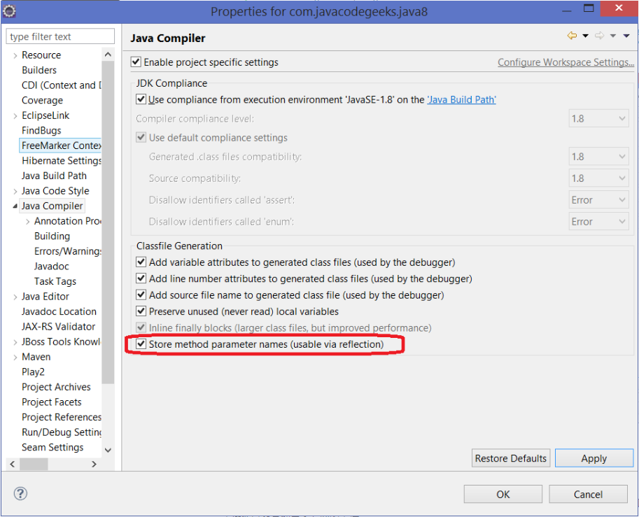

# 1. java8的新特性
java8的新特性包括:接口的默认方法、Lambda表达式、函数式接口、Lambda作用域、访问局部变量、访问对象字段与静态变量、访问接口的默认方法、Date API、Annotation注解。以下分别说明如下：
## 1.1. 接口的默认方法
在接口中新增了default方法和static方法，这两种方法可以有方法体 
### 1.1.1. static方法 
示例代码：
```java
public interface DefalutTest {
    static int a =5;
    default void defaultMethod(){
        System.out.println("DefalutTest defalut 方法");
    }
    int sub(int a,int b);
    static void staticMethod() {
        System.out.println("DefalutTest static 方法");
    }
}
```
接口里的静态方法，即static修饰的有方法体的方法不会被继承或者实现，但是静态变量会被继承 
例如：我们添加一个接口DefalutTest的实现类DefaultTestImpl
```java
public class DefaultTestImpl implements DefalutTest{
    @Override
    public int sub(int a, int b) {
        // TODO Auto-generated method stub
        return a-b;
    }
}
```
如下图所示是这个实现类中所有可调用的方法： 

在这些方法里面我们无法找到staticMethod方法，则说明接口中的static方法不能被它的实现类直接使用。但是我们看到了defaultMethod，说明实现类可以直接调用接口中的default方法； 
那么如何使用接口中的static方法呢？？？ 
接口.static方法调用，如：DefalutTest.staticMethod();
```java
public static void main(String[] args) {
    DefaultTestImpl dtl = new DefaultTestImpl();
    DefalutTest.staticMethod();
}
```
当我们试图使用接口的子接口去调用父接口的static方法是，我们发现，无法调用，找不到方法： 

>结论：接口中的static方法不能被继承，也不能被实现类调用，只能被自身调用
### 1.1.2. default方法
准备一个子接口继承DefalutTest接口
```java
public interface SubTest extends DefalutTest{
}
```
准备一个子接口的实现类
```java
public class SubTestImp implements SubTest{
    @Override
    public int sub(int a, int b) {
        // TODO Auto-generated method stub
        return a-b;
    }
}
```
现在我们创建一个子接口实现类对象，并调用对象中的default方法：
```java
public class Main {
    public static void main(String[] args) {
        SubTestImp stl = new SubTestImp();
        stl.defaultMethod();
    }
}
```
执行结果： 
```md
> DefalutTest defalut 方法
```
> 结论1：default方法可以被子接口继承亦可被其实现类所调用 

现在我们在子接口中重写default方法，在进行调用：
```java
public interface SubTest extends DefalutTest{
    default void defaultMethod(){
        System.out.println("SubTest defalut 方法");
    }
}
```
```md
> 执行结果：SubTest defalut 方法
```
>结论2：default方法被继承时，可以被子接口覆写
现在，我们去除接口间的继承关系，并使得SubTestImp同时实现父接口和子接口，我们知道此时父接口和子接口中存在同名同参数的default方法，这会怎么样？ 
如下图所示，实现类报错，实现类要求必须指定他要实现那个接口中的default方法 

>结论3：如果一个类实现了多个接口，且这些接口中无继承关系，这些接口中若有相同的（同名，同参数）的default方法，则接口实现类会报错，接口实现类必须通过特殊语法指定该实现类要实现那个接口的default方法 

特殊语法：`<接口>.super.<方法名>([参数]) `
示例代码：
```java
public class SubTestImp implements SubTest,DefalutTest{
    @Override
    public int sub(int a, int b) {
        // TODO Auto-generated method stub
        return a-b;
    }
    @Override
    public void defaultMethod() {
        // TODO Auto-generated method stub
        DefalutTest.super.defaultMethod();
    }
}
```
使用示例：
```java
//接口代码
interface Formula {
    double calculate(int a);
    default double sqrt(int a) {
        return Math.sqrt(a);
    }
}
//实现
Formula formula = new Formula() {
    @Override
    public double calculate(int a) {
        return sqrt(a * 100);
    }
};
formula.calculate(100);     // 100.0
formula.sqrt(16);           // 4.0
```
## 1.2. Lambda表达式
Lambda表达式可以看成是匿名内部类，使用Lambda表达式时，接口必须是函数式接口
### 1.2.1. 接口实现Lamabda方法
#### 1.2.1.1. 基本语法：
```lambda
<函数式接口>  <变量名> = (参数1，参数2...) -> {
        //方法体
}
```
#### 1.2.1.2. 说明
(参数1，参数2…)表示参数列表；->表示连接符；{}内部是方法体  
1. =右边的类型会根据左边的函数式接口类型自动推断； 
2. 如果形参列表为空，只需保留()； 
3. 如果形参只有1个，()可以省略，只需要参数的名称即可； 
4. 如果执行语句只有1句，且无返回值，{}可以省略，若有返回值，则若想省去{}，则必须同时省略return，且执行语句也保证只有1句； 
5. 形参列表的数据类型会自动推断； 
6. lambda不会生成一个单独的内部类文件； 
7. lambda表达式若访问了局部变量，则局部变量必须是final的，若是局部变量没有加final关键字，系统会自动添加，此后在修改该局部变量，会报错；  
#### 1.2.1.3. 示例代码：
```java
public interface LambdaTest {
    abstract void print();
}
public interface LambdaTest2 {
    abstract void print(String a);
}
public interface DefalutTest {
    static int a =5;
    default void defaultMethod(){
        System.out.println("DefalutTest defalut 方法");
    }
    int sub(int a,int b);
    static void staticMethod() {
        System.out.println("DefalutTest static 方法");
    }
}

public class Main {
    public static void main(String[] args) {
        //匿名内部类--java8之前的实现方式
        DefalutTest dt = new DefalutTest(){
            @Override
            public int sub(int a, int b) {
                // TODO Auto-generated method stub
                return a-b;
            }
        };
        //lambda表达式--实现方式1
        DefalutTest dt2 =(a,b)->{
            return a-b;
        };
        System.out.println(dt2.sub(2, 1));
        //lambda表达式--实现方式2，省略花括号
        DefalutTest dt3 =(a,b)->a-b;
        System.out.println(dt3.sub(5, 6));
        //测试final
        int c = 5;
        DefalutTest dt4 =(a,b)->a-c;
        System.out.println(dt4.sub(5, 6));
        //无参方法，并且执行语句只有1条
        LambdaTest lt = ()-> System.out.println("测试无参");
        lt.print();
        //只有一个参数方法
        LambdaTest2 lt1 = s-> System.out.println(s);
        lt1.print("有一个参数");
    }
}
```
局部变量修改报错如图： 

若是强行修改也无法编译通过

### 1.2.2. 引用实例Lamabda方法： 
#### 1.2.2.1. 基本语法：
```lambda
<函数式接口>  <变量名> = <实例>::<实例方法名>
//调用
<变量名>.接口方法([实际参数...])
```
将调用方法时的传递的实际参数，全部传递给引用的方法，执行引用的方法； 
#### 1.2.2.2. 示例代码
如我们引用PrintStream类中的println方法。我们知道System类中有一个PrintStream的实例为out，引用该实例方法：System.out::println：
```java
public class Main {
    public static void main(String[] args) {
        LambdaTest2 lt1 = s-> System.out.println(s);
        lt1.print("有一个参数");
        //改写为：
        LambdaTest2 lt2 = System.out::println;
        lt2.print("实例引用方式调用");
    }
}
```
将lt2调用时的实际参数传递给了PrintStream类中的println方法，并调用该方法
### 1.2.3. 引用类Lamabda方法
#### 1.2.3.1. 基本语法
```lamabda
<函数式接口>  <变量名> = <类>::<类方法名称>
//调用
<变量名>.接口方法([实际参数...])
```
将调用方法时的传递的实际参数，全部传递给引用的方法，执行引用的方法； 
#### 1.2.3.2. 示例代码
我们可以以数组排序方式为例
```java
public interface LambdaTest3 {
    abstract void sort(int[] args);
}
public class Main {
    public static void main(String[] args) {
        List<Integer>  list = new ArrayList<Integer>();
        list.add(50);
        list.add(18);
        list.add(6);
        list.add(99);
        list.add(32);
        System.out.println(list.toString()+"排序之前");
        LambdaTest3 lt3 = Collections::sort;
        lt3.sort(list, (a,b) -> {
            return a-b;
        });
        System.out.println(list.toString()+"排序之后");
    }
}
```
执行结果： 
```md
> [50, 18, 6, 99, 32]排序之前 
> [6, 18, 32, 50, 99]排序之后
```
再来看Comparator接口，它属于函数式接口，所以我们在Comparator入参时，也采取了lambda表达式写法。
```java
@FunctionalInterface
public interface Comparator<T> {
...
...
...
}
```
### 1.2.4. 引用类的实例Lamabda方法 
定义、调用接口时，需要多传递一个参数，并且参数的类型与引用实例的类型一致 
#### 1.2.4.1. 基本语法
```java
    //定义接口
    interface <函数式接口>{
        <返回值> <方法名>(<类><类名称>,[其他参数...]); 
    }
    <函数式接口>  <变量名> = <类>::<类实例方法名>
    //调用
    <变量名>.接口方法(类的实例,[实际参数...])
```
将调用方法时的传递的实际参数，从第二个参数开始（第一个参数指定的类的实例），全部传递给引用的方法，执行引用的方法； 
#### 1.2.4.2. 示例代码
```java
public class LambdaClassTest {
    public int add(int a, int b){
        System.out.println("LambdaClassTest类的add方法");
        return a+b;
    }
}
public interface LambdaTest4 {
    abstract int add(LambdaClassTest lt,int a,int b);
}
public class Main {
    public static void main(String[] args) {
        LambdaTest4 lt4 = LambdaClassTest::add;
        LambdaClassTest lct = new LambdaClassTest();
        System.out.println(lt4.add(lct, 5, 8));
    }
}
```
### 1.2.5. 引用构造器Lamabda方法： 
#### 1.2.5.1. 基本语法
```java
<函数式接口>  <变量名> = <类>::<new>
//调用
<变量名>.接口方法([实际参数...])
```
把方法的所有参数全部传递给引用的构造器，根据参数类型自动推断调用的构造器方法； 
#### 1.2.5.2. 示例代码：
```java
public interface LambdaTest5 {
    abstract String creatString(char[] c);
}
public class Main {
    public static void main(String[] args) {
        LambdaTest5 lt5 = String::new;
        System.out.println(lt5.creatString(new char[]{'1','2','3','a'}));
    }
}
```
根据传入的参数类型，自动匹配构造函数
## 1.3. 函数式接口
如果一个接口只有一个抽象方法，则该接口称之为函数式接口，因为默认方法不算抽象方法，所以你也可以给你的函数式接口添加默认方法。函数式接口可以使用Lambda表达式，lambda表达式会被匹配到这个抽象方法上我们可以将lambda表达式当作任意只包含一个抽象方法的接口类型，确保你的接口一定达到这个要求，你只需要给你的接口添加 `@FunctionalInterface`注解，编译器如果发现你标注了这个注解的接口有多于一个抽象方法的时候会报错的 
### 1.3.1. 示例代码
```java
@FunctionalInterface
interface Converter<F, T> {
    T convert(F from);
}
Converter<String, Integer> converter = (from) -> Integer.valueOf(from);
Integer converted = converter.convert("123");
System.out.println(converted);    // 123
```
## 1.4. Lambda作用域
在lambda表达式中访问外层作用域和老版本的匿名对象中的方式很相似。你可以直接访问标记了`final`的外层局部变量，或者实例的字段以及静态变量。
## 1.5. 访问局部变量
我们可以直接在lambda表达式中访问外层的局部变量，但是该局部变量必须是`final`的，即使没有加`final`关键字，之后我们无论在哪（lambda表达式内部或外部）修改该变量，均报错。
## 1.6. 重复注解
自从Java 5引入了注解机制，这一特性就变得非常流行并且广为使用。然而，使用注解的一个限制是相同的注解在同一位置只能声明一次，不能声明多次。Java 8打破了这条规则，引入了重复注解机制，这样相同的注解可以在同一地方声明多次。重复注解机制本身必须用`@Repeatable`注解。事实上，这并不是语言层面上的改变，更多的是编译器的技巧，底层的原理保持不变。让我们看一个快速入门的例子：
```java
package com.javacodegeeks.java8.repeatable.annotations;
 
import java.lang.annotation.ElementType;
import java.lang.annotation.Repeatable;
import java.lang.annotation.Retention;
import java.lang.annotation.RetentionPolicy;
import java.lang.annotation.Target;
 
public class RepeatingAnnotations {
    @Target( ElementType.TYPE )
    @Retention( RetentionPolicy.RUNTIME )
    public @interface Filters {
        Filter[] value();
    }
     
    @Target( ElementType.TYPE )
    @Retention( RetentionPolicy.RUNTIME )
    @Repeatable( Filters.class )
    public @interface Filter {
        String value();
    };
     
    @Filter( "filter1" )
    @Filter( "filter2" )
    public interface Filterable {        
    }
     
    public static void main(String[] args) {
        for( Filter filter: Filterable.class.getAnnotationsByType( Filter.class ) ) {
            System.out.println( filter.value() );
        }
    }
}
```

正如我们看到的，这里有个使用`@Repeatable( Filters.class)`注解的注解类`Filter`，`Filters`仅仅是`Filter`注解的数组，但Java编译器并不想让程序员意识到`Filters`的存在。这样，接口`Filterable`就拥有了两次`Filter`（并没有提到`Filter`）注解。同时，反射相关的API提供了新的函数`getAnnotationsByType()`来返回重复注解的类型（请注意`Filterable.class.getAnnotation(Filters.class)`经编译器处理后将会返回Filters的实例）。  
程序输出结果如下：
```md
> filter1
> filter2
```
## 1.7. 更好的类型推测机制
Java 8在类型推测方面有了很大的提高。在很多情况下，编译器可以推测出确定的参数类型，这样就能使代码更整洁。让我们看一个例子：
```java
package com.javacodegeeks.java8.type.inference;
 
public class Value< T > {
    public static< T > T defaultValue() { 
        return null; 
    }
     
    public T getOrDefault( T value, T defaultValue ) {
        return ( value != null ) ? value : defaultValue;
    }
}
```
这里是Value< String >类型的用法。
```java
package com.javacodegeeks.java8.type.inference;
 
public class TypeInference {
    public static void main(String[] args) {
        final Value< String > value = new Value<>();
        value.getOrDefault( "22", Value.defaultValue() );
    }
}
```
Value.defaultValue()的参数类型可以被推测出，所以就不必明确给出。在Java 7中，相同的例子将不会通过编译，正确的书写方式是 Value.<String>defaultValue()。

## 1.8. Java编译器的新特性
很长一段时间里，Java程序员一直在发明不同的方式使得方法参数的名字能保留在Java字节码中，并且能够在运行时获取它们（比如，Paranamer类库）。最终，在Java 8中把这个强烈要求的功能添加到语言层面（通过反射API与Parameter.getName()方法）与字节码文件（通过新版的javac的–parameters选项）中。
```java
package com.javacodegeeks.java8.parameter.names;
 
import java.lang.reflect.Method;
import java.lang.reflect.Parameter;
 
public class ParameterNames {
    public static void main(String[] args) throws Exception {
        Method method = ParameterNames.class.getMethod( "main", String[].class );
        for( final Parameter parameter: method.getParameters() ) {
            System.out.println( "Parameter: " + parameter.getName() );
        }
    }
}
```
如果不使用–parameters参数来编译这个类，然后运行这个类，会得到下面的输出：
```md
> Parameter: arg0
```
如果使用–parameters参数来编译这个类，程序的结构会有所不同（参数的真实名字将会显示出来）：
```md
> Parameter: args
```
对于有经验的Maven用户，通过maven-compiler-plugin的配置可以将-parameters参数添加到编译器中去。
```xml
<plugin>
    <groupId>org.apache.maven.plugins</groupId>
    <artifactId>maven-compiler-plugin</artifactId>
    <version>3.1</version>
    <configuration>
        <compilerArgument>-parameters</compilerArgument>
        <source>1.8</source>
        <target>1.8</target>
    </configuration>
</plugin>
```
针对Java 8最新发布的Eclipse Kepler SR2（请检查这里的下载说明）提供了非常实用的配置选项，可以通过下图的配置方式来控制编译器行为


此外，Parameter类有一个很方便的方法isNamePresent()来验证是否可以获取参数的名字。

## 1.9. Java类库新特性
Java 8 通过增加大量新类，扩展已有类的功能的方式来改善对并发编程、函数式编程、日期/时间相关操作以及其他更多方面的支持。
### 1.9.1. Optional空指针判断类
到目前为止，臭名昭著的空指针异常是导致Java应用程序失败的最常见原因。以前，为了解决空指针异常，Google公司著名的Guava项目引入了Optional类，Guava通过使用检查空值的方式来防止代码污染，它鼓励程序员写更干净的代码。受到Google Guava的启发，Optional类已经成为Java 8类库的一部分。Optional实际上是个容器：它可以保存类型T的值，或者仅仅保存null。Optional提供很多有用的方法，这样我们就不用显式进行空值检测。更多详情请参考官方文档。
我们下面用两个小例子来演示如何使用Optional类：一个允许为空值，一个不允许为空值。
```java
Optional< String > fullName = Optional.ofNullable( null );
System.out.println( "Full Name is set? " + fullName.isPresent() );        
System.out.println( "Full Name: " + fullName.orElseGet( () -> "[none]" ) ); 
System.out.println( fullName.map( s -> "Hey " + s + "!" ).orElse( "Hey Stranger!" ) );
```
下面是程序的输出：
```md
> First Name is set? true
> First Name: Tom
> Hey Tom!
```
另举例子如下
```java
public static String getUserNameByOptional(User user) {
    Optional<String> userName = Optional.ofNullable(user).map(User::getName);
    return userName.orElse(null);
}
```
说明：当user为null的时候我们设置UserName的值为null，否则返回getName的返回值，但此时不会抛出空指针
#### 1.9.1.1. 创建Optional对象
你可以通过静态工厂方法Optional.empty，创建一个空的Optional对象：
```java
Optional<User> emptyUser = Optional.empty();
```
创建一个非空值的Optional
```java
Optional<User> userOptional = Optional.of(user);
```
如果user是一个null，这段代码会立即抛出一个NullPointerException，而不是等到你试图访问user的属性值时才返回一个错误。
可接受null的Optional
```java
Optional<User> ofNullOptional = Optional.ofNullable(user);
```
使用静态工厂方法Optional.ofNullable，你可以创建一个允许null值的Optional对象。如果user是null，那么得到的Optional对象就是个空对象，但不会让你导致空指针。使用map从Optional对象中提取和转换值
```java
Optional<User> ofNullOptional = Optional.ofNullable(user);
Optional<String> userName = ofNullOptional.map(User::getName);
```
这种操作就像我们之前在操作Stream是一样的，获取的只是User中的一个属性。


### 1.9.2. Stream函数式编程风格
最新添加的Stream API（`java.util.stream`） 把真正的函数式编程风格引入到Java中。这是目前为止对Java类库最好的补充，因为Stream API可以极大提供Java程序员的生产力，让程序员写出高效率、干净、简洁的代码。Stream API极大简化了集合框架的处理（但它的处理的范围不仅仅限于集合框架的处理，这点后面我们会看到）。让我们以一个简单的Task类为例进行介绍：
```java
public class Streams  {
    private enum Status {
        OPEN, CLOSED
    };
     
    private static final class Task {
        private final Status status;
        private final Integer points;
 
        Task( final Status status, final Integer points ) {
            this.status = status;
            this.points = points;
        }
         
        public Integer getPoints() {
            return points;
        }
         
        public Status getStatus() {
            return status;
        }
         
        @Override
        public String toString() {
            return String.format( "[%s, %d]", status, points );
        }
    }
}
```

Task类有一个分数的概念（或者说是伪复杂度），其次是还有一个值可以为OPEN或CLOSED的状态.让我们引入一个Task的小集合作为演示例子：
```java
final Collection< Task > tasks = Arrays.asList(
    new Task( Status.OPEN, 5 ),
    new Task( Status.OPEN, 13 ),
    new Task( Status.CLOSED, 8 ) 
);
```
我们下面要讨论的第一个问题是所有状态为OPEN的任务一共有多少分数？在Java 8以前，一般的解决方式用foreach循环，但是在Java 8里面我们可以使用stream：一串支持连续、并行聚集操作的元素。
```java
// Calculate total points of all active tasks using sum()
final long totalPointsOfOpenTasks = tasks
    .stream()
    .filter( task -> task.getStatus() == Status.OPEN )
    .mapToInt( Task::getPoints )
    .sum();
         
System.out.println( "Total points: " + totalPointsOfOpenTasks );
```

程序在控制台上的输出如下：
```md
> Total points: 18
```
这里有几个注意事项。第一，task集合被转换化为其相应的stream表示。然后，filter操作过滤掉状态为CLOSED的task。下一步，mapToInt操作通过Task::getPoints这种方式调用每个task实例的getPoints方法把Task的stream转化为Integer的stream。最后，用sum函数把所有的分数加起来，得到最终的结果。在继续讲解下面的例子之前，关于stream有一些需要注意的地方（详情在这里）.stream操作被分成了中间操作与最终操作这两种。中间操作返回一个新的stream对象。中间操作总是采用惰性求值方式，运行一个像filter这样的中间操作实际上没有进行任何过滤，相反它在遍历元素时会产生了一个新的stream对象，这个新的stream对象包含原始stream中符合给定谓词的所有元素。像forEach、sum这样的最终操作可能直接遍历stream，产生一个结果或副作用。当最终操作执行结束之后，stream管道被认为已经被消耗了，没有可能再被使用了。在大多数情况下，最终操作都是采用及早求值方式，及早完成底层数据源的遍历。stream另一个有价值的地方是能够原生支持并行处理。让我们来看看这个算task分数和的例子。
```java
// Calculate total points of all tasks
final double totalPoints = tasks
   .stream()
   .parallel()
   .map( task -> task.getPoints() ) // or map( Task::getPoints ) 
   .reduce( 0, Integer::sum );
     
System.out.println( "Total points (all tasks): " + totalPoints );
```

这个例子和第一个例子很相似，但这个例子的不同之处在于这个程序是并行运行的，其次使用reduce方法来算最终的结果。下面是这个例子在控制台的输出：
```md
> Total points (all tasks): 26.0
```
经常会有这个一个需求：我们需要按照某种准则来对集合中的元素进行分组。Stream也可以处理这样的需求，下面是一个例子：
```java
// Group tasks by their status
final Map< Status, List< Task > > map = tasks
    .stream()
    .collect( Collectors.groupingBy( Task::getStatus ) );
System.out.println( map );
```
这个例子的控制台输出如下：
```md
> {CLOSED=[[CLOSED, 8]], OPEN=[[OPEN, 5], [OPEN, 13]]}
```
让我们来计算整个集合中每个task分数（或权重）的平均值来结束task的例子。
```java
// Calculate the weight of each tasks (as percent of total points) 
final Collection< String > result = tasks
    .stream()                                        // Stream< String >
    .mapToInt( Task::getPoints )                     // IntStream
    .asLongStream()                                  // LongStream
    .mapToDouble( points -> points / totalPoints )   // DoubleStream
    .boxed()                                         // Stream< Double >
    .mapToLong( weigth -> ( long )( weigth * 100 ) ) // LongStream
    .mapToObj( percentage -> percentage + "%" )      // Stream< String> 
    .collect( Collectors.toList() );                 // List< String > 
         
System.out.println( result );
```

下面是这个例子的控制台输出：
```md
> [19%, 50%, 30%]
```

最后，就像前面提到的，Stream API不仅仅处理Java集合框架。像从文本文件中逐行读取数据这样典型的I/O操作也很适合用Stream API来处理。下面用一个例子来应证这一点。
```java
final Path path = new File( filename ).toPath();
try( Stream< String > lines = Files.lines( path, StandardCharsets.UTF_8 ) ) {
    lines.onClose( () -> System.out.println("Done!") ).forEach( System.out::println );
}
```
对一个stream对象调用onClose方法会返回一个在原有功能基础上新增了关闭功能的stream对象，当对stream对象调用close()方法时，与关闭相关的处理器就会执行。Stream API、Lambda表达式与方法引用在接口默认方法与静态方法的配合下是Java 8对现代软件开发范式的回应。更多详情请参考官方文档。
## 1.10. Date/Time API (JSR 310)
Java 8通过发布新的Date-Time API (JSR 310)来进一步加强对日期与时间的处理。对日期与时间的操作一直是Java程序员最痛苦的地方之一。标准的 java.util.Date以及后来的java.util.Calendar一点没有改善这种情况（可以这么说，它们一定程度上更加复杂）。这种情况直接导致了Joda-Time——一个可替换标准日期/时间处理且功能非常强大的Java API的诞生。Java 8新的Date-Time API (JSR 310)在很大程度上受到Joda-Time的影响，并且吸取了其精髓。新的java.time包涵盖了所有处理日期，时间，日期/时间，时区，时刻（instants），过程（during）与时钟（clock）的操作。在设计新版API时，十分注重与旧版API的兼容性：不允许有任何的改变（从java.util.Calendar中得到的深刻教训）。如果需要修改，会返回这个类的一个新实例。让我们用例子来看一下新版API主要类的使用方法。第一个是Clock类，它通过指定一个时区，然后就可以获取到当前的时刻，日期与时间。Clock可以替换System.currentTimeMillis()与TimeZone.getDefault()。
```java
// Get the system clock as UTC offset 
final Clock clock = Clock.systemUTC();
System.out.println( clock.instant() );
System.out.println( clock.millis() );
```
下面是程序在控制台上的输出：
```md
> 2014-04-12T15:19:29.282Z
> 1397315969360
```
我们需要关注的其他类是LocaleDate与LocalTime。LocaleDate只持有ISO-8601格式且无时区信息的日期部分。相应的，LocaleTime只持有ISO-8601格式且无时区信息的时间部分。LocaleDate与LocalTime都可以从Clock中得到。
```java
// Get the local date and local time
final LocalDate date = LocalDate.now();
final LocalDate dateFromClock = LocalDate.now( clock );
         
System.out.println( date );
System.out.println( dateFromClock );
         
// Get the local date and local time
final LocalTime time = LocalTime.now();
final LocalTime timeFromClock = LocalTime.now( clock );
         
System.out.println( time );
System.out.println( timeFromClock );
```

下面是程序在控制台上的输出：
```md
> 2014-04-12
> 2014-04-12
> 11:25:54.568
> 15:25:54.568
```

LocaleDateTime把LocaleDate与LocaleTime的功能合并起来，它持有的是ISO-8601格式无时区信息的日期与时间。下面是一个快速入门的例子。
```java
// Get the local date/time
final LocalDateTime datetime = LocalDateTime.now();
final LocalDateTime datetimeFromClock = LocalDateTime.now( clock );
         
System.out.println( datetime );
System.out.println( datetimeFromClock );
```
下面是程序在控制台上的输出：

```md
> 2014-04-12T11:37:52.309
> 2014-04-12T15:37:52.309
```
如果你需要特定时区的日期/时间，那么ZonedDateTime是你的选择。它持有ISO-8601格式具具有时区信息的日期与时间。下面是一些不同时区的例子：
```java
// Get the zoned date/time
final ZonedDateTime zonedDatetime = ZonedDateTime.now();
final ZonedDateTime zonedDatetimeFromClock = ZonedDateTime.now( clock );
final ZonedDateTime zonedDatetimeFromZone = ZonedDateTime.now( ZoneId.of( "America/Los_Angeles" ) );
         
System.out.println( zonedDatetime );
System.out.println( zonedDatetimeFromClock );
System.out.println( zonedDatetimeFromZone );
```
下面是程序在控制台上的输出：

```md
> 2014-04-12T11:47:01.017-04:00[America/New_York]
> 2014-04-12T15:47:01.017Z
> 2014-04-12T08:47:01.017-07:00[America/Los_Angeles]
```
最后，让我们看一下Duration类：在秒与纳秒级别上的一段时间。Duration使计算两个日期间的不同变的十分简单。下面让我们看一个这方面的例子。
```java
// Get duration between two dates
final LocalDateTime from = LocalDateTime.of( 2014, Month.APRIL, 16, 0, 0, 0 );
final LocalDateTime to = LocalDateTime.of( 2015, Month.APRIL, 16, 23, 59, 59 );
 
final Duration duration = Duration.between( from, to );
System.out.println( "Duration in days: " + duration.toDays() );
System.out.println( "Duration in hours: " + duration.toHours() );
```

上面的例子计算了两个日期2014年4月16号与2014年4月16号之间的过程。下面是程序在控制台上的输出：
```md
> Duration in days: 365
> Duration in hours: 8783
```
对Java 8在日期/时间API的改进整体印象是非常非常好的。一部分原因是因为它建立在“久战杀场”的Joda-Time基础上，另一方面是因为用来大量的时间来设计它，并且这次程序员的声音得到了认可。更多详情请参考官方文档。

## 1.11. JavaScript引擎Nashorn
Nashorn，一个新的JavaScript引擎随着Java 8一起公诸于世，它允许在JVM上开发运行某些JavaScript应用。Nashorn就是javax.script.ScriptEngine的另一种实现，并且它们俩遵循相同的规则，允许Java与JavaScript相互调用。下面看一个例子：
```java
ScriptEngineManager manager = new ScriptEngineManager();
ScriptEngine engine = manager.getEngineByName( "JavaScript" );
         
System.out.println( engine.getClass().getName() );
System.out.println( "Result:" + engine.eval( "function f() { return 1; }; f() + 1;" ) );
```
下面是程序在控制台上的输出：

```md
> jdk.nashorn.api.scripting.NashornScriptEngine
> Result: 2
```
我们在后面的Java新工具章节会再次谈到Nashorn。
## 1.12. Base64
在Java 8中，Base64编码已经成为Java类库的标准。它的使用十分简单，下面让我们看一个例子：
```java
package com.javacodegeeks.java8.base64;
 
import java.nio.charset.StandardCharsets;
import java.util.Base64;
 
public class Base64s {
    public static void main(String[] args) {
        final String text = "Base64 finally in Java 8!";
         
        final String encoded = Base64
            .getEncoder()
            .encodeToString( text.getBytes( StandardCharsets.UTF_8 ) );
        System.out.println( encoded );
         
        final String decoded = new String( 
            Base64.getDecoder().decode( encoded ),
            StandardCharsets.UTF_8 );
        System.out.println( decoded );
    }
}
```

程序在控制台上输出了编码后的字符与解码后的字符：
```md
> QmFzZTY0IGZpbmFsbHkgaW4gSmF2YSA4IQ==
> Base64 finally in Java 8!
```
Base64类同时还提供了对URL、MIME友好的编码器与解码器（Base64.getUrlEncoder() / Base64.getUrlDecoder(), Base64.getMimeEncoder() / Base64.getMimeDecoder()）。
## 1.13. 并行（parallel）数组
Java 8增加了大量的新方法来对数组进行并行处理。可以说，最重要的是parallelSort()方法，因为它可以在多核机器上极大提高数组排序的速度。下面的例子展示了新方法（parallelXxx）的使用。
```java
package com.javacodegeeks.java8.parallel.arrays;
 
import java.util.Arrays;
import java.util.concurrent.ThreadLocalRandom;
 
public class ParallelArrays {
    public static void main( String[] args ) {
        long[] arrayOfLong = new long [ 20000 ];        
         
        Arrays.parallelSetAll( arrayOfLong, 
            index -> ThreadLocalRandom.current().nextInt( 1000000 ) );
        Arrays.stream( arrayOfLong ).limit( 10 ).forEach( 
            i -> System.out.print( i + " " ) );
        System.out.println();
         
        Arrays.parallelSort( arrayOfLong );     
        Arrays.stream( arrayOfLong ).limit( 10 ).forEach( 
            i -> System.out.print( i + " " ) );
        System.out.println();
    }
}
```

上面的代码片段使用了parallelSetAll()方法来对一个有20000个元素的数组进行随机赋值。然后，调用parallelSort方法。这个程序首先打印出前10个元素的值，之后对整个数组排序。这个程序在控制台上的输出如下（请注意数组元素是随机生产的）：
```md
> Unsorted: 591217 891976 443951 424479 766825 351964 242997 642839 119108 552378 
> Sorted: 39 220 263 268 325 607 655 678 723 793
```
## 1.14. 并发
在新增Stream机制与lambda的基础之上，在`java.util.concurrent.ConcurrentHashMap`中加入了一些新方法来支持聚集操作。同时也在`java.util.concurrent.ForkJoinPool`类中加入了一些新方法来支持共有资源池（common pool）新增的`java.util.concurrent.locks.StampedLock`类提供一直基于容量的锁，这种锁有三个模型来控制读写操作（它被认为是不太有名的`java.util.concurrent.locks.ReadWriteLock`类的替代者）。在`java.util.concurrent.atomic`包中还增加了下面这些类：
* `DoubleAccumulator`
* `DoubleAdder`
* `LongAccumulator`
* `LongAdder`
## 1.15. 新的Java工具
Java 8也带来了一些新的命令行工具。在这节里我们将会介绍它们中最有趣的部分。
### 1.15.1. Nashorn引擎: jjs
jjs是个基于Nashorn引擎的命令行工具。它接受一些JavaScript源代码为参数，并且执行这些源代码。例如，我们创建一个具有如下内容的func.js文件：
```javascript
function f() { 
     return 1; 
}; 
 
print( f() + 1 );
```

我们可以把这个文件作为参数传递给jjs使得这个文件可以在命令行中执行：
```md
> jjs func.js
```

下面是程序在控制台上的输出：
```md
> 2
```
### 1.15.2. 类依赖分析器jdeps
jdeps是一个很有用的命令行工具。它可以显示Java类的包级别或类级别的依赖。它接受一个.class文件，一个目录，或者一个jar文件作为输入。jdeps默认把结果输出到系统输出（控制台）上。下面我们查看现阶段较流行的Spring框架类库的依赖报告，为了简化这个例子，我们只分析一个jar文件：**org.springframework.core-3.0.5.RELEASE.jar**
```md
> jdeps org.springframework.core-3.0.5.RELEASE.jar
```
这个命令输出的内容很多，所以这里我们只选取一小部分。依赖信息按照包名进行分组。如果依赖不在classpath中，那么就会显示not found。
```md
> org.springframework.core-3.0.5.RELEASE.jar -> C:\Program Files\Java\jdk1.8.0\jre\lib\rt.jar
>    org.springframework.core (org.springframework.core-3.0.5.RELEASE.jar)
>       -> java.io                                            
>       -> java.lang                                          
>       -> java.lang.annotation                               
>       -> java.lang.ref                                      
>       -> java.lang.reflect                                  
>       -> java.util                                          
>       -> java.util.concurrent                               
>       -> org.apache.commons.logging                         not found
>       -> org.springframework.asm                            not found
>       -> org.springframework.asm.commons                    not found
>    org.springframework.core.annotation (org.springframework.core-3.0.5.RELEASE.jar)
>       -> java.lang                                          
>       -> java.lang.annotation                               
>       -> java.lang.reflect                                  
>       -> java.util
```
## 1.16. Java虚拟机（JVM）的新特性
PermGen空间被移除了，取而代之的是Metaspace（JEP 122）。JVM选项`-XX:PermSize`与`-XX:MaxPermSize`分别被`-XX:MetaSpaceSize`与`-XX:MaxMetaspaceSize`所代替。


