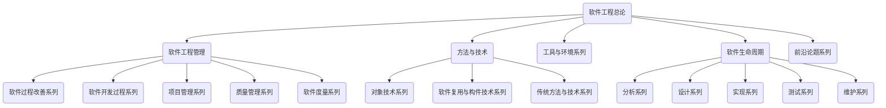

# 1. java极限编程

```mermaid
graph TB;
    A(软件工程总论)-->B1(软件工程管理);
    A-->B2(方法与技术);
    A-->B3(工具与环境系列);
    A-->B4(软件生命周期);
    A-->B5(前沿论题系列);
    B1-->C1(软件过程改善系列);
    B1-->C2(软件开发过程系列);
    B1-->C3(项目管理系列);
    B1-->C4(质量管理系列);
    B1-->C5(软件度量系列);
    B2-->C6(对象技术系列);
    B2-->C7(软件复用与构件技术系列);
    B2-->C8(传统方法与技术系列);
    B4-->C9(分析系列);
    B4-->C10(设计系列);
    B4-->C11(实现系列);
    B4-->C12(测试系列);
    B4-->C13(维护系列);
        
```