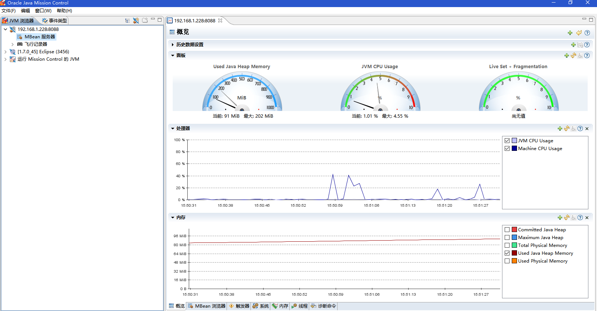

# linux tomcat8 配置 jmx监控
## 编辑tomcat的启动脚本catalina.sh
找到如下位置tomcat/bin/catalina.sh编辑位置如下：
```shell
# Uncomment the following line to make the umask available when using the
# org.apache.catalina.security.SecurityListener
#JAVA_OPTS="$JAVA_OPTS -Dorg.apache.catalina.security.SecurityListener.UMASK=`umask`"

# ----- Execute The Requested Command -----------------------------------------

# Bugzilla 37848: only output this if we have a TTY
```

在**Execute The Requested Command**前加入如下代码：
```shell
CATALINA_OPTS="$CATALINA_OPTS -Djava.rmi.server.hostname=10.12.116.135 -Dcom.sun.management.jmxremote -Dcom.sun.management.jmxremote.port=8088 -Dcom.sun.management.jmxremote.ssl=false -Dcom.sun.management.jmxremote.authenticate=true"
```
其中的 hostname换成你本机的ip， port 默认为8088。
## 编辑jmxremote.access和jmxremote.password
进入默认按照的 jdk 目录：
```shell
cd /usr/java/jdk1.8.0_45/jre/lib/management
cp jmxremote.password.template jmxremote.password
```
编辑最后的账户密码，去掉注释，密码改下别用默认的。
```shell
# Following are two commented-out entries.  The "measureRole" role has
# password "QED".  The "controlRole" role has password "R&D".
#
monitorRole  QEDworld
controlRole   R&Dhello
```
把文件改为运行 tomcat 的用户，如果已经是，则不需要修改
```shell
chown admin jmxremote.password jmxremote.access
chgrp admin jmxremote.password jmxremote.access
```
修改文件权限600，这是 java 的规范，防止别的用户看到你密码
```shell
chmod 600 jmxremote.access jmxremote.password
```
修改完之后文件的模样:）
```shell
[root@vm-xy-mms-nfsq management]# ll
总用量 32
-rw------- 1 admin admin  3998 4月  11 2015 jmxremote.access
-rw------- 1 admin admin  2862 4月  17 09:45 jmxremote.password
-rw-r--r-- 1 root  root   2856 4月  11 2015 jmxremote.password.template
-rw-r--r-- 1 root  root  14097 4月  11 2015 management.properties
-rw-r--r-- 1 root  root   3376 4月  11 2015 snmp.acl.template
```
## 重新启动tomcat
重新启动 tomcat：
```shell
sh bin/shutdown.sh
sh bin/startup.sh
```
看 logs日志，能看到刚刚catalina.sh配置的jmx配置信息，确认 tomcat 启动正常,无报错。
```shell
17-Apr-2016 09:54:38.152 INFO [main] org.apache.catalina.startup.VersionLoggerListener.log Command line argument: -Djava.rmi.server.hostname=10.3.0.105
17-Apr-2016 09:54:38.152 INFO [main] org.apache.catalina.startup.VersionLoggerListener.log Command line argument: -Dcom.sun.management.jmxremote
17-Apr-2016 09:54:38.152 INFO [main] org.apache.catalina.startup.VersionLoggerListener.log Command line argument: -Dcom.sun.management.jmxremote.port=8088
17-Apr-2016 09:54:38.152 INFO [main] org.apache.catalina.startup.VersionLoggerListener.log Command line argument: -Dcom.sun.management.jmxremote.ssl=false
17-Apr-2016 09:54:38.152 INFO [main] org.apache.catalina.startup.VersionLoggerListener.log Command line argument: -Dcom.sun.management.jmxremote.authenticate=true
```
## 验证

