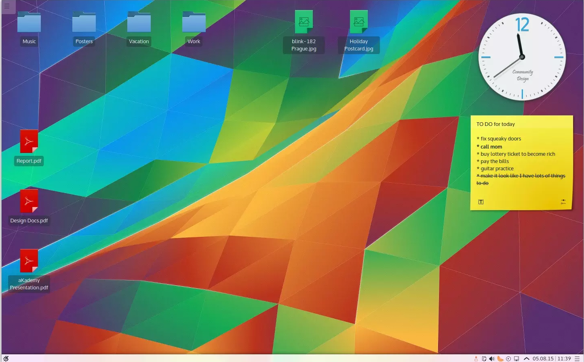
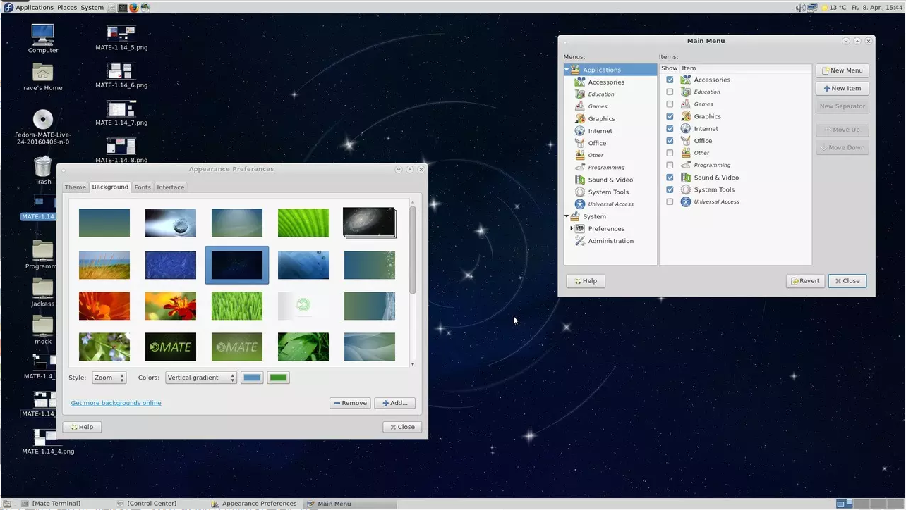
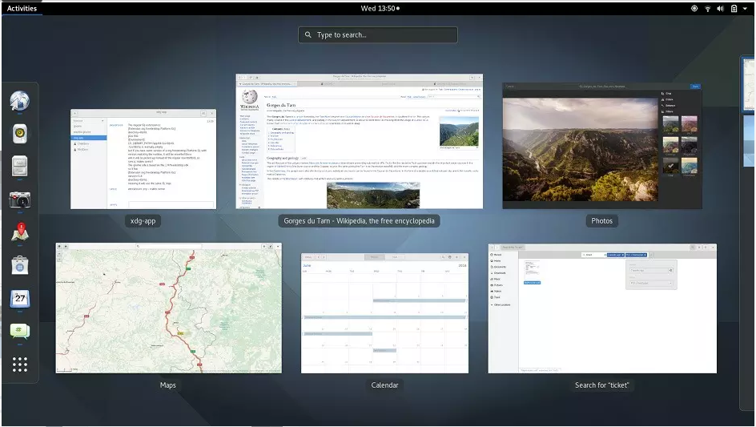
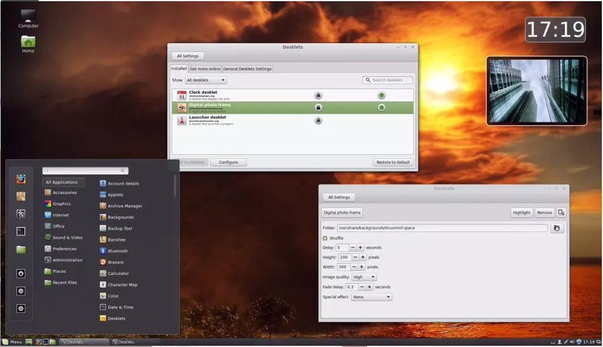
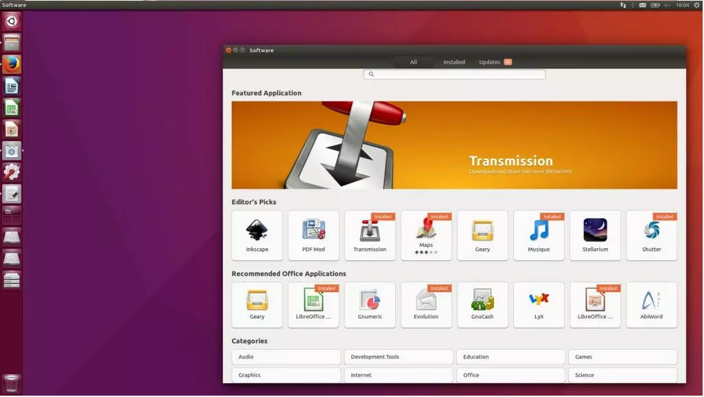
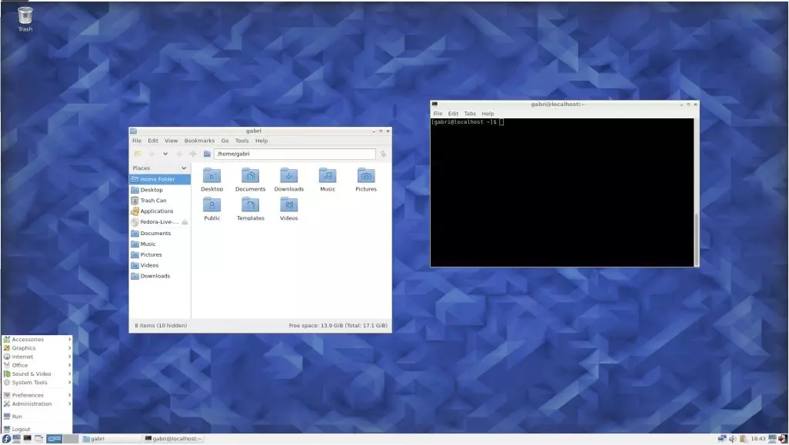
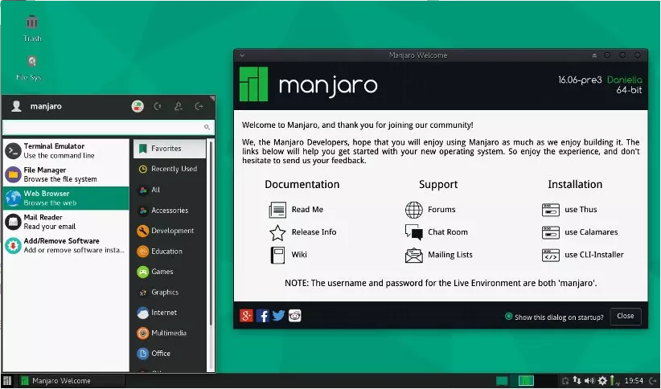

# Linux桌面说明
主流Linux的桌面有：KDE、MATE、GNOME、CINNAMON、UNITY、LXDE、XFCE、分别描述如下：
## KDE
### 图片
   
### 描述
   KDE 绝非只是一个桌面环境，实际上是各种应用程序与 Linux 桌面的一个集合，桌面环境本身只作为该套应用环境的一个子集。目前最新的 KDE 环境名叫 Plasma，它又分为 Plasma Desktop 和 Plasma Netbook 两个版本， KDE 可以说是目前定制性最强，最为灵活的 Linux 桌面环境之一。其它桌面环境可能需要使用额外的工具才能进行自定义或调整，而 KDE 将这一切都集成进了系统设置当中，用户不需要使用任何第三方工具即可以对桌面进行个性化订制，如下载桌面小工具、壁纸和主题等。KDE 还对常用的基本应用程序进行了集成，并对未使用 KDE 开发平台构建的应用进行兼容，KDE 集成的应用非常丰富，完全能够满足普通用户的日常应用，而无需安装其它替代应用。无论你只是想要一个开箱即用的 Linux 桌面环境还是要对桌面进行全面的个性化订制，KDE 都是一个非常不错的选择。目前采用 KDE 作为默认桌面环境的 Linux 发行版主要有 openSUSE 和 Kubuntu。
### 优点
* 功能十分丰富强大
* 采用现代化用户界面
* 高度可定制性和灵活性
* 范围广泛的软件兼容性
### 缺点
* 稍重的资源占用
* 某些组件使用起来似乎过于复杂
## MATE
### 图片

### 描述
MATE 桌面环境基于目前无人维护的 GNOME 2，MATE 最初就是为对 GNOME 3 失望的用户而开发。Fork GNOME 2 的代码进行开发并不意味着就使用过时的技术，MATE 将继续使用现代技术进行改善。MATE 桌面环境采用了现代而又不失传统的桌面体验，它支持面板系统、各种菜单、小程序、指示器和按钮等，并可按用户的需要进行布置。MATE 自带的基本应用都从 GNOME 2 复制过来进行集成，它本身对资源的消耗非常小，能够在不十分强劲的硬件平台上稳定工作。Ubuntu MATE 目前采用 MATE 作为自己的默认桌面环境。
### 优点
* 直观和稳定的用户体验
* 简单、轻便
* 高度可定制
### 缺点
* 接口看起来有些老了
##  GNOME
### 图片

### 描述
GNOME 是各 Linux 发行版采用最为广泛、最流行的桌面环境之一，许多 Linux 发行版都使用 GNOME 作为默认桌面环境。它也有一些流行的分支，例如 Cinnamon 、Unity 等等。GNOME 以易于使用和定制为设计初衷，目前果最新的 GNOME 3 具有非常现代和有吸引力的用户界面，并能为触摸设备提供更好的支持。GNOME 几乎包含了所有现代化桌面环境需要的所有功能，GNOME 3 比 GNOME 2 的精典模式提供了更好的界面，仪表板、全系统搜索和强大的应用程序都能够直接轻松搞定用户使用需求。不过桌面环境的定制调整需要使用 gnome-tweak-tool 工具来完成，在 3.18 版本中它还了文件管理器的一些有趣功能，例如对 Google Drive 进行了集成。目前使用 GNOME 作为默认桌面环境的 Linux 发行版主要有 Debian、Fedora、openSUSE 和 Ubuntu GNOME。
### 优点
* 现代和触摸友好的用户界面
* 能够通过 Shell 扩展延伸功能
* 可定制性强
### 缺点
* 扩展管理不尽如人意
## CINNAMON
### 图片

### 描述
Cinnamon 是 GNOME 3 的一个分支，目前正作为 Linux Mint 的默认桌面环境。它最出名的便是与 Windows 相似的用户界面，可以帮助 Linux 入门用户轻松上手并减低不适应度。Cinnamon 集成的各种基本应用都源于 GNOME 3，Cinnamon 集成了面板、主题、小应用程序和各种自定义组件扩展，面板位置屏幕底部边缘，配备了主菜单、启用程序、打开窗口列表及系统托盘等。
### 优点
* 时尚精致的外观
* 熟悉的界面
* 非常漂亮的定制
### 缺点
* 偶尔出现的 Bug
## UNITY
### 图片

### 描述
Unity 也是基于 GNOME 桌面环境开发而来，配备有最核心的 GNOME 应用程序。Unity 主要用于 Canonical 开发的 Ubuntu 桌面环境。Unity 主攻方向为使用键盘、鼠标、触控板甚至触摸屏的用户提供一致一用户体验，为用户提供了简单的应用程序并集成了触控友好的使用环境，还实现了一些新的想法和技术，如 Lens 和 HUD 等。尽管针对 Unity 桌面环境有大量的争论，但它还是有非常大量的用户，这都归功于它是目前最流行 Linux 发行版 Ubuntu 的默认桌面环境。
### 优点
* 非常直观
* 无缝的桌面体验
### 缺点
* 定制性较差
* 不适用于主要的 Linux 发行版
## LXDE
### 图片

### 描述
LXDE 是一款速度极快、足够省资源的桌面环境，它提供足够轻量和用户友好度的桌面，它采用的模块化实现方法让每个组件都可以独立使用，这也让 LXDE 移植到其它 Linux、BDS 和 Unix 更加容易。LXDE 自带各种桌面组件、系统和配置工具，目前是 Lubuntu 的默认桌面环境。
### 优点
* 足够轻量，速度极快
* 几乎支持所有 Linux 发行版
### 缺点
* 用户界面似乎没有什么吸引力
## XFCE
### 图片

### 描述
Xfce 是 Linux、BSD 及其它类 Unix 发行版最为轻量级的桌面环境之一，Xfce 提供了非常精简、现代、有视觉吸引力的用户友好界面并配备了一套具有基本功能的应用程序。目前 Manjaro Linux 和 Xubuntu 都使用 Xfce 作为默认桌面环境。
### 优点
* 非常轻量，适用于老旧硬件
* 界面足够现代、有吸引力
* 有一定定制性
### 缺点
* 内置应用较少

