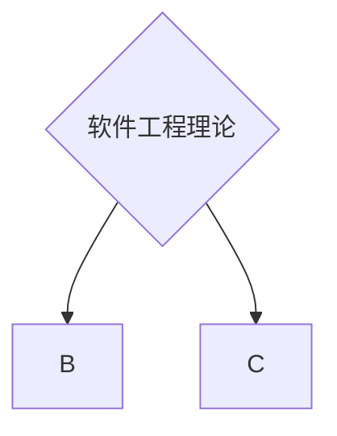
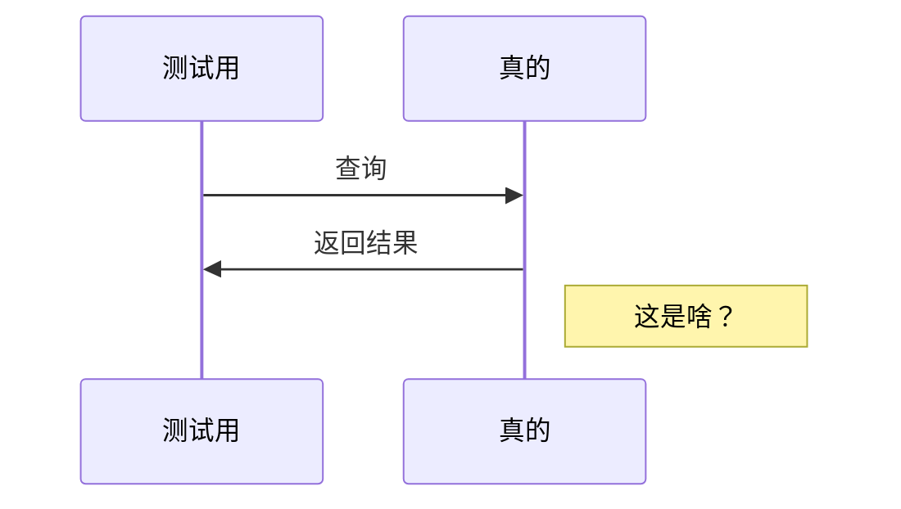
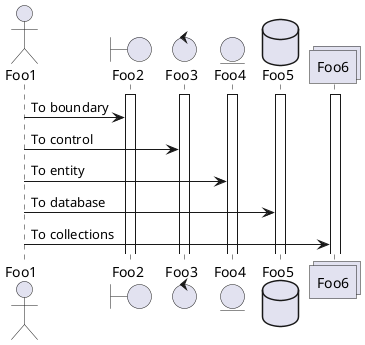
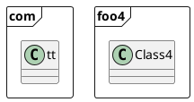
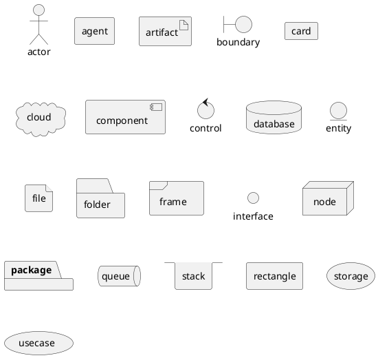
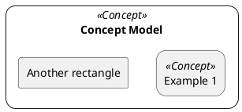
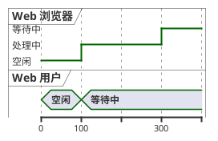
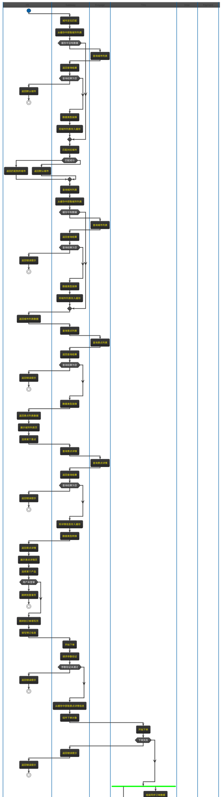

# 1. 测试一下
[:exclamation:]
:blush:
This is a text with subscript H<sub>2</sub>O. co<sub>2</sub>    :bowtie:
- [x]  ~~CUA_Ancillary~~
- [x]  ~~CUA_BackOffice~~
- [x]  ~~CUA_ITG~~
- [x]  ~~CUA_Payment~~
- [x]  ~~CUA_REP~~
- [x]  ~~CUA_Report~~
- [x]  ~~CUA_User~~
- [ ]  ~~CUA_WECHAT不和版理论上~~
- [x] ~~CUA_FFP~~
- [x] ~~CUA_Booking~~
- [x] ~~CUA_EWP~~
- [x]  ~~jetair_pip_booking不用和版~~
- [ ]  Jetair_PIP_Gateway
- [x]  ~~jetair_tms不能合板代码结构完全变化~~






```flowchart
st=>start: 开始
e=>end: 结束
op=>operation: 我的操作
cond=>condition: 确认？
opd=>operation: 继续操作
conde=>condition: 我是要继续吗？
st->op->cond
cond(yes)->opd
cond(no)->op
opd->conde
conde(yes)->e
conde(no)->op
```
科技股份有限公司<sup>tm</dup>




::: alert-info
 
这是一个信息文本。
 
:::

::: alert-danger
 
这是一个危险文本。
 
:::

::: alert-success
fewfewfewfwef
:::










```puml
@startuml
sprite $businessProcess [16x16/16] {
FFFFFFFFFFFFFFFF
FFFFFFFFFFFFFFFF
FFFFFFFFFFFFFFFF
FFFFFFFF0FFFFFFF
FFFFFFF000FFFFFF
FFFFFF00000FFFFF
FFFFF0000000FFFF
FFFFFFF000FFFFFF
FFFFFFF000FFFFFF
FFFFFFF000FFFFFF
FFFFFFF000FFFFFF
FFFFFFF000FFFFFF
FFFFFFF000FFFFFF
FFFFFFF000FFFFFF
FFFFFFFFFFFFFFFF
FFFFFFFFFFFFFFFF
}


rectangle " End to End\nbusiness process" <<$businessProcess>> {
 rectangle "inner process 1" <<$businessProcess>> as src
 rectangle "inner process 2" <<$businessProcess>> as tgt
 src -> tgt
}
@enduml
```

```echarts
{
    "width":500,
    "height":400,
    "series": [
        "name":"访问来源",
        "type":"pie"
        "radius":"55%"t
    ]
```