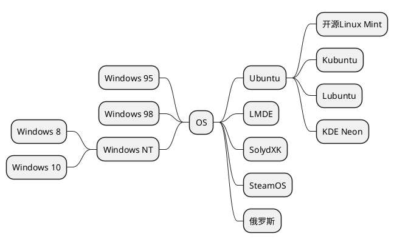

java编译简易图
```puml
allow_mixing
skinparam rectangle {
	roundCorner 50
}
rectangle "编译时环境" as a {
    class A
	rectangle "Another rectangle"
}
rectangle "运行时环境" as b {
	rectangle "Example 1" as ex34
	rectangle "Another recta"
}
a -RIGHT-> b
```
