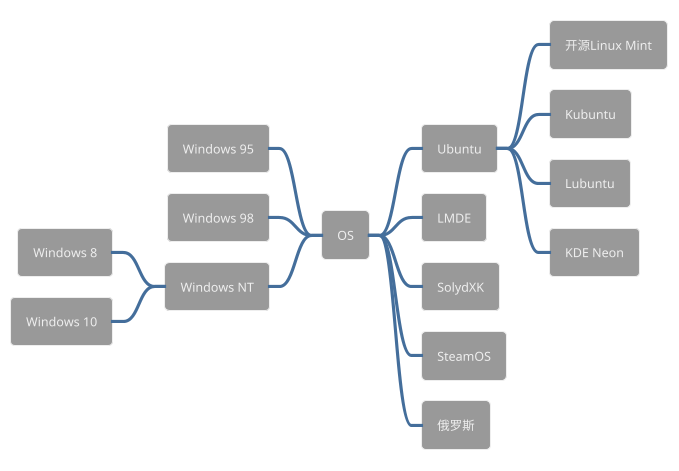

java编译简易图
```puml
!theme bluegray
allow_mixing
skinparam rectangle {
	roundCorner 50
}
rectangle "编译时环境" as a {
    class A
	rectangle "Another rectangle"
}
rectangle "运行时环境" as b {
	rectangle "Example 1" as ex34
	rectangle "Another recta"
}
a -RIGHT-> b
```


```puml
@startmindmap
!theme sketchy
+ 会员异常
++ 后台开发
+++ 短信轰炸（前台）
+++ 任意密码修改
+++ 短信轰炸（后台）
+++ 越权操作
+++ 邮箱轰炸
+++ 用户枚举
-- 前台开发
--- 短信轰炸（前台）
--- Jquery跨站脚本攻击
--- 任意密码修改
--- 短信轰炸（后台）
--- 邮箱轰炸
++ 运维
+++ 明文传输

@endmindmap


