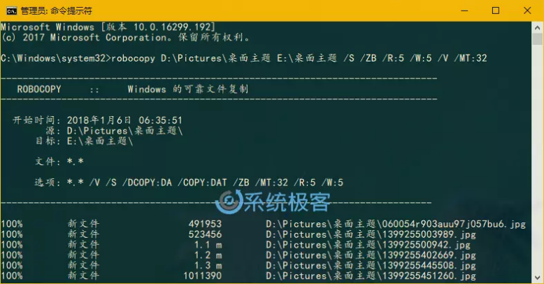
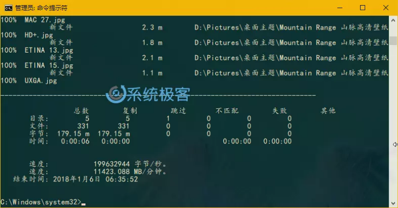

# 1. Win10的robocopy命令
Robocopy 最为特殊也经常被忽略的是其支持多线程的能力，允许我们同时复制多个文件，而不像在「文件管理器」中复制文件时只能一次一个（移动多个文件时也只是列队之后一个一个移动）。
## 1.1. 命令说明
`robocopy` 的功能非常强大，因此其命令行开关也非常之多，下面我们只列出能够可靠、快速复制文件的常用开关。
* `/S` — 复制子目录，但不复制空的子目录。
* `/E` — 复制子目录，包括空的子目录。
* `/Z` — 在可重新启动模式下复制文件。
* `/ZB` — 使用可重新启动模式；如果拒绝访问，请使用备份模式。
* `/R:5` — 失败副本的重试次数: 默认为 1 
* `/W:5` — 两次重试间的等待时间: 默认为 30 秒。
* `/TBD` — 等待定义共享名称(重试错误 67)。
* `/NP` — 无进度 – 不显示已复制的百分比。
* `/V` — 生成详细输出，同时显示跳过的文件。
* `/MT:32` [^1] — 使用 n 个线程进行多线程复制(默认值为 8)。必须至少为 1，但不得大于 128。


## 1.2. 使用步骤
1. 以管理员权限打开「命令提示符」
2. 执行类似如下命令进行多线程复制：
```bat
robocopy C:\source\folder\path\ D:\destination\folder\path\ /S /ZB /R:5 /W:5 /V /MT:32
```
## 1.3. 图例


[^1]: 上述命令中最为重要的开关就是 /MT，它让 robocopy 能够以多线程模式进行复制传输。如果你没为 /MT设置数字，那么默认数字是 8，这意味着 Robocopy 将会同时复制 8 个文件。我个人推荐使用 32 个线程，虽然可开的线程可以更多，但数字越大，所使用的系统资源和带宽就越多。