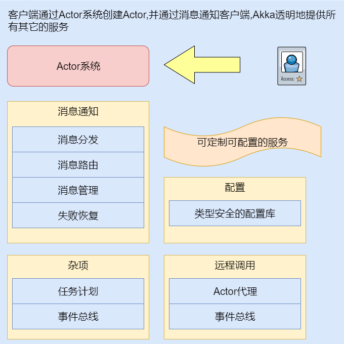

# 1. Akka介绍
## 1.1. 什么是Akka
Akka是用Scala写的，它可用于java以及Scala开发的程序。它的主要目的是简化程序对**可扩展性**、**执行效率**以及**稳定性**的考量。
## 1.2. Akka特性
* 可并行处理多个请求
* 可同时做为客户端和服务端
* 可同步响应
* 可做为事件驱动
## 1.3. AKKA组件图
  
*注：Actor是计算机科学领域中的一个并行计算模型，它把actors当做通用的并行计算原语*
