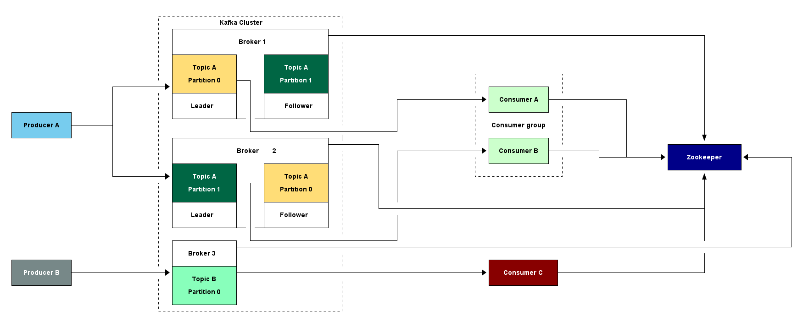
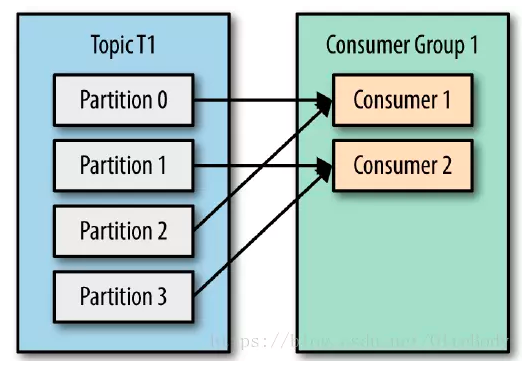

# 1. kafka
Kafka 是由 Linkedin 公司开发的，它是一个分布式的，支持多分区、多副本，基于 Zookeeper 的分布式消息流平台，它同时也是一款开源的基于发布订阅模式的消息引擎系统。
## 1.1. 基本术语
* 消息：Kafka 中的数据单元被称为消息，也被称为记录，可以把它看作数据库表中某一行的记录。
* 批次：为了提高效率， 消息会分批次写入 Kafka，批次就代指的是一组消息。
* 主题：消息的种类称为 主题（Topic）,可以说一个主题代表了一类消息。相当于是对消息进行分类。主题就像是数据库中的表。
* 分区：主题可以被分为若干个分区（partition），同一个主题中的分区可以不在一个机器上，有可能会部署在多个机器上，由此来实现 kafka 的伸缩性，单一主题中的分区有序，但是无法保证主题中所有的分区有序
* 生产者：向主题发布消息的客户端应用程序称为生产者（Producer），生产者用于持续不断的向某个主题发送消息。
* 消费者：订阅主题消息的客户端程序称为消费者（Consumer），消费者用于处理生产者产生的消息。
* 消费者群组：生产者与消费者的关系就如同餐厅中的厨师和顾客之间的关系一样，一个厨师对应多个顾客，也就是一个生产者对应多个消费者，消费者群组（Consumer Group）指的就是由一个或多个消费者组成的群体。
* 偏移量：偏移量（Consumer Offset）是一种元数据，它是一个不断递增的整数值，用来记录消费者发生重平衡时的位置，以便用来恢复数据。
* broker: 一个独立的 Kafka 服务器就被称为 broker，broker 接收来自生产者的消息，为消息设置偏移量，并提交消息到磁盘保存。
* broker 集群：broker 是集群 的组成部分，broker 集群由一个或多个 broker 组成，每个集群都有一个 broker 同时充当了集群控制器的角色（自动从集群的活跃成员中选举出来）。
* 副本：Kafka 中消息的备份又叫做 副本（Replica），副本的数量是可以配置的，Kafka 定义了两类副本：领导者副本（Leader Replica） 和 追随者副本（Follower Replica），前者对外提供服务，后者只是被动跟随。
* 重平衡：Rebalance。消费者组内某个消费者实例挂掉后，其他消费者实例自动重新分配订阅主题分区的过程。Rebalance 是 Kafka 消费者端实现高可用的重要手段。
## 1.2. 特性
* 高吞吐、低延迟：kakfa 最大的特点就是收发消息非常快，kafka 每秒可以处理几十万条消息，它的最低延迟只有几毫秒；
* 高伸缩性：每个主题(topic) 包含多个分区(partition)，主题中的分区可以分布在不同的主机(broker)中；
* 持久性、可靠性：Kafka 能够允许数据的持久化存储，消息被持久化到磁盘，并支持数据备份防止数据丢失，Kafka 底层的数据存储是基于 Zookeeper 存储的，Zookeeper 我们知道它的数据能够持久存储；
* 容错性：允许集群中的节点失败，某个节点宕机，Kafka 集群能够正常工作；
* 高并发：支持数千个客户端同时读写。
## 1.3. 使用场景
* 活动跟踪：Kafka 可以用来跟踪用户行为，比如我们经常回去淘宝购物，你打开淘宝的那一刻，你的登陆信息，登陆次数都会作为消息传输到 Kafka ，当你浏览购物的时候，你的浏览信息，你的搜索指数，你的购物爱好都会作为一个个消息传递给 Kafka ，这样就可以生成报告，可以做智能推荐，购买喜好等；
* 传递消息：Kafka 另外一个基本用途是传递消息，应用程序向用户发送通知就是通过传递消息来实现的，这些应用组件可以生成消息，而不需要关心消息的格式，也不需要关心消息是如何发送的；
* 度量指标：Kafka也经常用来记录运营监控数据。包括收集各种分布式应用的数据，生产各种操作的集中反馈，比如报警和报告；
* 日志记录：Kafka 的基本概念来源于提交日志，比如我们可以把数据库的更新发送到 Kafka 上，用来记录数据库的更新时间，通过kafka以统一接口服务的方式开放给各种consumer，例如hadoop、Hbase、Solr等；
* 流式处理：流式处理是有一个能够提供多种应用程序的领域；
* 限流削峰：Kafka 多用于互联网领域某一时刻请求特别多的情况下，可以把请求写入Kafka 中，避免直接请求后端程序导致服务崩溃。



## 1.4. kafka分区
### 1.4.1. 优点
kafka使用分区将topic的消息打散到多个分区分布保存在不同的broker上，实现了producer和consumer消息处理的高吞吐量。Kafka的producer和consumer都可以多线程地并行操作，而每个线程处理的是一个分区的数据。因此分区实际上是调优Kafka并行度的最小单元。对于producer而言，它实际上是用多个线程并发地向不同分区所在的broker发起Socket连接同时给这些分区发送消息；而consumer，同一个消费组内的所有consumer线程都被指定topic的某一个分区进行消费。
所以说，如果一个topic分区越多，理论上整个集群所能达到的吞吐量就越大。
### 1.4.2. 缺点
每个分区都有自己的开销
1. **客户端/服务器端需要使用的内存就越多**Kafka0.8.2之后，在客户端producer有个参数batch.size，默认是16KB。它会为每个分区缓存消息，一旦满了就打包将消息批量发出。看上去这是个能够提升性能的设计。不过很显然，因为这个参数是分区级别的，如果分区数越多，这部分缓存所需的内存占用也会更多。假设你有10000个分区，按照默认设置，这部分缓存需要占用约157MB的内存。而consumer端呢？我们抛开获取数据所需的内存不说，只说线程的开销。如果还是假设有10000个分区，同时consumer线程数要匹配分区数(大部分情况下是最佳的消费吞吐量配置)的话，那么在consumer client就要创建10000个线程，也需要创建大约10000个Socket去获取分区数据。这里面的线程切换的开销本身已经不容小觑了。服务器端的开销也不小，如果阅读Kafka源码的话可以发现，服务器端的很多组件都在内存中维护了分区级别的缓存，比如controller，FetcherManager等，因此分区数越多，这种缓存的成本就越大。
2. **文件句柄的开销** 每个分区在底层文件系统都有属于自己的一个目录。该目录下通常会有两个文件： base_offset.log和base_offset.index。Kafak的controller和ReplicaManager会为每个broker都保存这两个文件句柄(file handler)。很明显，如果分区数越多，所需要保持打开状态的文件句柄数也就越多，最终可能会突破你的ulimit -n的限制。
3. **降低高可用性** Kafka通过副本(replica)机制来保证高可用。具体做法就是为每个分区保存若干个副本(replica_factor指定副本数)。每个副本保存在不同的broker上。期中的一个副本充当leader 副本，负责处理producer和consumer请求。其他副本充当follower角色，由Kafka controller负责保证与leader的同步。如果leader所在的broker挂掉了，contorller会检测到然后在zookeeper的帮助下重选出新的leader——这中间会有短暂的不可用时间窗口，虽然大部分情况下可能只是几毫秒级别。但如果你有10000个分区，10个broker，也就是说平均每个broker上有1000个分区。此时这个broker挂掉了，那么zookeeper和controller需要立即对这1000个分区进行leader选举。比起很少的分区leader选举而言，这必然要花更长的时间，并且通常不是线性累加的。如果这个broker还同时是controller情况就更糟了。
### 1.4.3. 分区数的确定
可以遵循一定的步骤来尝试确定分区数：创建一个只有1个分区的topic，然后测试这个topic的producer吞吐量和consumer吞吐量。假设它们的值分别是Tp和Tc，单位可以是MB/s。然后假设总的目标吞吐量是Tt，那么分区数 = Tt / max(Tp, Tc)
说明：*Tp表示producer的吞吐量。测试producer通常是很容易的，因为它的逻辑非常简单，就是直接发送消息到Kafka就好了。Tc表示consumer的吞吐量。测试Tc通常与应用的关系更大， 因为Tc的值取决于你拿到消息之后执行什么操作，因此Tc的测试通常也要麻烦一些。*
### 1.4.4. 消息分配
1. 按照key值分配：默认情况下，Kafka根据传递消息的key来进行分区的分配，即hash(key) % numPartitions：
```scala
def partition(key: Any, numPartitions: Int): Int = {
    Utils.abs(key.hashCode) % numPartitions
}
```
这保证了相同key的消息一定会被路由到相同的分区。
2. 没有key时，从缓存中取分区id或者随机取一个
```scala
if(key == null) {  // 如果没有指定key
    val id = sendPartitionPerTopicCache.get(topic)  // 先看看Kafka有没有缓存的现成的分区Id
    id match {
      case Some(partitionId) =>  
        partitionId  // 如果有的话直接使用这个分区Id就好了
      case None => // 如果没有的话，
        val availablePartitions = topicPartitionList.filter(_.leaderBrokerIdOpt.isDefined)  //找出所有可用分区的leader所在的broker
        if (availablePartitions.isEmpty)
          throw new LeaderNotAvailableException("No leader for any partition in topic " + topic)
        val index = Utils.abs(Random.nextInt) % availablePartitions.size  // 从中随机挑一个
        val partitionId = availablePartitions(index).partitionId
        sendPartitionPerTopicCache.put(topic, partitionId) // 更新缓存以备下一次直接使用
        partitionId
    }
}
```
不指定key时，Kafka几乎就是随机找一个分区发送无key的消息，然后把这个分区号加入到缓存中以备后面直接使用——当然了，Kafka本身也会清空该缓存（默认每10分钟或每次请求topic元数据时）。
## 1.5. 消费者与分区的关系
topic下的一个分区只能被同一个consumer group下的一个consumer线程来消费，但反之并不成立，即一个consumer线程可以消费多个分区的数据，比如Kafka提供的ConsoleConsumer，默认就只是一个线程来消费所有分区的数据。**<font color = red>即分区数决定了同组消费者个数的上限</font>**

所以，如果你的分区数是N，那么最好线程数也保持为N，这样通常能够达到最大的吞吐量。超过N的配置只是浪费系统资源，因为多出的线程不会被分配到任何分区。
### 1.5.1. 消费者分配分区的策略
Kafka提供的两种分配策略： range和roundrobin，由参数partition.assignment.strategy指定，默认是range策略。
当以下事件发生时，Kafka 将会进行一次分区分配：
* 同一个 Consumer Group 内新增消费者
* 消费者离开当前所属的Consumer Group，包括shuts down 或 crashes
* 订阅的主题新增分区

将分区的所有权从一个消费者移到另一个消费者称为重新平衡（rebalance），如何rebalance就涉及到本文提到的分区分配策略。
下面我们将详细介绍 Kafka 内置的两种分区分配策略。本文假设我们有个名为 T1 的主题，其包含了10个分区，然后我们有两个消费者（C1，C2）
来消费这10个分区里面的数据，而且 C1 的 num.streams = 1，C2 的 num.streams = 2。
#### 1.5.1.1. Range strategy
Range策略是对每个主题而言的，首先对同一个主题里面的分区按照序号进行排序，并对消费者按照字母顺序进行排序。在我们的例子里面，排完序的分区将会是0, 1, 2, 3, 4, 5, 6, 7, 8, 9；消费者线程排完序将会是C1-0, C2-0, C2-1。然后将partitions的个数除于消费者线程的总数来决定每个消费者线程消费几个分区。如果除不尽，那么前面几个消费者线程将会多消费一个分区。在我们的例子里面，我们有10个分区，3个消费者线程， 10 / 3 = 3，而且除不尽，那么消费者线程 C1-0 将会多消费一个分区，所以最后分区分配的结果看起来是这样的：
* C1-0 将消费 0, 1, 2, 3 分区
* C2-0 将消费 4, 5, 6 分区
* C2-1 将消费 7, 8, 9 分区

假如我们有11个分区，那么最后分区分配的结果看起来是这样的：
* C1-0 将消费 0, 1, 2, 3 分区
* C2-0 将消费 4, 5, 6, 7 分区
* C2-1 将消费 8, 9, 10 分区

假如我们有2个主题(T1和T2)，分别有10个分区，那么最后分区分配的结果看起来是这样的：
* C1-0 将消费 T1主题的 0, 1, 2, 3 分区以及 T2主题的 0, 1, 2, 3分区
* C2-0 将消费 T1主题的 4, 5, 6 分区以及 T2主题的 4, 5, 6分区
* C2-1 将消费 T1主题的 7, 8, 9 分区以及 T2主题的 7, 8, 9分区

可以看出，C1-0 消费者线程比其他消费者线程多消费了2个分区，这就是Range strategy的一个很明显的弊端。
#### 1.5.1.2. RoundRobin strategy
使用RoundRobin策略有两个前提条件必须满足：
* 同一个Consumer Group里面的所有消费者的num.streams必须相等；
* 每个消费者订阅的主题必须相同。
* 
所以这里假设前面提到的2个消费者的num.streams = 2。RoundRobin策略的工作原理：将所有主题的分区组成 TopicAndPartition 列表，然后对 TopicAndPartition 列表按照 hashCode 进行排序，看下面的代码应该会明白：
```scala
val allTopicPartitions = ctx.partitionsForTopic.flatMap { case(topic, partitions) =>
  info("Consumer %s rebalancing the following partitions for topic %s: %s"
       .format(ctx.consumerId, topic, partitions))
  partitions.map(partition => {
    TopicAndPartition(topic, partition)
  })
}.toSeq.sortWith((topicPartition1, topicPartition2) => {
  /*
   * Randomize the order by taking the hashcode to reduce the likelihood of all partitions of a given topic ending
   * up on one consumer (if it has a high enough stream count).
   */
  topicPartition1.toString.hashCode < topicPartition2.toString.hashCode
})
```
最后按照round-robin风格将分区分别分配给不同的消费者线程。
在这个的例子里面，假如按照 hashCode 排序完的topic-partitions组依次为T1-5, T1-3, T1-0, T1-8, T1-2, T1-1, T1-4, T1-7, T1-6, T1-9，我们的消费者线程排序为C1-0, C1-1, C2-0, * * * * C2-1，最后分区分配的结果为：
* C1-0 将消费 T1-5, T1-2, T1-6 分区；
* C1-1 将消费 T1-3, T1-1, T1-9 分区；
* C2-0 将消费 T1-0, T1-4 分区；
* C2-1 将消费 T1-8, T1-7 分区；

多个主题的分区分配和单个主题类似。遗憾的是，目前我们还不能自定义分区分配策略，只能通过partition.assignment.strategy参数选择 range 或 roundrobin。
## 1.6. 参考资料
[参考资料](https://baijiahao.baidu.com/s?id=1651919282506404758&wfr=spider&for=pc)~~~~