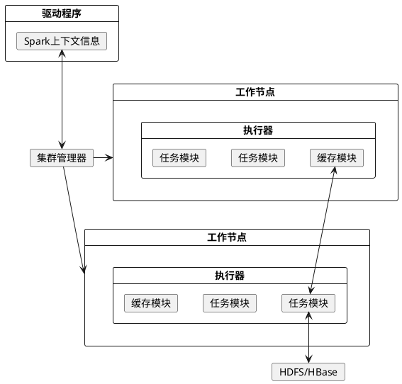
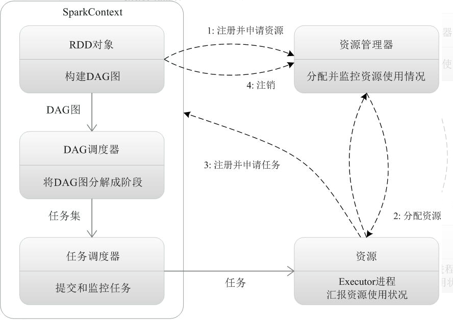
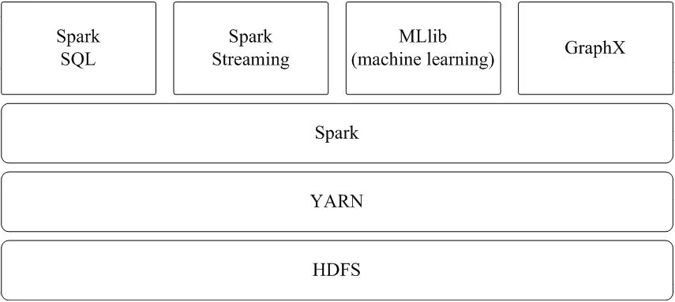

# 1. Spark大数据学习

## 1.1. 生态
Spark的生态系统主要包含了`Spark Core`、`Spark SQL`、`Spark Streaming`、`MLLib`和`GraphX`等组件，各个组件的具体功能如下：
* `Spark Core`：`Spark Core`包含Spark的基本功能，如**内存计算**、**任务调度**、**部署模式**、**故障恢复**、**存储管理**等。Spark建立在统一的抽象RDD之上，使其可以以基本一致的方式应对不同的大数据处理场景；通常所说的Apache Spark，就是指Spark Core；
* `Spark SQL`：`Spark SQL`允许开发人员直接处理RDD，同时也可查询Hive、HBase等外部数据源。Spark SQL的一个重要特点是其能够统一处理关系表和RDD，使得开发人员可以轻松地使用SQL命令进行查询，并进行更复杂的数据分析；
* `Spark Streaming`：`Spark Streaming`支持高吞吐量、可容错处理的实时流数据处理，其核心思路是将流式计算分解成一系列短小的批处理作业。`Spark Streaming`支持多种数据输入源，如`Kafka`、`Flume`和`TCP套接字`等；
* `MLlib`（机器学习）：`MLlib`提供了常用机器学习算法的实现，包括聚类、分类、回归、协同过滤等，降低了机器学习的门槛，开发人员只要具备一定的理论知识就能进行机器学习的工作；
* `GraphX`（图计算）：`GraphX`是Spark中用于图计算的API，可认为是`Pregel`在Spark上的重写及优化，`Graphx`性能良好，拥有丰富的功能和运算符，能在海量数据上自如地运行复杂的图算法。
## 1.2. 基本概念
* RDD：是弹性分布式数据集（Resilient Distributed Dataset）的简称，是分布式内存的一个抽象概念，提供了一种高度受限的共享内存模型；
* DAG：是Directed Acyclic Graph（有向无环图）的简称，反映RDD之间的依赖关系；
* Executor：是运行在工作节点（Worker Node）上的一个进程，负责运行任务，并为应用程序存储数据；
* 应用：用户编写的Spark应用程序；
* 任务：运行在Executor上的工作单元；
* 作业：一个作业包含多个RDD及作用于相应RDD上的各种操作；
* 阶段：是作业的基本调度单位，一个作业会分为多组任务，每组任务被称为“阶段”，或者也被称为“任务集”。
## 1.3. 结构设计
Spark运行架构包括*集群资源管理器*（Cluster Manager）、*运行作业任务的工作节点*（Worker Node）、*每个应用的任务控制节点*（Driver）和*每个工作节点上负责具体任务的执行进程*（Executor）。其中，集群资源管理器可以是Spark自带的资源管理器，也可以是YARN或Mesos等资源管理框架。

## 1.4. 各种概念之间的关系
在Spark中，一个应用（Application）由一个任务控制节点（Driver）和若干个作业（Job）构成，一个作业由多个阶段（Stage）构成，一个阶段由多个任务（Task）组成。当执行一个应用时，任务控制节点会向集群管理器（Cluster Manager）申请资源，启动Executor，并向Executor发送应用程序代码和文件，然后在Executor上执行任务，运行结束后，执行结果会返回给任务控制节点，或者写到HDFS或者其他数据库中。
## 1.5. 执行器的优点
与Hadoop MapReduce计算框架相比，Spark所采用的执行器有两个优点：
1. 利用多线程来执行具体的任务（Hadoop MapReduce采用的是进程模型），减少任务的启动开销；
2. 执行器中有一个BlockManager存储模块，会将内存和磁盘共同作为存储设备，当需要多轮迭代计算时，可以将中间结果存储到这个存储模块里，下次需要时，就可以直接读该存储模块里的数据，而不需要读写到HDFS等文件系统里，因而有效减少了IO开销；或者在交互式查询场景下，预先将表缓存到该存储系统上，从而可以提高读写IO性能。
## 1.6. 运行基本流程
1. 当一个Spark应用被提交时，首先需要为这个应用构建起基本的运行环境，即由驱动节点（Driver）创建一个Spark上下文，由Spark上下文负责和集群管理器（Cluster Manager）的通信以及进行资源的申请、任务的分配和监控等。Spark上下文会向集群管理器注册并申请运行执行器的资源；
2. 集群管理器为执行器分配资源，并启动执行器进程，执行器的运行情况将随着“心跳”发送到集群管理器上；
3. Spark上下文根据RDD的依赖关系构建DAG图，DAG图提交给DAG调度器（DAGScheduler）进行解析，将DAG图分解成多个“阶段”（每个阶段都是一个任务集），并且计算出各个阶段之间的依赖关系，然后把一个个“任务集”提交给底层的任务调度器（TaskScheduler）进行处理；执行器向Spark上下文申请任务，任务调度器将任务分发给执行器运行，同时，Spark上下文将应用程序代码发放给执行器；
4. 任务在执行器上运行，把执行结果反馈给任务调度器，然后反馈给DAG调度器，运行完毕后写入数据并释放所有资源。

## 1.7. 运行架构的特点
1. 每个应用都有自己专属的Executor进程，并且该进程在应用运行期间一直驻留。执行器进程以多线程的方式运行任务，减少了多进程任务频繁的启动开销，使得任务执行变得非常高效和可靠；
2. Spark运行过程与集群管理器无关，只要能够获取执行器进程并保持通信即可；
3. 执行器上有一个BlockManager存储模块，类似于键值存储系统（把内存和磁盘共同作为存储设备），在处理迭代计算任务时，不需要把中间结果写入到HDFS等文件系统，而是直接放在这个存储系统上，后续有需要时就可以直接读取；在交互式查询场景下，也可以把表提前缓存到这个存储系统上，提高读写IO性能；
4. 任务采用了数据本地性和推测执行等优化机制。数据本地性是尽量将计算移到数据所在的节点上进行，即“计算向数据靠拢”，因为移动计算比移动数据所占的网络资源要少得多。而且，Spark采用了延时调度机制，可以在更大的程度上实现执行过程优化。比如，拥有数据的节点当前正被其他的任务占用，那么，在这种情况下是否需要将数据移动到其他的空闲节点呢？答案是不一定。因为，如果经过预测发现当前节点结束当前任务的时间要比移动数据的时间还要少，那么，调度就会等待，直到当前节点可用。
## 1.8. Spark的部署模式
Spark支持的三种典型集群部署方式，即**standalone**、**Spark on Mesos**和**Spark on YARN**；然后，介绍在企业中是如何具体部署和应用Spark框架的，在企业实际应用环境中，针对不同的应用场景，可以采用不同的部署应用方式，或者采用Spark完全替代原有的Hadoop架构，或者采用Spark和Hadoop一起部署的方式。
### 1.8.1. 五种部署方式
#### 1.8.1.1. Local模式
#### 1.8.1.2. standalone模式
与MapReduce1.0框架类似，Spark框架本身也自带了完整的资源调度管理服务，可以独立部署到一个集群中，而不需要依赖其他系统来为其提供资源管理调度服务。在架构的设计上，Spark与MapReduce1.0完全一致，都是由一个Master和若干个Slave构成，并且以槽（slot）作为资源分配单位。不同的是，Spark中的槽不再像MapReduce1.0那样分为Map 槽和Reduce槽，而是只设计了统一的一种槽提供给各种任务来使用。
#### 1.8.1.3. Spark on Mesos模式
Mesos是一种资源调度管理框架，可以为运行在它上面的Spark提供服务。Spark on Mesos模式中，Spark程序所需要的各种资源，都由Mesos负责调度。由于Mesos和Spark存在一定的血缘关系，因此，Spark这个框架在进行设计开发的时候，就充分考虑到了对Mesos的充分支持，因此，相对而言，Spark运行在Mesos上，要比运行在YARN上更加灵活、自然。目前，Spark官方推荐采用这种模式，所以，许多公司在实际应用中也采用该模式。
#### 1.8.1.4. Spark on YARN模式
Spark可运行于YARN之上，与Hadoop进行统一部署，即“Spark on YARN”，其架构如图9-13所示，资源管理和调度依赖YARN，分布式存储则依赖HDFS。

#### 1.8.1.5. Spark on Kubernetes
