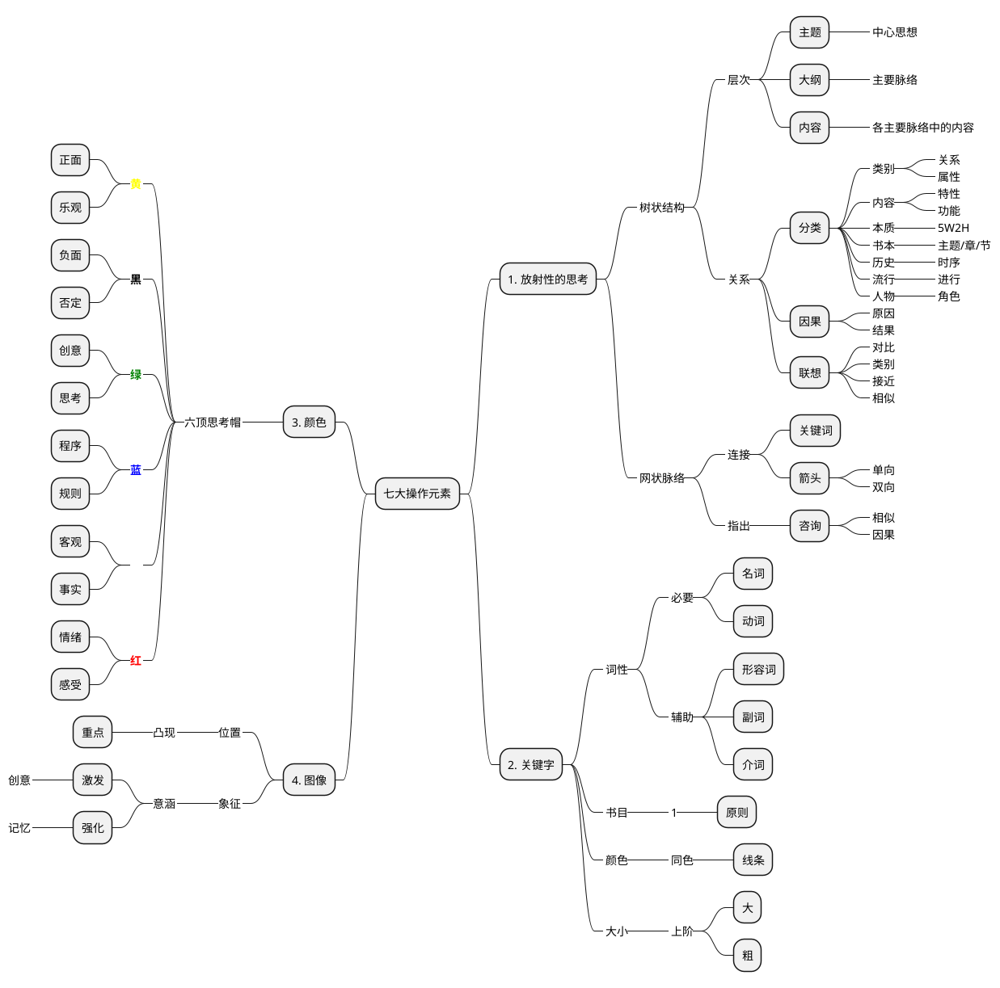

# 1. 思维导图法诀
## 1.1. 心法

```puml
@startmindmap
+ 七大操作元素
++ 1. 放射性的思考
+++_ 树状结构
++++_ 层次
+++++ 主题
++++++_ 中心思想
+++++ 大纲
++++++_ 主要脉络
+++++ 内容
++++++_ 各主要脉络中的内容
++++_ 关系
+++++ 分类
++++++_ 类别
+++++++_ 关系
+++++++_ 属性
++++++_ 内容
+++++++_ 特性
+++++++_ 功能
++++++_ 本质
+++++++_ 5W2H
++++++_ 书本
+++++++_ 主题/章/节
++++++_ 历史
+++++++_ 时序
++++++_ 流行
+++++++_ 进行
++++++_ 人物
+++++++_ 角色
+++++ 因果
++++++_ 原因
++++++_ 结果
+++++ 联想
++++++_ 对比
++++++_ 类别
++++++_ 接近
++++++_ 相似
+++_ 网状脉络
++++_ 连接
+++++ 关键词
+++++ 箭头
++++++_ 单向
++++++_ 双向
++++_ 指出
+++++ 咨询
++++++_ 相似
++++++_ 因果
++ 2. 关键字
+++_ 词性
++++_ 必要
+++++ 名词
+++++ 动词
++++_ 辅助
+++++ 形容词
+++++ 副词
+++++ 介词
+++_ 书目
++++_ 1
+++++ 原则
+++_ 颜色
++++_ 同色
+++++ 线条
+++_ 大小
++++_ 上阶
+++++ 大
+++++ 粗
-- 3. 颜色
---_ 六顶思考帽
----_ <font color = yellow>**黄**</font>
----- 正面
----- 乐观
----_ **黑**
----- 负面
----- 否定
----_ <font color = green>**绿**</font>
----- 创意
----- 思考
----_ <font color = blue>**蓝**</font>
----- 程序
----- 规则
----_ <font color = white>**白**</font>
----- 客观
----- 事实
----_ <font color = red>**红**</font>
----- 情绪
----- 感受
-- 4. 图像
---_ 位置
----_ 凸现
----- 重点
---_ 象征
----_ 意涵
----- 激发
------_ 创意
----- 强化
------_ 记忆
@endmindmap
```