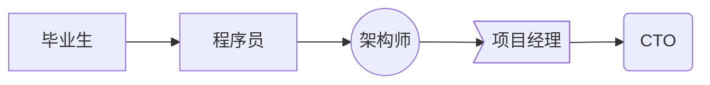
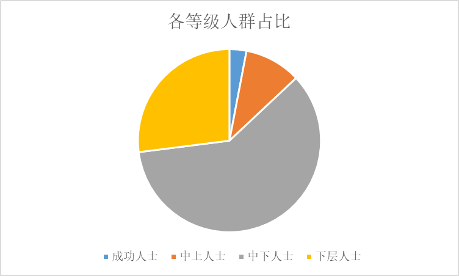
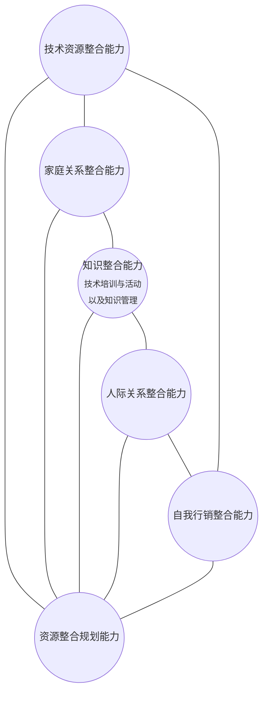

# 成长之路

```mermaid
graph LR;
Graduate[毕业生]-->Programmer[程序员];
Programmer-->Architect((架构师));
Architect-->Project_Manager>项目经理];
Project_Manager-->CTO(CTO);
```

 CTO的整合能力

```mermaid
graph TB;
A((技术资源整合能力))---B((家庭关系整合能力));
B---C((知识整合能力</br> <sub>技术培训与活动</br>以及知识管理</sub>));
C---D((人际关系整合能力));
D---E((自我行销整合能力));
E---A;
A---F((资源整合规划能力));
B---F;
C---F;
D---F;
E---F;

```