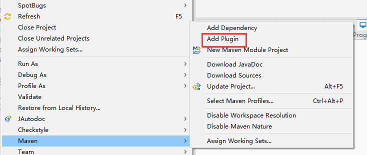
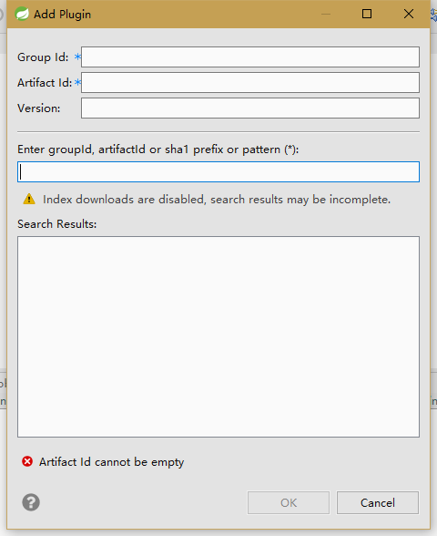

# 初识maven
## 问题描述
1. 在maven项目中添加插件方法。
 
这时会弹出对话框如下： 
 
这里说明一下，Group Id与Artifact Id的概念：
- groupid和artifactid被统称为“坐标”是为了保证项目的唯一性，如果要把项目放到maven本地库中，就需要这两个id来标识。
    - groupId 一般分为多个段，这里我只说两段，第一段为域，第二段为公司名称。域又分为org、com、cn等等许多，其中org为非营利组织，com为商业组织。举个apache公司的tomcat项目例子：这个项目的groupId是org.apache，它的域是org（因为tomcat是非营利项目），公司名称是apache，artigactId是tomcat。
    - artifactId是可以设置为项目名称。
