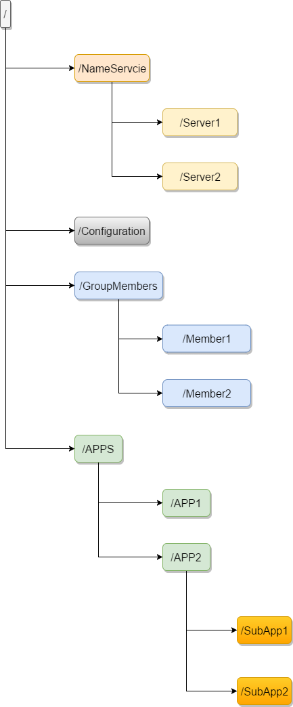
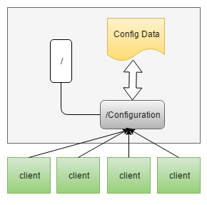
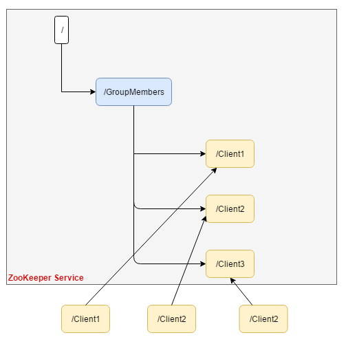

# 1. 定义
ZooKeeper[^1]是一个分布式的，开放源码的分布式应用程序协调服务，是Google的Chubby一个开源的实现，它是集群的管理者，监视着集群中各个节点的状态根据节点提交的反馈进行下一步合理操作。最终，将简单易用的接口和性能高效、功能稳定的系统提供给用户
# 2. 功能
## 2.1. 文件系统
   每个子目录项如 NameService 都被称作为znode，和文件系统一样，我们能够自由的增加、删除znode，在一个znode下增加、删除子znode，唯一的不同在于znode是可以存储数据的。  
   有四种类型的znode： 
1) PERSISTENT->持久化目录节点: 客户端与zookeeper断开连接后，该节点依旧存在 
2) PERSISTENT_SEQUENTIAL->持久化顺序编号目录节点: 客户端与zookeeper断开连接后，该节点依旧存在，只是Zookeeper给该节点名称进行顺序编号 
3) EPHEMERAL->临时目录节点: 客户端与zookeeper断开连接后，该节点被删除 
4) EPHEMERAL_SEQUENTIAL->临时顺序编号目录节点: 客户端与zookeeper断开连接后，该节点被删除，只是Zookeeper给该节点名称进行顺序编号 

### 2.1.1. 命名服务（NameServie）
在zookeeper的文件系统里创建一个目录，即有唯一的path。在我们使用tborg无法确定上游程序的部署机器时即可与下游程序约定好path，通过path即能互相探索发现。
### 2.1.2. 配置管理（Configuration）
程序总是需要配置的，如果程序分散部署在多台机器上，要逐个改变配置就变得困难。现在把这些配置全部放到zookeeper上去，保存在 Zookeeper 的某个目录节点中，然后所有相关应用程序对这个目录节点进行监听，一旦配置信息发生变化，每个应用程序就会收到 Zookeeper 的通知，然后从 Zookeeper 获取新的配置信息应用到系统中就好


### 2.1.3. 集群管理（GroupMembers）
所谓集群管理无在乎两点：是否有机器退出和加入、选举master。 
对于第一点，所有机器约定在父目录GroupMembers下创建临时目录节点，然后监听父目录节点的子节点变化消息。一旦有机器挂掉，该机器与 zookeeper的连接断开，其所创建的临时目录节点被删除，所有其他机器都收到通知：某个兄弟目录被删除，于是，所有人都知道：它上船了。
新机器加入也是类似，所有机器收到通知：新兄弟目录加入，highcount又有了，对于第二点，我们稍微改变一下，所有机器创建临时顺序编号目录节点，每次选取编号最小的机器作为master就好。


### 2.1.4. 分布式锁
有了zookeeper的一致性文件系统，锁的问题变得容易。锁服务可以分为两类，一个是保持独占，另一个是控制时序。对于第一类，我们将zookeeper上的一个znode看作是一把锁，通过createznode的方式来实现。所有客户端都去创建 /distribute_lock 节点，最终成功创建的那个客户端也即拥有了这把锁。用完删除掉自己创建的distribute_lock 节点就释放出锁。 
对于第二类， /distribute_lock 已经预先存在，所有客户端在它下面创建临时顺序编号目录节点，和选master一样，编号最小的获得锁，用完删除，依次方便。
 ```flowchart
st=>start: 开始
e=>end: 结束
op_Creat_lock=>operation: 要获得锁的Client L=create(/Locks/Lock_i,EPHEMERAL_SEQUENTIAL)
op_Get_Lock=>operation: getChildren(/Locks/,false)取得最小的i值
op_Look_mix=>operation: 监控比自己创建的L小的一个值exists(/Locks/Lock_j,true)
op_Lock=>operation: 获得锁
op_Wait=>operation: 等待exists(/Locks/Lock_j,true)中Watch的通知
con_Mix=>condition: 当前的最小i值是否等于自己创建的L?
con_Exit=>condition: /Locks/Lock_J目录节点是否存在?
st->op_Creat_lock->op_Get_Lock->con_Mix
con_Mix(yes)->op_Lock->e
con_Mix(no)->op_Look_mix->con_Exit
con_Exit(yes)->op_Wait->con_Exit
con_Exit(no)->op_Get_Lock
 ```
### 2.1.5. 分布式与数据复制
Zookeeper作为一个集群提供一致的数据服务，自然，它要在所有机器间做数据复制。  
* 数据复制的好处：
1. 容错：一个节点出错，不致于让整个系统停止工作，别的节点可以接管它的工作；
2. 提高系统的扩展能力：把负载分布到多个节点上，或者增加节点来提高系统的负载能力；
3. 提高性能：客户端本地访问就近的节点，提高用户访问速度。
* 客户端读写访问的透明度来看，数据复制集群系统分下面两种：
1. 写主(WriteMaster)：对数据的修改提交给指定的节点。读无此限制，可以读取任何一个节点。这种情况下客户端需要对读与写进行区别，俗称读写分离；
2. 写任意(Write Any)：对数据的修改可提交给任意的节点，跟读一样。这种情况下，客户端对集群节点的角色与变化透明。
对zookeeper来说，它采用的方式是写任意。通过增加机器，它的读吞吐能力和响应能力扩展性非常好，而写，随着机器的增多吞吐能力肯定下降（这 也是它建立observer的原因），而响应能力则取决于具体实现方式，是延迟复制保持最终一致性，还是立即复制快速响应。

### 2.1.6. 数据一致性与paxos算法
我们关注的重点还是在如何保证数据在集群所有机器的一致性，这就涉及到paxos算法。
据说Paxos算法的难理解与算法的知名度一样令人敬仰，所以我们先看如何保持数据的一致性，这里有个原则就是：**在一个分布式数据库系统中，如果各节点的初始状态一致，每个节点都执行相同的操作序列，那么他们最后能得到一个一致的状态。**  
Paxos算法解决的就是保证每个节点执行相同的操作序列。这还不简单，master维护一个全局写队列，所有写操作都必须 放入这个队列编号，那么无论我们写多少个节点，只要写操作是按编号来的，就能保证一致性。没错，就是这样，可是如果master挂了呢。Paxos算法通过投票来对写操作进行全局编号，同一时刻，只有一个写操作被批准，同时并发的写操作要去争取选票，只有获得过半数选票的写操作才会被 批准（所以永远只会有一个写操作得到批准），其他的写操作竞争失败只好再发起一轮投票，就这样，在日复一日年复一年的投票中，所有写操作都被严格编号排 序。编号严格递增，当一个节点接受了一个编号为100的写操作，之后又接受到编号为99的写操作（因为网络延迟等很多不可预见原因），它马上能意识到自己 数据不一致了，自动停止对外服务并重启同步过程。任何一个节点挂掉都不会影响整个集群的数据一致性（总2n+1台，除非挂掉大于n台）。
### 2.1.7. 队列管理
两种类型的队列：
1. 同步队列，当一个队列的成员都聚齐时，这个队列才可用，否则一直等待所有成员到达。（在约定目录下创建临时目录节点，监听节点数目是否是我们要求的数目。）
2. 队列按照 FIFO 方式进行入队和出队操作。（和分布式锁服务中的控制时序场景基本原理一致，入列有编号，出列按编号。）
## 2.2. 通知机制
客户端注册监听它关心的目录节点，当目录节点发生变化（数据改变、被删除、子目录节点增加删除）时，zookeeper会通知客户端。

[^1]:zookeeper 作为 Hadoop 项目中的一个子项目，是 Hadoop 集群管理的一个必不可少的模块，它主要用来控制集群中的数据，如它管理 Hadoop 集群中的 NameNode，还有 Hbase 中 Master Election、Server 之间状态同步等。