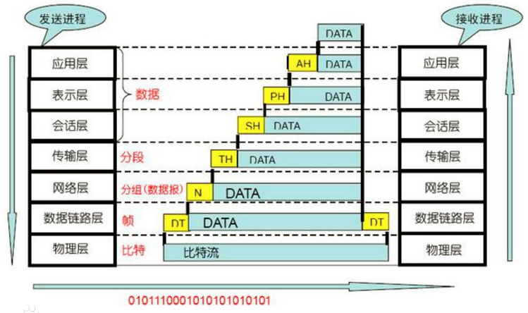

# 1. 网络安全
网络安全的敌人主要攻击目标是：零售商、证券交易所和公用事业公司等组织。
“零日漏洞”是指被发现后立即被恶意利用的安全漏洞，这种攻击利用厂商缺少防范意识或缺少补丁，从而能够造成巨大破坏。     
# 2. 网络ISO七层

## 2.1. 应用层
网络服务与最终用户的一个接口。
协议有：HTTP FTP TFTP SMTP SNMP DNS TELNET HTTPS POP3 DHCP
## 2.2. 表示层
数据的表示、安全、压缩。（在五层模型里面已经合并到了应用层）
格式有，JPEG、ASCll、DECOIC、加密格式等
## 2.3. 会话层
建立、管理、终止会话。（在五层模型里面已经合并到了应用层）
对应主机进程，指本地主机与远程主机正在进行的会话
## 2.4. 传输层
定义传输数据的协议端口号，以及流控和差错校验。
协议有：TCP UDP，数据包一旦离开网卡即进入网络传输层
## 2.5. 网络层
进行逻辑地址寻址，实现不同网络之间的路径选择。
协议有：ICMP IGMP IP（IPV4 IPV6） ARP RARP
## 2.6. 数据链路层
建立逻辑连接、进行硬件地址寻址、差错校验 [2]  等功能。（由底层网络定义协议）
将比特组合成字节进而组合成帧，用MAC地址访问介质，错误发现但不能纠正。
## 2.7. 物理层
建立、维护、断开物理连接。（由底层网络定义协议）
TCP/IP 层级模型结构，应用层之间的协议通过逐级调用传输层（Transport layer）、网络层（Network Layer）和物理数据链路层（Physical Data Link）而可以实现应用层的应用程序通信互联。
应用层需要关心应用程序的逻辑细节，而不是数据在网络中的传输活动。应用层其下三层则处理真正的通信细节。在 Internet 整个发展过程中的所有思想和着重点都以一种称为 RFC（Request For Comments）的文档格式存在。针对每一种特定的 TCP/IP 应用，有相应的 RFC [3]  文档。
一些典型的 TCP/IP 应用有 FTP、Telnet、SMTP、SNTP、REXEC、TFTP、LPD、SNMP、NFS、INETD 等。RFC 使一些基本相同的 TCP/IP 应用程序实现了标准化，从而使得不同厂家开发的应用程序可以互相通信
# 3. IP协议
## 3.1. 地址结构
目前的IP版本有4和6。
### 3.1.1. IPV4
有十进制和二进制两种表示方法。分别是：
点分四组十进制。每一组范围是[0~255]，如：255.255.255.255
二进制。如：11111111 11111111 11111111 11111111
#### 3.1.1.1. 地址结构
##### 3.1.1.1.1. 分类寻址
IPV4被分为五大类：ABCDE
* A类为：点分四组中的第一组地址范围为0~127的IP地址。已二进制来看就是“首位为0”
* B类：128~191.二进制首位为10

### 3.1.2. IPV6
地址长度是128位，由8块（或8个字段）组成，每一块都包含四个16进制数，每块由冒号分隔。
特点如下：
1. 一个块中前导的0不必书写。
2. 全0的块可以省略，并用符号::代替。
3. IPv6可以兼容IPv4地址，即可以用IPv6格式表示IPv4地址。表示方式为：IPv6块值为ffff，其后面紧跟“点分四组”的格式。如:`::ffff:10.0.0.1`可表示IPV4:10.0.0.1的地址。
4. IPv6的低32位通常采用点分四组（就是上面那样）的表示法。
