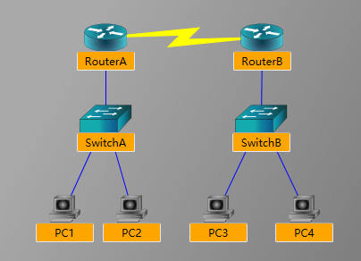

# 网络背景
配置路由器`RouterA`使`PC1`和`PC2`可以与`PC3`和`PC4`进行通信。配置路由器`RouterB`、`SwitchA`、`SwitchB`以及让所有的PC。这个实验室的拓扑包含三个网络：包含连接路由器A和路由器B的串行接口的101.1.4/30广域网（WAN），连接PC1和PC2的192.168100.0/24局域网（LAN）到RouterA的FaSTetReteNetworks 0/0接口，以及192.168.200.0/24局域网将PC3和PC4连接到RouTeB的FasTestNET0/0接口。使用增强的内部网关路由协议（EIGRP）来交换RouterA和RouTB之间的路由表更新。
# 网络拓扑图

# 命令汇总

|命令|描述|
|---|---|
|**clock rate** *clock-rate*|设置数据通信设备（DCE）接口的时钟速率|
|**configure terminal**|从特权执行模式进入全局配置模式|
|**enable**|进入特权执行模式|
|**end**|结束和退出配置模式|
|**exit**|退出菜单结构中的一个级别|
|**hostname** *host-name*|设置设备名称|
|**interface** *type number*|从全局配置模式切换到接口配置模式|
|**ip address** *ip-address subnet-mask*|将IP地址分配给接口|
|**network** *network-address*|激活指定网络上的指定路由协议|
|**ping** *ip-address*|向指定地址发送Internet控制消息协议（ICMP）回音请求|
|**router eigrp** *autonomous-system-number*|进入网络路由模式|
|**show ip interface brief**|显示接口状态和配置的简要摘要|
|**show ip route**|显示IP路由表|
|**show running-config**|显示活动配置文件|
|**shutdown**;**no shutdown**|禁用接口；启用接口|

